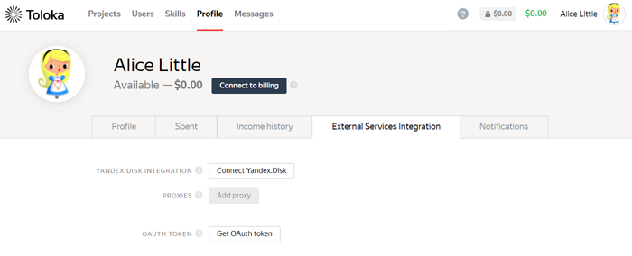

# Accessing the API

All requests to the Toloka API must specify the resource URL and the OAuth token.

#### Query example

```
GET https://sandbox.toloka.yandex.com/api/v1/assignments?pool_id=12345
Authorization: OAuth <OAuth token>
```

## Resource URL {#urls}

- For requests to the sandbox: `https://sandbox.toloka.yandex.com/api/v1/<the path to the resource>`.
    
- For requests to the production version: `https://toloka.yandex.com/api/v1/<the path to the resource>`.
    

## Getting an OAuth token {#token}

Working with the Toloka API requires an OAuth access token. [Register](https://toloka.ai/docs/guide/concepts/access.html?lang=en) in Toloka and get an OAuth token in the requester interface:

- In the sandbox for debugging tasks: [https://sandbox.toloka.yandex.com/requester/profile/integration](https://sandbox.toloka.yandex.com/requester/profile/integration).
    
- In the production version of Toloka: [https://toloka.yandex.com/requester/profile/integration](https://toloka.yandex.com/requester/profile/integration).


    

