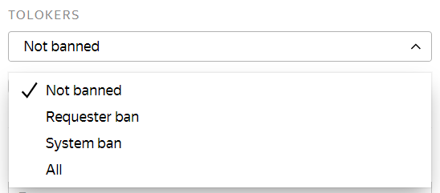



The list may take several minutes to load. If you see **Tolokers not found**, try to wait a bit or use filters.





To select one Toloker, enter their ID in the search field and click **Search**.

To select multiple Tolokers:

1. Create a text file and add the Toloker IDs in it, for example:

    ```plaintext
    059db2fa0927xec84a4cb9ccafc77ea4
    1a1f14bd48f0be13cb10c18sqgeb0679
    83khfalkdg78m3qhfai3kaf91h9n3ls3
    ```

1. Click the **Upload file** button at the bottom left and choose the file.

1. When the file is uploaded, click **Add**.



To view detailed information about a Toloker, click on their ID.







By default, blocked users aren't displayed. Click the drop-down list for other options:

- **Project ban** — Tolokers you blocked in one of the project pools, for example based on a quality control rule.

- **Requester ban** — Tolokers you blocked in all your projects.

- **Blocked in the system** — Tolokers blocked in the platform for violating the rules, poor response quality, or frequent errors when entering captcha.

- **All** — Show both blocked and not blocked users.







Choose **Show active users** and specify the number of days when the Toloker completed at least one task.





**In the left part of the window** use the **Project** and **Pool** fields to select Tolokers who opened tasks in one of your projects or pools.

On the pool statistics page, these Tolokers are listed in the **Interested in pool** field.

The **Completed** field shows the number of completed tasks. If the number is `0`, it means the Toloker only opened a task but didn't complete it.





To find Tolokers by skill, use [filters](../../glossary.md#filters):

1. Click **Add filter**.

1. Scroll down and choose **Choose skill**.

1. Specify the skill and the required skill value.

Filters for selecting Tolokers work the same way as in the pool. Learn more in the [Filters](../concepts/filters.md) section.


