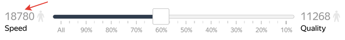

# Speed/quality balance

By default, your tasks are available to all Tolokers. If you set [filters](filters.md), they are available only to those who match them.

When there are many Tolokers, you can get results quickly, but the quality of the Tolokers' responses may be poor. The number of [active Tolokers](../../glossary.md#active-tolokers) (who will see the task if you publish it now) is displayed in the **TOP %** tab to the left of the slider:

You can select Tolokers for your task based on a personalized quality forecast.

## How does it work? {#how-it-works}

A personalized quality forecast is based on a large amount of data about user behavior in the system, how other users completed your task, and the task itself. Based on this data, we predict in real time how well each particular user will handle your task. We select the best Tolokers by comparing quality forecasts for all users.

## Improve the quality of results {#concept_cgm_vzq_xlb}

You can select only the best Tolokers using one of the filters in the [personalized quality forecast](../../glossary.md#personilized-quality-forecast):

- **TOP %** — Allows you to set the percentage of the best Tolokers who will have access to your task.

- **Online** — Allows you to set the maximum number of the best Tolokers who will have access to your task.

## Recommendations {#concept_gtb_2zk_xlb}

- Make sure that the total number of Tolokers exceeds the one required to complete your task several times. Otherwise, your task may not be completed due to lack of Tolokers.

- If you don't know what settings to choose, make the task available only to the best Tolokers. For example, set 20% in the **TOP %** setting. If the tasks completion speed is insufficient, increase the value to get results faster.

## What's next {#what-next}

- [Add tasks](pool.md) to the pool.
- Learn more about how to set up a pool:

    - [Setting up pricing](dynamic-pricing.md).
    - [Dynamic overlap](dynamic-overlap.md).
    - Selective [majority vote](selective-mvote.md) control.
    - [Filters](filters.md).
    - [Setting up quality control](qa-pool-settings.md).
    - [Reviewed assignments](offline-accept.md).

## See also {#see-also}

- [{#T}](nav.md)

## For developers {#for-developers}

- [Toloka-Kit: TopPercentageByQuality class](../../toloka-kit/reference/toloka.client.pool.speed_quality_balance_config.TopPercentageByQuality.md)
- [Toloka-Kit: BestConcurrentUsersByQuality class](../../toloka-kit/reference/toloka.client.pool.speed_quality_balance_config.BestConcurrentUsersByQuality.md)

## Troubleshooting {#troubleshooting}



Possible reasons:

- You've stopped the [main pool](../../glossary.md#training-pool). This could limit the number of Tolokers with access to the pool. Start the training pool again. There will be more Tolokers who can access the tasks.

- The filters you set are too strict. For example, a strong restriction on a certain skill that most users don't have.

- Too many users are banned. Ease the quality control rules.





- To motivate Tolokers, assign a [public skill](nav-create.md#public) and use [dynamic pricing](dynamic-pricing.md).

- Try to [increase the project rating](project_rating_stat.md), so that your task is higher in the list of tasks for Tolokers.

- Adjust the [quality-speed ratio](adjust.md).

- Set a higher [priority](pool_poolparams.md#priority) for the pool among other project pools.



