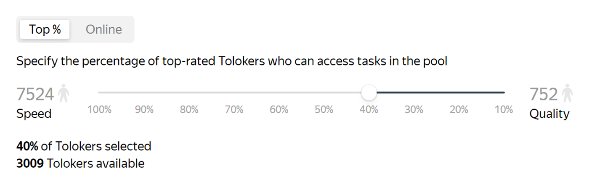
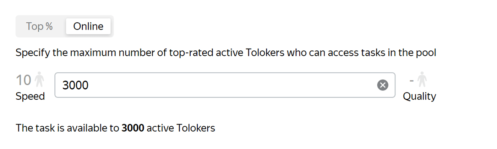

# Speed/quality balance

By default, your tasks are available to all Tolokers. If you set [filters](filters.md), they are available only to those who match them.

When there are many Tolokers, you can get results quickly, but the quality of the Tolokers' responses may be poor.

If you want to improve speed or quality of labeling, use the **Speed/quality balance** pool setting.

It allows you to select Tolokers based on a [personalized quality forecast](../../glossary.md#personilized-quality-forecast):

- **TOP %** — allows you to set the percentage of top-rated Tolokers who will have access to your task.

  

  

  Only 40% of top-rated Tolokers will have access to your task.

  

- **Online** — allows you to set the maximum number of top-rated Tolokers who will have access to your task.

  

  

  Only 3000 of top-rated Tolokers will have access to your task.

  



If there are few suitable performers, then a dash will be indicated in the **Speed** and **Quality** fields.



## How does it work? {#how-it-works}

A personalized quality forecast is based on a large amount of data about user behavior in the system, how other Tolokers completed your task, and the task itself. Based on this data, we predict in real time how well each particular user will handle your task. We select top-rated Tolokers by comparing quality forecasts for all Tolokers.

## Recommendations {#concept_gtb_2zk_xlb}

- Make sure that the total number of Tolokers exceeds the one required to complete your task several times. Otherwise, your task may not be completed due to lack of Tolokers.

- If you don't know what settings to choose, make the task available only to top-rated Tolokers. For example, set 20% in the **TOP %** setting. If the tasks completion speed is insufficient, increase the value to get results faster.

## What's next {#what-next}

- [Add tasks](pool.md) to the pool.
- Learn more about how to set up a pool:

    - [Setting up pricing](dynamic-pricing.md).
    - [Dynamic overlap](dynamic-overlap.md).
    - Selective [majority vote](selective-mvote.md) control.
    - [Filters](filters.md).
    - [Setting up quality control](qa-pool-settings.md).
    - [Reviewed assignments](offline-accept.md).

## See also {#see-also}

- [{#T}](nav.md)

## For developers {#for-developers}

- [Toloka-Kit: TopPercentageByQuality class](../../toloka-kit/reference/toloka.client.pool.speed_quality_balance_config.TopPercentageByQuality.md)
- [Toloka-Kit: BestConcurrentUsersByQuality class](../../toloka-kit/reference/toloka.client.pool.speed_quality_balance_config.BestConcurrentUsersByQuality.md)

## Troubleshooting {#troubleshooting}







