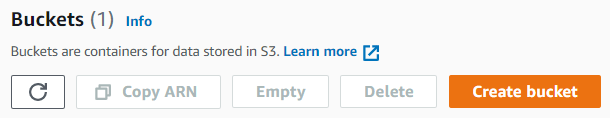

# Amazon S3



You can use any photo hosting service to add a small number of images, such as [imgbb]({{ imgbb }}), [ImageShack]({{ imageshack }}), or [imgur]({{ imgur }}). This way you can quickly get direct links to your images to add them to the task file or instructions.



To try out [S3]({{ amazon-s3-about }}), you can activate a [free trial]({{ amazon-s3-free }}).

#### Trial terms

Length | Free storage size | Grant amount
----- | ----- | -----
12 months | 5 GB | —

## Steps to follow {#workflow}

To get links to files:

1. Sign up to [Amazon Web Services]({{ aws }}).
1. Go to the [Console]({{ amazon-console }}).
1. Log in to [Amazon S3]({{ amazon-s3-console }}).
1. [Create a bucket](#create-bucket).
1. [Upload files to the bucket](#upload).
1. [Copy links](#get-files).

## Create a bucket {#create-bucket}

1. In the **Buckets** section, click **Create Bucket**.

    

1. Enter the bucket name. The name must be unique and must not contain spaces or upper-case letters.

    Learn more about the [Bucket naming rules]({{ amazon-s3-bucket-naming }}).

1. Select the region closest to your Tolokers. For example, for Tolokers from Germany: .

1. To make files in the bucket available by link, disable the option **Block all public access** in the **Block Public Access settings for this bucket** section.

    

    Files will be accessible to anyone with a link. We recommend using hashed file names to keep your files secure. You can generate hashes using online tools (for example, [Online MD5 Hash Generator]({{ hash-function-wiki }})). Learn more about [hashing]({{ hash-function-wiki }}).

    

1. Confirm changes.

    

1. If you want to enable version control, select .

    To make your files easier to navigate, add [tags]({{ amazon-s3-tags }}).

1. Click **Create bucket**.



You can set the lifetime of files in the bucket so that they are automatically deleted after a specified number of days. [Learn more]({{ amazon-s3-ttl }}).



## Upload files to the bucket {#upload}

1. In the **Buckets** section, select a bucket.

1. On the**Objects** tab, click **Upload**.

    

1. 

    Select the files on your computer and click **Add files**.

    

    

    Select the folder with the files on your computer and click **Add folder**.

    

    

    To create a folder in the bucket, click **Create folder** and upload files.

    

    

    All symbols except for Latin letters will be replaced with codes, and spaces will be replaced with plus signs.

    

1. Click **Upload**.

1. After the files are uploaded, click **Close**.

## Copy links. {#get-files}

1. Select the uploaded file and click **Copy URL** on the **Object** tab.

    

1. All file links are created by the same template.

    Links look like this:

    ```plaintext
    https://<bucket-name>.s3.<region-code>.amazonaws.com/<filename>
    ```

    The link in the folder looks like this:

    ```plaintext
    https://<bucket-name>.s3.<region-code>.amazonaws.com/<path-to-file>/<filename>
    ```

    

    To quickly get links to other files, copy the link to one of them and replace `<file-name>` with the names of other files.

    

1. In the [file with tasks](pool_csv.md), paste the links in the column that matches the input data field to which this data is passed.

    For example, if you want to use images in the `image` field, specify the file links in the `INPUT:image` column:

    ```plaintext
    INPUT:image
    https://mybucket.s3.eu-north-1.amazonaws.com/newfolder/image1.png
    https://mybucket.s3.eu-north-1.amazonaws.com/newfolder/image2.png
    ```

## See also {#see-also}

- [{#T}](task_upload.md)

