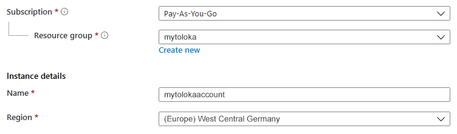
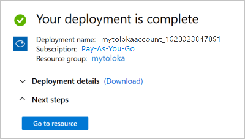

# Azure Blob Storage



You can use any photo hosting service to add a small number of images, such as [imgbb]({{ imgbb }}), [ImageShack]({{ imageshack }}), or [imgur]({{ imgur }}). This way you can quickly get direct links to your images to add them to the task file or instructions.



To try [Microsoft Azure]({{ azure-blob }}), create a [free account]({{ azure-free }}).

#### Trial terms

Length | Free storage size | Grant amount
----- | ----- | -----
12 months | 5 GB | $200 within 30 days

## Steps to follow {#workflow}

To get links to files:

1. Sign up for [Azure]({{ azure-sign-up }}).
1. [Create a storage account.](#create-account)
1. [Create a container.](#container)
1. [Upload files to the container.](#upload)
1. [Copy links.](#get-files)

## Create a storage account {#create-account}

1. Open the Azure [main page]({{ azure-home }}) and click  in the top left corner.

1. Select **Storage accounts**.

1. On the top panel, click  **Create**.

1. On the **Basic** tab, select the subscription for the new storage account.

1. Enter the name of the resource group and your account.

1. Select the region closest to your Tolokers. For example, for Tolokers from Germany: **Region → (Europe) West Central Germany**.

    

    

    

1. Leave other fields unchanged. Click **Review + create**.

1. Wait till it opens. Click **Go to resource.**

    

## Create a container {#container}

1. In the **Data storage** section in the left menu, select **Containers**.

1. On the top panel, click  **Container**.

1. Enter the container name.

1. In the **Public access level** field, select **Container**.

    

    Files will be accessible to anyone with a link. We recommend using hashed file names to keep your files secure. You can generate hashes using online tools (for example, [Online MD5 Hash Generator]({{ hash-function-wiki }})). Learn more about [hashing]({{ hash-function-wiki }}).

    

1. Click **Create**.



You can set up the lifetime of files in the container so that they are automatically deleted after a specified number of days. [Learn more]({{ azure-ttl }}).



## Upload your files to the container {#upload}

1. To open the container, click on its name.

1. On the top panel, click  **Send**.

1. 

    Select files on your device.

    

    

    In the **Send to folder** field in the **Additional** section, enter the name of the folder. If the folder doesn't exist, it will be created.

    

    

    The name can't contain spaces. Files can't be accessed by link.

    

1. Click **Send**.

## Copy links {#get-files}

1. Select the uploaded file and copy its **URL** from the **Review** section.

1. All file links are created by the same template.

    Links look like this:

    ```plaintext
    https://<storage-account>.blob.core.windows.net/<container>/<filename>
    ```

    The link in the folder looks like this:

    ```plaintext
    https://<storage-account>.blob.core.windows.net/<container>/<file-path>/<filename>
    ```

    

    To quickly get links to other files, copy the link to one of them and replace `<file-name>` with the names of other files.

    

1. In the [file with tasks](pool_csv.md), paste the links in the column that matches the input data field to which this data is passed.

    For example, if you want to use images in the `image` field, specify the file links in the `INPUT:image` column:

    ```plaintext
    INPUT:image
    https://mytolokaaccount.blob.core.windows.net/mycontainer/newfolder/image1.png
    https://mytolokaaccount.blob.core.windows.net/mycontainer/newfolder/image2.png
    ```

## See also {#see-also}

- [{#T}](task_upload.md)

