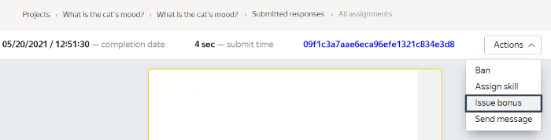
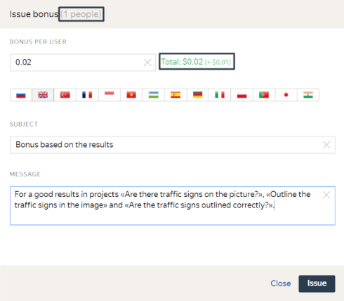
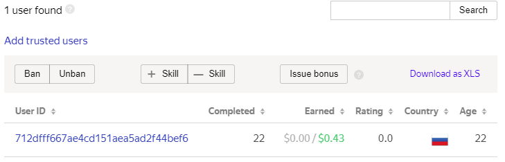
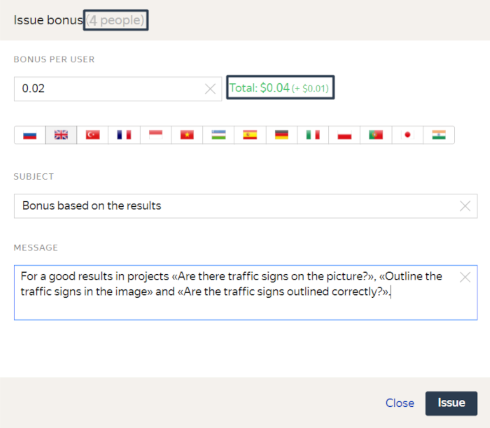
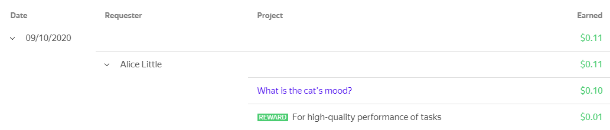

# Bonuses

To motivate Tolokers to complete your project tasks quickly and provide high-quality responses, you can give extra bonuses for individual tasks, or bonus one or more trusted Tolokers (in addition to paying them for [task completion](../../glossary.md#completed-tasks)).

The bonus amount can be from $0.005 to $100 per Toloker per time.

A [fee](budget.md) also applies to bonuses.

## For a task {#bonus-task}

This is the recommended method, since it is the most economical and targeted for motivating Tolokers.

To issue a bonus for a specific pool task, use [online task review](accept.md#acception):

1. Click the **Review assignments** button on the pool page.

1. Choose a task and open it. Please note that a bonus can only be issued for an accepted task.

1. Click **Actions → Issue bonus**

    

    

    

1. Fill in the fields in the **Issue bonus** window that appears:

    - **Bonus per Toloker** in dollars.

    - **Topic** and **Message** for Tolokers. Specify what exactly the bonus is credited for. To send messages in different languages, use the button for switching languages.

    

    

    

1. Click **Grant**.

## Selected Tolokers {#bonus-selected-annotators}

To issue bonuses to Tolokers:

1. Go to the [Users]({{ users }}) page.

1. Choose the Tolokers who will receive the bonus.

    

    

    

1. Specify the [project](../../glossary.md#project) or [pool](../../glossary.md#pool) in the corresponding fields in the left part of the page.

    

    

    

1. To credit bonuses to one Toloker, click the link to their ID in the **Toloker ID** field.

    On the page that opens, click **Actions → Issue bonus**.

    To credit bonuses to a group of Tolokers click **Issue bonus**.

1. Fill in the fields in the **Issue bonus** window that appears:

    - **Bonus per Toloker** in dollars.

    - **Topic** and **Message** for Tolokers. Specify the projects and accomplishments the bonus was granted for. To send messages in different languages, use the button for switching languages.

1. Click **Grant**.

    Before doing this, check the number of people who will receive the bonus, and the total amount.

    

    

    

The Toloker will see bonuses for completed tasks, activity and quality of work in projects in their profile (the **History** tab). The transferred amounts are added to the list of payments.







You can track money deducted for extra bonuses in your [profile]({{ profile }}) on the **Spent** tab.



To issue bonuses using Toloka API, send a `POST` request with the information about the bonuses:

```bash
curl -X POST 'https://toloka.dev/api/v1/user-bonuses' \
     -H 'Authorization: OAuth PlaceYourRealOAuthToken_Here' \
     -H 'Content-Type: application/json' \
     -d '{"user_id":"fac97860c7929add8048ed2ef63b66fd", "amount":0.5, "public_title":{"EN":"Perfect job!"}, "public_message":{"EN":"You are the best!"}}'
```

Refer to the [Issue bonuses](https://toloka.ai/docs/api/api-reference/#post-/user-bonuses) section of the Toloka API documentation for more details about the request, its parameters, and possible responses. You will find examples of the requests for [Toloka-Kit](../../toloka-kit/index.md) and other code samples there.



## See also {#see-also}

- [Crowdsourcing concepts: Pricing](https://toloka.ai/knowledgebase/pricing/)

## For developers {#for-developers}

- [Toloka API: Issuing bonuses](https://toloka.ai/docs/api/api-reference/#post-/user-bonuses)
- [Toloka-Kit recipe: Issue bonuses to Tolokers](../../toloka-kit/recipes/assign-reward.md)
- [Toloka-Kit recipe: Get list of all bonuses issued](../../toloka-kit/recipes/get-rewards.md)
- [Toloka-Kit recipe: Get bonus details](../../toloka-kit/recipes/get-reward-by-id.md)

## Troubleshooting {#troubleshooting}







