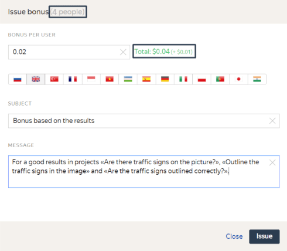

# Rewards

To motivate Tolokers to complete your project tasks quickly and provide high-quality responses, you can give extra rewards for individual tasks, or reward one or more trusted users (in addition to paying them for [task completion](../../glossary.md#completed-tasks)).

The reward amount can be from $0.005 to $100 per Toloker per time.

A [fee](budget.md) also applies to rewards.

## For a task {#bonus-task}

This is the recommended method, since it is the most economical and targeted for motivating Tolokers.

To issue a reward for a specific pool task, use [online task review](accept.md#acception):

1. Click the **Review assignments** button on the pool page.

1. Choose a task and open it. Please note that a reward can only be issued for an accepted task.

1. Click **Actions → Issue bonus**

    

    

    

1. Fill in the fields in the **Issue bonus** window that appears:

    - **Bonus per user** in dollars.

    - **Topic** and **Message** for Tolokers. Specify what exactly the reward is credited for. To send messages in different languages, use the button for switching languages.

    

    

    

1. Click **Grant**.

## Selected Tolokers {#bonus-selected-annotators}

To issue rewards to Tolokers:

1. Go to the [Tolokers]({{ users }}) page.

1. Choose the Tolokers who will receive the reward.

    

    

    

1. Specify the [project](../../glossary.md#project) or [pool](../../glossary.md#pool) in the corresponding fields in the left part of the page.

    

    

    

1. To credit rewards to one Toloker, click the link to their ID in the **Toloker ID** field.

    On the page that opens, click **Actions → Issue bonus**.

    To credit rewards to a group of Tolokers click **Issue bonus**.

1. Fill in the fields in the **Issue bonus** window that appears:

    - **Bonus per Toloker** in dollars.

    - **Topic** and **Message** for Tolokers. Specify the projects and accomplishments the reward was granted for. To send messages in different languages, use the button for switching languages.

1. Click **Grant**.

    Before doing this, check the number of people who will receive the reward, and the total amount.

    

    

    

The Toloker will see rewards for completed tasks, activity and quality of work in projects in their profile (the **History** tab). The transferred amounts are added to the list of payments.





You can track money deducted for extra rewards in your [profile]({{ profile }}) on the **Spent** tab.

## See also {#see-also}

- [Crowdsourcing concepts: Pricing](https://toloka.ai/knowledgebase/pricing/)

## For developers {#for-developers}

- [Toloka API: Issuing rewards](../../api/concepts/bonus.md)
- Toloka-Kit: Rewarding Tolokers with [create_user_bonus()](../../toloka-kit/reference/toloka.client.TolokaClient.create_user_bonus.md) and [create_user_bonuses()](../../toloka-kit/reference/toloka.client.TolokaClient.create_user_bonuses.md) methods

## Troubleshooting {#troubleshooting}






