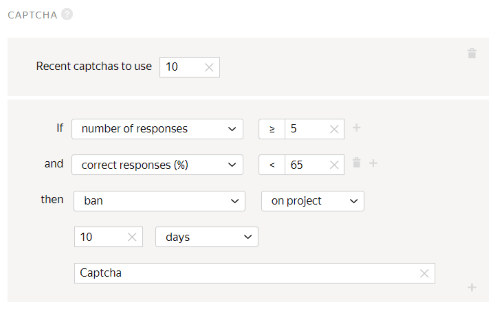
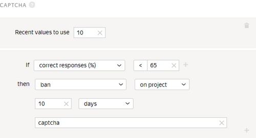

# Captcha

Captchas and the [Fast responses](quick-answers.md) rule provide a high level of protection from robots.

To show a captcha to Tolokers, set [captcha frequency](pool_poolparams.md#captcha) in the [pool](../../glossary.md#pool-ru) settings.

In Toloka, a captcha is normally shown once every 10 assignments. If responses are given quickly and captchas get in the way, they can be shown every 20 assignments.

## When to use {#when-use}

Restrict access to tasks for Tolokers who fail to enter captcha several times in a row. This setting is necessary if you want to provide additional protection from robots.

#### Don't use it if:

- There aren't very many tasks in the pools. For example, if the task is a survey on a single page, a captcha won't help you control the quality, since the minimum frequency of captcha display is every 10 assignments.
- It's difficult or impossible to automate user actions: selecting areas, performing field tasks or any tasks where Tolokers need to attach files or write meaningful texts.

## How to configure {#rule}



The **If** and **then** fields in this rule are mandatory. If you don't fill in at least one field, you won't be able to save the rule.



Field
 |
Overview

----- | -----
**Recent captchas to use** | The number of times the Toloker was shown a captcha recently.  If this field is not filled in, the calculation includes only captcha entries from the pool to which the rule is applied.  If the field is filled in, the corresponding number of captcha entries is used. The rule takes into account captcha entries from both this pool and other pools where this field is filled in.  [Learn more](remember-values.md) about how this field works.
**If** | A condition for performing the action in the **then** field: - **number of responses** — The number of entered captchas (less than or equal to the number in the **Recent values to use** field).      - **correct responses (%)** — The percentage of correct responses (from 0 to 100).      - **% incorrect answers** — The percentage of incorrect responses (from 0 to 100).  To add multiple conditions, click .
**then** | Action to perform for the condition:  - **ban** — Block access to the project or all of the requester's projects for the specified number of days. Only the requester can view the reason.          If access to tasks is blocked temporarily (for example, for 7 days), the history of the Toloker's responses is not saved after the ban is lifted. The skill value is based on new responses.      - **assign skill from the field** — Save the percentage of the Toloker's correctly entered captchas in tasks as a [skill](nav.md) value.      - **suspend** — Suspend the Toloker's access to the pool for the specified number of days. Only the requester can view the reason.      - **accept all assignments from this performer in the pool** — Requires the [non-automatic acceptance](offline-accept.md) option to be set.          Useful if the Toloker completes most tasks well. Example: The Toloker completed more than 80% of the tasks correctly and you are satisfied with this result. The rule will work automatically and accept all responses in the pool.      - **assign skill value** — Assign a fixed value to the [skill](nav.md).

## Rule example {#examples}

Since a person can also make a mistake when entering a captcha, it's advisable to add the **number of responses** field and set a value greater than 1. Otherwise, the Toloker will be banned after the first captcha entry.



The assignments submitted by banned Tolokers will be taken into account if they are not rejected manually using assignment review They can be reassigned by setting up the [Recompletion of assignments from banned users](restore-task-overlap.md) rule.



#### Blocking for incorrect captcha entries

#### Correct settings

If the Toloker entered a captcha at least 5 times and the percentage of correct answers is less than 65%, they are banned and can't complete your tasks for 10 days.

#### Incorrect settings

The Toloker will be banned after the first captcha entry.

## Troubleshooting {#troubleshooting}

#### Should I create a skill for every pool?

It is better to use one [skill](../../glossary.md#skill-ru) in a project. You can choose the way to calculate the skill:

- Calculate the skill for each pool separately. The current skill value is the value of the skill in the pool the Toloker completed last. This option is convenient if:

    - The pools are intended for different groups of Tolokers (for example, there are filters by city or country).

    - Pools are started one by one and you don't want to take into account the responses in the previous pools to calculate the skill in the current pool.

    This calculation method is used by default when adding a quality control rule to a pool. For the control tasks block, leave the **Recent control task responses to use** field empty.

- Calculate skill based on all tasks in a project This option is good if the pools are small and you don't need to have skill calculated for each pool.

    This option is available only for skills on control tasks. To use it, fill in the **Recent control task responses to use** field in pool quality control rules.

#### Can I use a skill beyond a particular pool or project and apply it to other projects as well?

Yes, of course — you can use the same skill for different projects. But most often, a skill is intended for a specific project. If the Toloker completes a certain task well, this doesn't mean that they will complete other ones successfully. Another disadvantage is that if you filter by skills that were set long ago, you will artificially limit the number of available Tolokers.

#### I set up a rule to ban users after the first incorrect captcha. This is to eliminate any bots. Is this too strict? What rule do most projects use?

Indeed, this rule is probably too strict. Even the most careful user can make a mistake, so you probably want to relax the rule. Besides the requester-specific bans, we have system processes that ban users who regularly fail captcha checks in Toloka.

#### Can I control the frequency of showing captchas to the Tolokers? Some Tolokers get a bit demotivated by that.

The frequency of issuing [captchas](captcha.md) is set up in the pool.
#### No
Don't show captchas.
#### Low
Show a captcha after every 20 assignments.
#### Average/High
Show a captcha after every 10 assignments.

#### Can I get more details on the best practices for using captchas? For which projects is it better to use captchas and how often?

[Captcha](captcha.md) is usually used in simple projects with automatic acceptance, like classification, categorization, or information search. These are cases where there are few response options and users don't need to upload files or write texts. It helps you filter out bots and sloppy Tolokers.

The frequency of issuing captchas is configured in the pool.
#### No
Don't show captchas.
#### Low
Show a captcha after every 20 assignments.
#### Average/High
Show a captcha after every 10 assignments.

#### I found the following terms related to captcha in Help: "Percentage of correct responses" and "Percentage of incorrect responses". Are they determined from the control sample?

The percentage of correct responses is based on the total number of captchas processed by the Toloker within the "range" specified in the **Recent control task responses to use** field. If the value is empty, the percentage is calculated using all the captchas that are shown for the tasks in the pool which uses the captcha rule.

