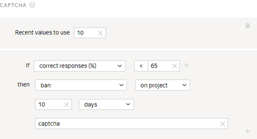

# Captcha



Captchas and the [Fast responses](quick-answers.md) rule provide a high level of protection from robots.

To show a captcha to Tolokers, set captcha frequency in the [pool](../../glossary.md#pool) settings.

In Toloka, a captcha is normally shown once every 10 assignments. If responses are given quickly and captchas get in the way, they can be shown every 20 assignments.

## When to use {#when-use}

Restrict access to tasks for Tolokers who fail to enter captcha several times in a row. This setting is necessary if you want to provide additional protection from robots.

#### Don't use it if:

- There aren't very many tasks in the pools. For example, if the task is a survey on a single page, a captcha won't help you control the quality, since the minimum frequency of captcha display is every 10 assignments.

- It's difficult or impossible to automate user actions: selecting areas, performing field tasks or any tasks where Tolokers need to attach files or write meaningful texts.

## How to configure {#rule}



The **If** and **then** fields in this rule are mandatory. If you don't fill in at least one field, you won't be able to save the rule.



#|
|| **Field**  | **Overview** ||
||**Recent captchas to use** | The number of times the Toloker was shown a captcha recently.

If this field is not filled in, the calculation includes only captcha entries from the pool to which the rule is applied.

If the field is filled in, the corresponding number of captcha entries is used. The rule takes into account captcha entries from both this pool and other pools where this field is filled in.

[Learn more](remember-values.md) about how this field works.||
||**If** | A condition for performing the action in the **then** field:

- **number of responses** — The number of entered captchas (less than or equal to the number in the **Recent values to use** field).

- **correct responses (%)** — The percentage of correct responses (from 0 to 100).

- **% incorrect answers** — The percentage of incorrect responses (from 0 to 100).

To add multiple conditions, click .||
||**then** | Action to perform for the condition:

- **ban** — Block access to the project or all of the requester's projects for the specified number of days. Only the requester can view the reason.

    If access to tasks is blocked temporarily (for example, for 7 days), the history of the Toloker's responses is not saved after the ban is lifted. The skill value is based on new responses.

- **assign skill from the field** — Save the percentage of the Toloker's correctly entered captchas in tasks as a [skill](nav.md) value.

- **suspend** — Suspend the Toloker's access to the pool for the specified number of days. Only the requester can view the reason.

- **accept all assignments from this Toloker in the pool** — Requires the [manual review](offline-accept.md) option to be set.

    Useful if the Toloker completes most tasks well. Example: The Toloker completed more than 80% of the tasks correctly and you are satisfied with this result. The rule will work automatically and accept all responses in the pool.

- **assign skill value** — Assign a fixed value to the [skill](nav.md).||
|#

## Rule example {#examples}

Since a person can also make a mistake when entering a captcha, it's advisable to add the **number of responses** field and set a value greater than 1. Otherwise, the Toloker will be banned after the first captcha entry.



The assignments submitted by banned Tolokers will be taken into account if they are not rejected using manual review. They can be reassigned by setting up the [Recompletion of assignments from banned users](restore-task-overlap.md) rule.



#### Blocking for incorrect captcha entries



- Correct settings

  

  If the Toloker entered a captcha at least 5 times and the percentage of correct answers is less than 65%, they are banned and can't complete your tasks for 10 days.

- Incorrect settings

  

  The Toloker will be banned after the first captcha entry.



## See also {#see-also}

- [{#T}](skipped-assignments.md)

## For developers {#for-developers}

- [Toloka API: Using captcha](../../api/concepts/captcha.md)
- [Toloka-Kit: Captcha class](../../toloka-kit/reference/toloka.client.collectors.Captcha.md)

## Troubleshooting {#troubleshooting}











