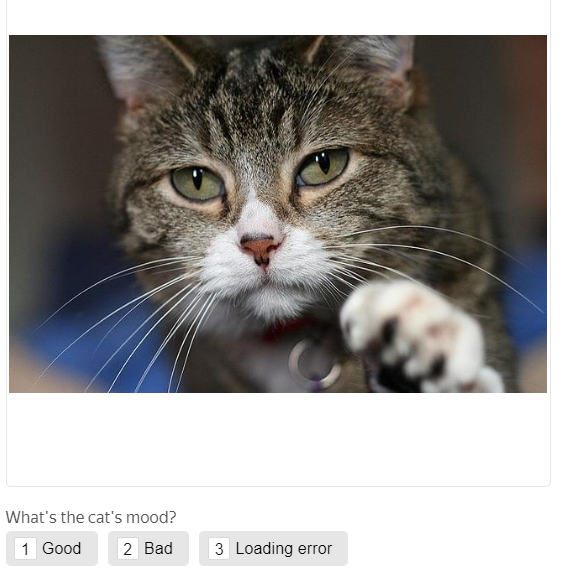

# Image classification

[projects](../../glossary.md#project-ru) of the classification type are intended for tasks with a finite number of response options. Examples are moderating content or grouping images by category.

You may need additional projects for your task, such as dataset pre-check or checking Tolokers' responses. Learn more about this in [Decomposition of the task](solution-architecture.md).

Let's say you want to group the photos of cats according to the cat's mood. Create the following task: the Toloker looks at the image and selects a response option.


Run the project in the [Sandbox]({{ sandbox }}) first. This helps you avoid making mistakes and spending money on a task that isn't working right.



#### Example of a prepared task


To run tasks and get responses:

1. [Create a project](#project)
1. [Add a task pool](#pool)
1. [Upload tasks](#tasks_upload)
1. [Set up quality control](#quality_control)
1. [Add training](#training)
1. [Start the pool and get the results](#launch)

## Create a project {#project}

The project defines what the task will look like for a Toloker.

#### In the interface:

1. Choose a template:

    1. Click **Create project**.

    1. Select the **Image classification** template.

1. Provide general information:

    1. Enter a clear name and a short description for the project. Tolokers will see this in the task list.

    1. Optionally add a **Private comment**.

    1. Click **Save**.

1. Edit the task interface in the editor you selected:

    #### Template Builder

    1. The task interface describes how the elements should be arranged in the task.

    Use the ready-made template for this project with pre-configured validation, keyboard shortcuts, and task layout. The Toloker won't be able to submit a response without selecting one of the options.

    For more information, see the Template Builder Help:

    - [Setting up conditions]({{ tb-conditions }}).

    - [Image classification]({{ tb-image-classification }}) template.

    1. To specify what data you will pass to the Toloker and receive in response, create input and output data fields.

    #### What are input and output data?

    **Input data** is types of objects that are passed to the Toloker for completing the task. For example, this could be a text, an image, or geographic coordinates.

    **Output data** is types of objects that you receive after the task is completed. For example, this could be one of several response options, typed text, or an uploaded file.

    Input data fields are created from the code on the **Example of input data** tab.

    The output data fields depend on the components that use `data.output` and values supported by it.

    Click **Show specifications** to see the input and output data fields.

    Learn more about [input and output data fields]({{ tb-create-specs }}) in the Template Builder Help.

    In this project:

    - Input data field: `image` — A link to an image.

    Change the data type to string to add links to your files.

    - Output data field: `result` — string for saving the Toloker's response.

    #### HTML/CSS/JS editor

    1. The task interface describes how the elements should be arranged in the task.

    In the HTML interface, use the standard HTML tags and [special expressions](t-components.md) in double curly brackets for input and output data fields.

    1. Edit the **HTML** block in the **Task interface**. After the image line, add the question:
    ```html
    {{img src=image width="100%" height="400px"}} <div>What's the cat's mood</b>?<div>
    ```
    
    1. For this project, leave the **JS** and **CSS** blocks unchanged.

    1. In the **Data specification** section, you can configure the input and output data fields.

    #### What are input and output data?

    **Input data** is types of objects that are passed to the Toloker for completing the task. For example, this could be a text, an image, or geographic coordinates.

    **Output data** is types of objects that you receive after the task is completed. For example, this could be one of several response options, typed text, or an uploaded file.

    In this project:

    - Input data field: `image` — A link to an image.

    Change the data type to string to add links to your files.

    - Output data field: `result` — string for saving the Toloker's response.

    1. Click  to see the Toloker's view of the task.

    

    The project preview shows one task with standard data. You can define the number of tasks to show on the page later.

    

    Check if the task options work correctly. In the lower-right corner, click **Submit**.

    To exit preview mode, click **Exit** in the lower-left corner. If there were errors when testing, check the code blocks that you entered.

    1. Save the changes.

1. 1. Write short and clear instructions. Describe what needs to be done and give examples in them.

    You can prepare instructions in HTML format, then copy and paste into the editor. Click **<>** to switch to HTML mode.

    1. Click **Finish**.

Learn more about working with the project in the [Project](project.md) section.

## Add a task pool {#pool}

A pool is a set of paid tasks sent out for completion at the same time.

1. Open the project and click **Add pool**.
1. Give the pool any convenient name. It is available only to you — the Toloker will only see the name of the project.
1. In the **Audience** block, add **Filters** to select Tolokers. To make your task available only to English-speaking users, set filters by language and country detected by the phone number.

    Tasks in pools will automatically be available in the web version of Toloka and the mobile app. If you want to change the default settings and limit the visibility of the task for any of the versions, add the **Client** filter and select the desired value: **Toloka web version** or **Toloka for mobile**.

1. In the **Price** block, set the price per task suite (for instance, `0.02`).
    #### What is a task suite?

    A task suite can contain one or several tasks that are shown on the same page. If the tasks are simple, you can add 10-20 tasks per suite. Don't make task suites too long because it slows down loading speed for Tolokers.

    Tolokers get paid for completing the entire task suite.

    The number of tasks per suite is set when [uploading tasks](#smart-mixing).

    #### What is a fair price for a task suite?

    The general rule of pricing is the more time the Toloker spends to complete the task, the higher the price is.

    You can register in Toloka as a Toloker and find out how much other requesters pay for tasks.

1. In the **Quality control** block, set the **Task overlap**, which is the number of Tolokers to complete the same task. For classification tasks, 3 is enough.
1. In the **Additional settings** block, specify **Time per task suite**. It should be long enough to read the instructions and wait for task data to download. (for example, 600 seconds).
1. Click **Create a pool**.

## Upload tasks {#tasks_upload}

Prepare your own task file. Check out the example in [the demo file](https://download.cdn.yandex.net/from/yandex.ru/support/ru/toloka-requester/files/categorization-cats.tsv). In the Toloka interface under the pool name, there are links to **file** templates for regular, control, and training tasks.

1. Click **Upload**. In the window that opens, you can also download a sample file.

1. Add input data in it. The header of the input data column contains the word `INPUT`. Leave the other columns empty.
1. Upload the tasks using **Smart mixing** and enter the number of tasks per suite. For example: 9 [general tasks](../../glossary.md#general-task-ru) and 1 control task.
    #### What is smart mixing? {#smart-mixing}
    **Smart mixing** randomly generates pages with tasks so that tasks are not repeated for each Toloker.

1. Add control tasks. To do this, click the **Edit** button and give the correct responses for several tasks.
    

    If you selected something else instead of **smart mixing**, click **Edit**. If this button is missing, delete the file and upload it again.

    

    #### What are the control tasks?

    Control tasks are tasks with the correct response known in advance. They are used to track the Toloker's quality of responses. The response you provided is compared to the Toloker's response. If they match, it means the Toloker answered correctly.
    Control tasks should make up [at least 1%](../troubleshooting/pool-setup.md#why-one-percent) of the total number of tasks. This means that for 1000 tasks you should add at least 20 control tasks.
    More about [control tasks](goldenset.md).

## Set up quality control {#quality_control}

[Quality control rules](control.md) allow you to filter out inattentive Tolokers. You can configure quality control both in the project and in the pool.



Quality control settings are applied to all project pools, so you can't change them in just one of the pools.

When you [clone a project](project.md), its quality control settings aren't transferred.




1. #### Pool

    Go to pool editing (the **Edit** button in the upper-right corner of the page) and click **Add Quality Control Rule**.

    You can copy quality control settings from another pool. To do this, click **Copy audience filters and quality control settings** in the **Audience** section.

    #### Project

    Open the project page, open the **Quality control** tab and click **Set quality control**. Then click **+ Add Quality Control Rule**.

    The rules are applied to all project pools, so you can't change settings in just one of the pools.

    

    When you [clone a project](project.md), its quality control settings aren't transferred.

    

1. Add the **Control tasks** section and specify the following values:
    This means that a Toloker who gives more than 40% of incorrect responses will be blocked for five days and won't be able to complete tasks in this project.

1. Add a restriction for **Fast responses**.

    The **Minimum time per page** value depends on the number of tasks on this page. It takes 2-4 seconds to identify the cat's mood. This means that a page with 10 tasks may take 20-30 seconds to complete.

    A Toloker can make an accidental mistake once in a while, but after 2-3 repeated mistakes you can ban the Toloker for a while.

    Specify the following values:

    

    The assignments submitted by banned Tolokers will be taken into account if they are not rejected manually using non-automatic acceptance. They can be reassigned by setting up the [Recompletion of assignments from banned users](restore-task-overlap.md) rule.

    


## Add training {#training}

Create a [training pool](../../glossary.md#training-pool-ru):

1. Open the [Project](../../glossary.md#project-ru) page.

1. Go to the **Training** tab.

1. Click the **Add training** button.

1. Fill in the [training settings](train.md) fields.
    You can use the **Retry after** field to set up [repeated training](train.md).
1. Click **Save training**.
After you create a training pool:
1. Get the **task template** or edit the one you used for uploading the main pool tasks.
    

    Files for all project pools have the same structure.

    

1. Add links to images for the training tasks in the file.
1. Upload the file and specify the number of tasks on the page. For example, 10. This number must not exceed the number of tasks per suite in the main pool.
1. Click **Download** and enter the number of training tasks on the page.
1. Click **Add**.
1. Click **Mark up**and then **Create training tasks**. Next, add correct answers and hints for all the uploaded tasks.
1. After the file is uploaded, open the **Preview** and check that the tasks are displayed correctly.
1. Open the main pool with tasks, link **Training** to it and set the **Level required** to 55. This means that the main pool will be available for users who made no more than 45% of mistakes in the training pool.

    To link the training pool, go to the main pool editing mode and select your training pool in the **Training** parameter drop-down list.


Learn more [about creating a pool with training](train.md).

## Start the pool and get the results {#launch}

1. Start the pool by clicking .
1. Track the completion of tasks in the **Pool statistics** section.
1. When the pool is completed, launch aggregation of results. To do this, find the **Download results** button and click  next to it.
    Aggregation of responses is necessary to get a complete picture of all results. Learn more [about aggregation](result-aggregation.md).

1. Track the aggregation progress on the **Operations** page. When the process is completed, click **Download**.


## Troubleshooting {#troubleshooting}

#### Why do I see a syntax error when I upload a task where a user has to view an image and write feedback?

The error might occur if the expected input type is URL, but a string is received.

There may be two reasons:
- The input field has the "link" type.
- The pool was created for an outdated project version. It means that the pool was created before you changed the input field type.

#### I have a task for photo classification. When there are more than 5 photos on the page, why does Toloka split them across 2 pages?

Toloka will split the links to images in the uploaded file into task suites depending on the method you specified when uploading the file. For more information about the three upload methods, see the [Guide](distribute-tasks-by-pages.md).

#### How do I make an image expand to its maximum size on click?

To the component that inserts the image, add the parameters: `real-size=true` and `screenshot=true`.

#### Do I need to convert all the images in the task to the same size or can they be different?
You can use different image sizes.

