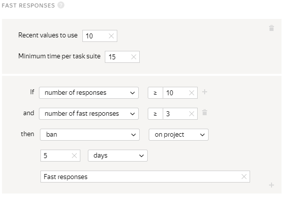
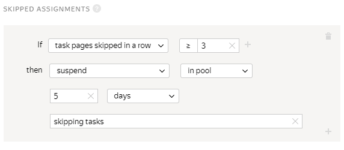
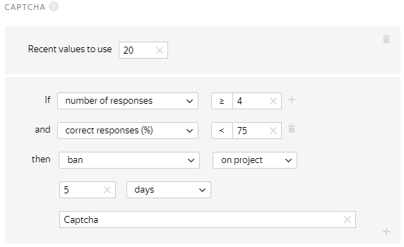
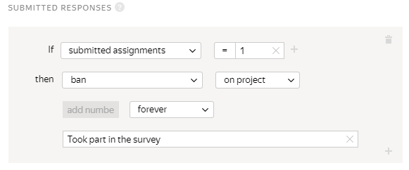
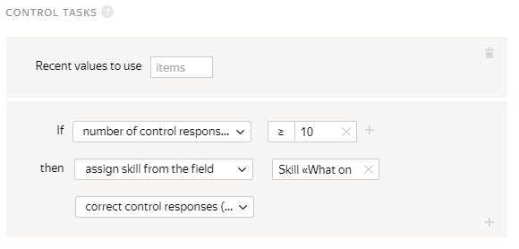
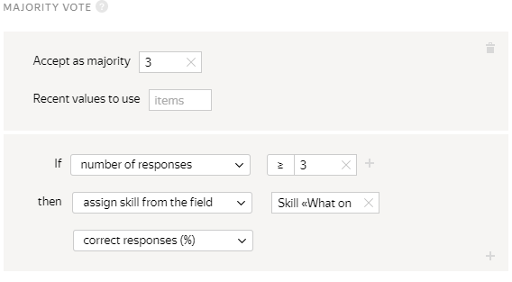
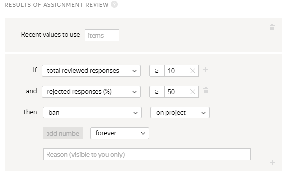
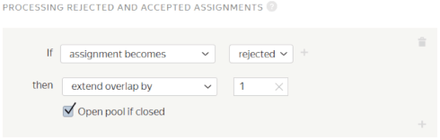
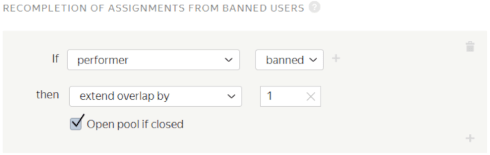

# How to check Tolokers: quality control rules



Use quality control rules to get better results for tasks and restrict access to fraudulent users. Rules are configured for both projects as a whole (the **Quality control** tab) and individual pools.

## Monitoring Toloker actions {#control-actions}

If your project has a lot of similar tasks, you'll need to protect it from fake Tolokers (robots) and cheaters.

#### Limiting fast responses

Use the [Fast responses](quick-answers.md) rule to weed out Tolokers who perform tasks too quickly and carelessly. You've tried doing tasks and you know that each task takes at least 15 seconds. You should suspend Tolokers who submit three out of ten assignments in a row faster than the control time.

#### Limit on skipped assignments

Another “optimization” technique that cheaters use is skipping certain assignments. They pick out the ones that seem easier to them, while other Tolokers reliably complete all the assignments they receive. However, both get paid in the same way.

Use the [Skipped assignments](skipped-assignments.md) rule to restrict access to Tolokers who skip several pages of tasks in a row.

#### Captcha

Use the [Captcha](captcha.md) rule to protect from robots. In Toloka, a captcha is shown every 10 assignments. If assignments are completed quickly and captchas get in the way, they can be shown every 20 assignments: specify low captcha frequency in the pool settings.



#### Limit on available tasks

Limits are also useful when you need as many different Tolokers as possible. For example, to collect data for statistics, run surveys, or pick the best version of a logo. Another case is personal descriptions for a [dating service](https://rb.ru/opinion/chat-bot-dataset/). If texts are all written by the same person, they are likely to turn out monotonous and boring.

You can limit the number of tasks in the pool per Toloker or set a limit on daily earnings for your project. Use the [Submitted responses](submitted-answers.md) and [Earnings](income.md) rules.

## Task completion quality control {#check-resalts}

Results from conscientious Tolokers should be checked, too. In Toloka, this can be done automatically.

#### Control tasks

Tolokers complete tasks by selecting one of multiple possible answers. To check the quality in this type of project, use the [Control tasks](goldenset.md) rule. This involves adding questions where you define the correct response.

Mix the control questions in with the general tasks. They should make up at least 1% of the total tasks. Assign Tolokers a skill level depending on how many answers they get right.

The skill filters will remove anyone who makes a critical number of errors. Pay highly skilled Tolokers more. That will encourage everyone to try harder.

#### Majority vote

Sometimes requesters aren't able to regularly add control tasks and keep them updated.

In this case, the [Majority vote](mvote.md) rule is helpful. The platform assigns the same task to multiple Tolokers. For example, five people get the exact same task. If three or more choose the same answer, we assume it is correct.

Use the percentage of matching responses to assign skill levels, control access to tasks, and reward Tolokers.

#### Review results

For tasks that aren't multiple-choice, the customer or other Tolokers check the answers. They might include recording audio, taking pictures, or writing something. Poor-quality responses are rejected.

Use the [Review results](reviewing-assignments.md) rule to control Tolokers' access to tasks. The platform calculates the percentage of responses accepted and rejected for each Toloker. Those who often made mistakes will stop getting tasks.

## Recompletion of rejected assignments {#revision-results}

Quality control rules let you minimize the consequences of errors. Toloka lets you send individual tasks back to Tolokers to be redone or have them redo all their work if they make too many mistakes.

#### Rejected tasks

For example, you can use Toloka to improve speech recognition algorithms. Tolokers listen to a series of 5–10-second recordings and make a transcription of each of them in order to convert speech to text.

In some cases, they get it wrong. Use the [Processing rejected and accepted assignments](reassessment-after-accepting.md) rule to automatically have Tolokers review each other's work.

#### Responses from banned Tolokers

When Tolokers make too many mistakes, the platform bans them from taking on more tasks. But the responses that they have already provided remain in the database and may get into the final dataset. Send these assignments for recompletion.

The [Recompletion of assignments from banned users](restore-task-overlap.md) rule is helpful here. While the cost will go up, there will be fewer errors.

When Tolokers are blocked, the tasks they've completed are sent to other Tolokers.

## Combination of methods {#combination-methods}

The best practice is to combine quality control rules. For example, if tasks involve selecting a response from several options, you should use:

- [Captchas](captcha.md).
- [Fast responses](quick-answers.md).

Content generation projects like writing texts or taking photos need a different combination:

- [Limit on available tasks](#limit-task).
- [Review results](reviewing-assignments.md).
- [Recompletion of rejected assignments](#revision-results).

## General recommendations {#general-advice}

Each project requires its own approach. Methods that are effective in one case may be pointless in another. But there are some general recommendations:

1. Analyze the task and select the appropriate quality control rules.

1. Write clear instructions. If you create control tasks, make sure they don't have any outdated, ambiguous, or incorrect responses.

1. Test your project in the testing environment, the [Sandbox](sandbox.md). Running and completing tasks in it will help you understand the rules and estimate how much time it will take to complete a single task.

1. Launch the first real project with a small number of tasks. Analyze the results and adjust the settings if necessary.

1. Monitor the labeling results and listen to feedback from Tolokers.

1. Contact support If something isn't working.

