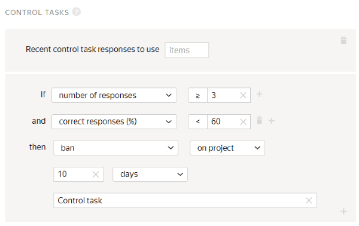

# Project 1. Does the photo contain a certain object?

In this [project](../../glossary.md#project), you will ask Tolokers if there are shoes in the photo.

## Create a project {#create_project}

To create a project, open [Toloka for requesters]({{ yandex-toloka }}).

#### In the interface:

1. Choose a template:

    1. Click **Create project**.

    1. Select the **Image classification** template.

1. Provide general information:

    1. In the **Name for Tolokers** field, enter `Are there shoes in the photo?`.

    1. In the **Description for Tolokers** field, enter `Look at the picture and answer if there are shoes in it.`.

    1. Optionally add a **Private comment**.

    1. Save the changes.

1. Edit the task interface in the editor you selected:

    

    - Template Builder

      1. The task interface describes how the elements should be arranged in the task.

          The template has pre-configured validation. The Toloker won't be able to submit a response without selecting one of the options.

          For more information, see the Template Builder Help:

          - [Setting up conditions](../../template-builder/best-practices/conditions.md).

          - [Image classification](../../template-builder/templates/image-classification.md) template.

      1. On the **Configuration** panel, replace lines 19 to 28 in the code:

          

          ```json
          "label": "What is the cat's mood?",
          "options": [
          {
          "label": "Good",
          "value": "ok"
          },
          {
          "label": "Bad",
          "value": "bad"
          },
          ```

          

          with the following:

          

          ```json
          "label": "Are there shoes in the image?",
          "options": [
          {
          "label": "Yes",
          "value": "ok"
          },
          {
          "label": "No",
          "value": "bad"
          },
          ```

          

      1. Click **Show specifications** to see the input and output data fields.

          Input data fields are created from the code on the **Example of input data** tab.

          The output data fields depend on the components that use `data.output` and values supported by it.

          Learn more about [input and output data fields](../../template-builder/operations/create-specs.md) in the Template Builder Help.

          - Input data field: `image` — A link to an image.

          Change the data type to string to add links to your files.

          - Output data field: `result` — string for saving the Toloker's response.

          

          **Input data** is types of objects that are passed to the Toloker for completing the task. For example, this could be a text, an image, or geographic coordinates.

          **Output data** is types of objects that you receive after the task is completed. For example, this could be one of several response options, typed text, or an uploaded file.

          If you add interface elements to the task template, the corresponding fields in the **Data specification** block will be created automatically.

          

    - HTML/CSS/JS editor

      1. In the **Task interface**, edit the **HTML** block.

          - After the image line, add the question:

              `<div>Are there <b>shoes</b> in the picture?<div>`

          - Change the labels on the response options: **Good** → **Yes**, **Bad** → **No**:

          

          ```html
          {{img src=image width="100%" height="400px"}} <div>Are there <b>shoes</b> in the picture?<div>

          {{field type="radio" name="result" value="OK" label="Yes" hotkey="1"}}
          {{field type="radio" name="result" value="BAD" label="No" hotkey="2"}}
          {{field type="radio" name="result" value="404" label="Loading error" hotkey="3"}}
          ```

          

      1. Leave the **JS**, **CSS**, and **Data specification** blocks unchanged.

          Learn more about the **Specification** parameters in [Input and output data](incoming.md).

      1. Click  to see the Toloker's view of the task.

          

          The project preview shows one task with standard data. You can define the number of tasks to show on the page later.

          

      1. In the window that opens, check if the task options work correctly. In the lower-right corner, click **Submit**.

      1. Exit preview mode.

          In the lower-left corner, click **Exit**. If there were errors when testing, check the code blocks that you entered.

    

1. Save the changes.

1. In the **Instructions for Tolokers** field, enter the [instructions](../../glossary.md#instructions) and add an image.

    1. **Instructions:**

        

        ```plaintext
        Look at the picture and determine if there are **shoes** in the picture.
        If there are, click **Yes**.
        If there aren't, click **No**.
        For example, there are shoes in the photo, so the correct answer is **Yes**.
        ```

        

    1. To add an image, click  and provide a link to the image you want to use as an example.

    1. Save the changes.

1. To go back to the **Projects** page, click **Finish editing**.

Learn more about working with the project in the [Project](project.md) section.

## Create a pool {#create_pool}

To create a [pool](../../glossary.md#pool):

1. Open the page of the project titled **Are there shoes in the photo?**.

1. Click the **Add pool** button.

1. Specify the **pool name**.

1. (optional) Add a **Private comment**. This information is available only to you.

1. In the **Tolokers** section of the **Audience** block, filter Tolokers by language:

    1. Click **Add filter**.

    1. Find the **Toloker profile** block in the list and choose the **Languages** skill.

    1. In the **?** field specify `=`.

    1. In the **Value** field, specify **Russian**.

    Tasks in pools will automatically be available in the web version of Toloka and the mobile app. If you want to change the default settings and limit the visibility of the task for any of the versions, add the **Client** filter and select the desired value: **Toloka web version** or **Toloka for mobile**.

1. (optional) In the **Speed/quality balance** section, specify the desired quality level. Improving quality may reduce the speed of task completion because the pool will be available to fewer Tolokers. Learn more in the [Speed/quality balance](adjust.md) section.

1. Enter `0.01` in the **Price per task suite** field in the **Price** block.

1. In the **Quality control** block, specify [quality control](../../glossary.md#quality-control) settings for the pool:

    1. Click **Add a quality control rule**.

    1. Find the **Rules** block in the list and choose **Control tasks**.

    1. Set a rule for control tasks: If the **number of responses** to control questions **is greater than or equal to 3** and the **percentage of correct responses** to control questions **is less than 60**, then **restrict the Toloker's access** to the **project for 10 days**. Specify the **Control task** as a reason.

        

        Learn more in [Quality control](control.md).

1. Enter `3` in the **The number of Tolokers to complete each task** field in the **Task overlap** section.

1. Enter `300` in the **Time per task suite** field in the **Additional settings** block.

1. Click **Create a pool**.

## Upload tasks {#upload_file}

Prepare your own task file. Check out the example in [the demo file](https://download.cdn.yandex.net/from/yandex.ru/support/ru/toloka-requester/files/dataset-shoes.tsv). In the Toloka interface under the pool name, there are links to **file** templates for regular, control, and training tasks.

To upload tasks:

1. Click **Upload**. In the window that opens, you can also download a sample file.

1. In the window that opens, configure the file upload settings:

    1. Choose **Smart mixing**.

    1. In the **General tasks** field, specify `9`.

    1. In the **Training tasks** field, specify `0`.

    1. In the **Control tasks** field, specify `1`.

    1. Click **Upload**.

    1. In the window that opens, choose the [file](../../glossary.md#tsv) with tasks to upload and click **Open**.

    1. In the window that opens, check the number of tasks and click **Add**.

1. Create a [control task](goldenset.md).

    1. Click **Edit**.

        

        If you selected something else instead of **smart mixing**, click **Edit**. If this button is missing, delete the file and upload it again.

        

    1. In the window that opens, click **Create control tasks**.

    1. In the window that opens, in the column on the left, turn on the **result** option.

    1. Choose the correct answer to the question.

    1. Click **Save and go to next**.

    1. Click **Are there shoes in the photo?** to exit the [task markup](../../glossary.md#task-markup) mode.

        

        In small pools, [control tasks](../../glossary.md#control-task) should be 10-20% of all tasks. Include different versions of correct responses in equal amounts. See the distribution of responses on the **Edit tasks** page, **Control tasks** tab.

        

1. Click  to start the pool.

    

    The tasks will be completed by real Tolokers in Toloka. Recheck your project setup before you start the pool.

    

## Get the results {#get_results}

To get the results:

1. Next to the **Download results** button, click .

1. Choose the **Dawid-Skene aggregation model**. Learn more about [Result aggregation based on the Dawid-Skene model](result-aggregation-dawid-skene.md).

1. In the window that opens, click **Yes**.

1. At the top of the page, click **View operations list**.

    

    To track the progress, refresh the page from time to time. Aggregation takes from 5 to 20 minutes. You can start designing another project meanwhile.

    

1. When the operation is complete, download the file with the results. To do this, click **Download** in the **Files** column.

1. Use the file with the results in [project 2](find_an_item_in_store.md).

## What's next {#what-next}

- Create [Project 2](find_an_item_in_store.md) to search for similar items in an online store.

