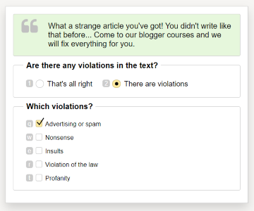
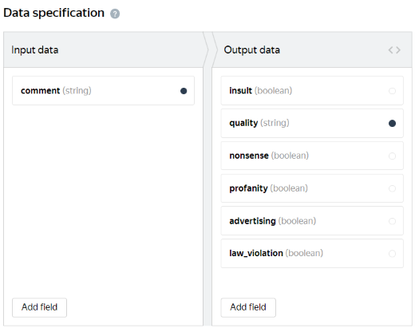
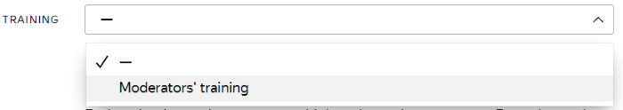

# Sentiment analysis and content moderation

This [project template](../../glossary.md#project-template-ru) works well for content moderation, when you need to check the text for compliance.

Use this template when you need to:

- Moderate comments and nicknames on a forum.
- Check ads on a site, product reviews in a store, or messages in social networks.
- Check for the presence of a brand or company name.

#### More types of content

- News. You have a news site where visitors leave comments on the news. Analyze the comments and decide whether to display them on the site.
- Social networks. Classify social media posts by several attributes.
- Text features. Evaluate the emotion and tone of the comment.
- Toxicity of comments. Evaluate if the comment is toxic.
- Toxic level of comments. For each comment, select the toxicity level corresponding to its content.
- Value of the text (if the text is useful). Determine if the message contains spam.
- Online stores: content moderation. Determine which of the suggested attribute values is the best for a specific product.
- Moderation of comments complained about. Evaluate the comments that other users of the social service consider unacceptable and decide if they should be banned.
- Moderation of messages. Check comments for offensive language, illegal content, spam, and advertising.
- Moderation of sport comments. Specify if the comment meets the moderation rules in a particular area or service.
- Meaningfulness of information. Check comments from a variety of sources for meaningfulness and label them.
- Yandex.Market comments.

For example, if you have a blog and you want to moderate comments on a new post that collected a lot of negative feedback, check the text comments for violation of the rules: insults, violations of the law, spam and advertising.



Run the project in the [Sandbox]({{ sandbox }}) first. This helps you avoid making mistakes and spending money on a task that isn't working right.




#### Example of a prepared task


## Before you start {#before_start}

If you have a complex project, register in the [sandbox](sandbox.md) and create a project there. There you can:

1. Test the project settings as a Toloker.
1. [Transfer](sandbox.md#export) them to the **production version**.

This helps you avoid making mistakes and spending unnecessary money on a task that doesn't work.

## Create a project {#create_project}

In the project, you define what the task will look like for the Toloker.

#### In the interface:

1. Click **+ Create a project** and choose the **Sentiment analysis & Сontent moderation** template.

1. Provide general information:

    1. Enter a clear name and a short description for the project. Tolokers will see this in the task list.

    1. Optionally add a **Private comment**.

    1. Click **Save**.

1. Edit the task interface:

    

    This tutorial shows how to create a task interface in the **HTML/JS/CSS editor**. You can try creating a task interface in [Template Builder]({{ tb-quickstart }}).

    

    1. Define which objects you are going to pass to the Tolokers and which one you want to receive from them in response. To do this, add input and output fields in the **Specifications** block.
    #### What are input and output data?

    **Input** — Types of objects the Toloker receives for the task completion. In this template, you need text. In other tasks, it can be a picture or geographical coordinates.

    **Output data** is types of objects that you receive after the task is completed. For this template, it is one of the two response options. If the Toloker chooses the second response, a list of checkboxes opens — the Toloker should choose appropriate options from them. In other tasks, the output data can contain entered text or an uploaded file, for example.

    Learn more about [input and output data fields](incoming.md).

    In this case they are:

    - Input data: `comment` field, text for checking.
    - Output data: the `quality` string to record the selected response option from the field “Are there any violations in the text?”. Other fields: types of violations. You can use this list of fields or customize it for your tasks.

    #### Graphic mode
    
    #### JSON

    Input data

    ```json
    {
    "comment": {
    "type": "string",
    "hidden": false,
    "required": true
    }
    }
    ```

    Output data

    ```json
    {
    "insult": {
    "type": "boolean",
    "hidden": false,
    "required": false
    },
    "quality": {
    "type": "string",
    "hidden": false,
    "required": true
    },
    "nonsense": {
    "type": "boolean",
    "hidden": false,
    "required": false
    },
    "profanity": {
    "type": "boolean",
    "hidden": false,
    "required": false
    },
    "advertising": {
    "type": "boolean",
    "hidden": false,
    "required": false
    },
    "law_violation": {
    "type": "boolean",
    "hidden": false,
    "required": false
    }
    }
    ```

    Create the task interface in the **HTML** block. It describes how the task elements should be arranged in the task.

    The HTML interface uses standard HTML tags and [special components](spec.md) in double (or triple, as for the `comment` field) curly brackets for input and output data fields.
    
    ```html

    {{{comment}}}

    {{field type="radio"name="quality" value="OK" size="L" label="Everything is fine" hotkey="1" class="yes"}}
    {{field type="radio" name="quality" value="BAD" size="L" label="Violations found" hotkey="2" class="no"}}

    {{field type="checkbox" name="advertising" label="Ads or spam" hotkey="q"}}
    {{field type="checkbox" name="nonsense" label="Nonsense" hotkey="w"}}
    {{field type="checkbox" name="insult" label="Insults" hotkey="e"}}
    {{field type="checkbox" name="law_violation" label="Illegal content" hotkey="r"}}
    {{field type="checkbox" name="profanity" label="Profanity" hotkey="t"}}

    ```
    
    This notation describes the following task design:

    - The text of the comment to check at the top.
    - Two radio buttons, the chosen value is recorded in the `quality` field.
    - Five check boxes that appear if you select the second switch. The chosen checkbox options are written to the fields with the corresponding name in the result.

    1. Click  to see the Toloker's view of the task.

    

    The project preview shows one task with standard data. You can define the number of tasks to show on the page later.

    

    1. Save the changes.

1. Write instructions for Tolokers:

    1. Write short and clear guidelines (see the [recommendations](faq.md)). Describe what needs to be done and give examples in them.

    You can prepare instructions in HTML format, then copy and paste into the editor. Click **<>** to switch to HTML mode.

    1. Click **Finish**.

## Adding a task pool {#add_pull}

A pool is a set of paid tasks sent out for completion at the same time.

1. On your new project page, click **Add pool**.
1. Give the pool any convenient name and description. They are available only to you, the Toloker sees only the project name and description.
1. In the **Audience** block, add **Filters** to select Tolokers. If the instructions, the task interface and the comments themselves are in Russian, use the “Russian-speaking Tolokers” set. If you plan to analyze comments in English or another language, add the `Language = English` filter to them

    Tasks in pools will automatically be available in the web version of Toloka and the mobile app. If you want to change the default settings and limit the visibility of the task for any of the versions, add the **Client** filter and select the desired value: **Toloka web version** or **Toloka for mobile**.

1. You can leave the **Speed/quality balance** section unchanged.
1. In the **Price** block, set the price per task suite (for instance, $0.02).
    #### What is a task suite?

    A task suite can contain one or several tasks that are shown on the same page. If the tasks are simple, you can add 10-20 tasks per suite. Don't make pages too long because it slows down loading speed for Tolokers.

    Tolokers get paid for completing the entire task suite.

    The number of tasks per suite is set when [uploading tasks](#load_tasks).

    #### What is a fair price for a task suite?

    The general rule of pricing is the more time the Toloker spends to complete the task, the higher the price is.

    Register in Toloka as a Toloker and find out how much other requesters pay.

1. Set up **Quality control**. [Quality control rules](control.md) allow you to filter out careless Tolokers. You can also [set up quality control in the project](project-qa.md). You won't need to **review the assignments**.

    Typical settings for the content moderation task:

    #### Fast responses

    Add a block and specify the following values:

    

    **How do I determine the fast response time?**
    Complete your task and record the time. If you ban users for one fast response, then set a minimal time. If you do it after several fast responses, increase the time slightly.

    

    #### Control tasks
    Specify the following values:
    A Toloker who gives more than 40% of incorrect responses will be blocked and won't be able to complete tasks in this project for 10 days.

    Advanced settings:

    #### Captcha
    Example of the rule configuration.
    A Toloker who entered a captcha at least 5 times and the percentage of correct answers is less than 60% is banned and can't complete your tasks for 10 days.

    #### Majority vote
    [Examples](mvote.md#examples) of the **Majority vote** rule configuration. Choose appropriate actions and parameters.

1. Configure normal or dynamic overlap:

    - **Overlap** is the number of Tolokers to complete the same task. For content moderation tasks, 3-5 is an appropriate value. In this case, it makes sense to use [Aggregation of results](result-aggregation.md) to check the reliability of responses.
    - [Dynamic overlap](../../glossary.md#dynamic-overlap-ru) (incremental relabeling, IRL). It will help you optimize your budget for getting the most reliable responses. [Example of settings](dynamic-overlap.md#example).

    For this parameter to work, you need to load tasks using **Smart mixing**.

1. In the **Additional settings** block, specify **Time** allowed for completing a task suite. It should be long enough to read the instructions and wait for task data to download. For example, 150 seconds.
1. Save the pool.

## Uploading tasks {#load_tasks}
 
Download the sample upload file. You can find it on the pool page. There are links to **files** with regular, control, and training tasks. Use it to prepare your own [file](../../glossary.md#tsv-file-definition-ru) with tasks.

1. Click **Upload**. In the window that opens, you can also download a sample file.
1. Add input data in it. The header of the input data column contains the `INPUT` word. Add the comments you want to check in it. Leave the other columns empty.
    This is the beginning of the file with the tasks for checking comments:

1. Load the tasks and choose **Smart mixing**.
    #### What is smart mixing?
    The task distribution logic that places tasks of different types on the same page. For example, one control task per three general tasks. If you have a lot of comments, set one control task per 9-10 regular comments on the page.

1. Mark up control tasks.
    - Click .
    

    If you selected something else instead of **smart mixing**, click **Edit**. If this button is missing, delete the file and upload it again.

    

    - Add the correct responses in the control tasks. There should be as many as you set in the settings above.

    - Go back to the pool or project page from the menu bar at the top. The uploaded and marked up tasks will be saved.


## Adding a training {#education}

A training pool is a set of unpaid training tasks where the Toloker learns to answer correctly. Training tasks contain correct responses and a hint shown if the Toloker answers incorrectly.



Write clear instructions. Criteria for good and bad comments on different resources differ, and you need to explain to the Tolokers what and how they should check in the tasks.




1. Open the [project](../../glossary.md#project-ru) page, go to the **Training** tab and click **Add training**.

1. Give a name to the training pool and set the time for completing a task suite.
1. Save the pool by clicking **Create training**.
1. Get the **Sample upload file** or edit the one you used for uploading the main pool tasks.
    

    Files for all project pools have the same structure.

    

1. Add comments to include in training in the file.
1. Upload the file and specify the number of tasks on the page. For example, 2. This number must not exceed the number of tasks per suite in the linked pool.
1. Click **Download** and enter the number of training tasks on the page.
1. Click **Add**.
1. Click . Next, add correct answers and hints for all the uploaded tasks. [Why do I need markup?](task-markup-by-yourself.md).
1. After the file is uploaded, open the **Preview** and check that the tasks are displayed correctly.
1. Link training.

    - Open the main pool.
    - Click **Edit**.
    - Choose the name of the training you just created.
    
1. Set the **Level required** to 70. This means that the main pool will be available for users who made no more than 30% of mistakes in the training pool.

1. Click **Save**.

Learn more [about creating a pool with training](train.md).

## Starting a pool and getting results {#pull_launch}

1. Start the training pool first, then the regular pool. From the pool page, you can do this by clicking . From the project page — click  next to the pool name.
1. Track the completion of tasks in the **Pool statistics** section. If you created a project in the sandbox, you can test it [by yourself](sandbox.md#self).
1. When the pool is fully completed, start aggregation of results. Next to the **Download results** button, click .
    In the file with aggregated responses, you can see the response significance in percentage in the `CONFIDENCE` field. It helps you understand how reliable the comment evaluation is. Learn more [about aggregation](result-aggregation.md).

1. Track the aggregation progress on the **Operations** page (next to the **Download results** button: ). When the process is completed, click **Download**.


## Troubleshooting {#troubleshooting}

#### How do I show two different versions of the text to Tolokers?

If you pass texts to the input data, you can upload 2 different tasks to the pool: pass Text 1 in the `INPUT: <input field name>` field of Task 1. In Task 2, use this field to pass Text 2.

If the text is in the HTML block of the task template, then clone the project. To limit a Toloker to doing only one task in your project, use the [Submitted responses](submitted-answers.md) rule. You can assign a skill or ban the Toloker after they submit one response.

