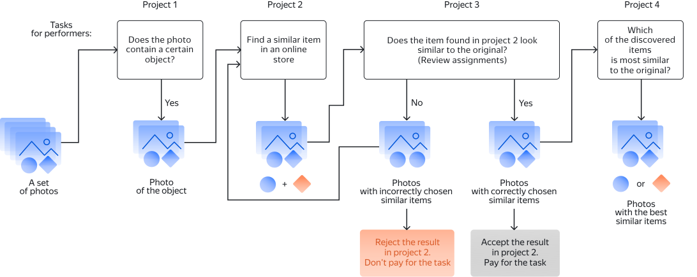

# Business information (example with decomposition)



Run the project in the [Sandbox]({{ sandbox }}) first. This helps you avoid making mistakes and spending money on a task that isn't working right.



This is an example of taking a task for collecting relevant data and decomposing it into multiple projects. Decomposition can improve the quality of results and reduce the cost of performing complex tasks.

_Collecting relevant data_ is a task to search for matching data. Let's say you have photos of clothes and shoes and you need to find similar shoes in an online store. But you don't know if there are shoes in all the photos and want to filter them first. Next, you need to find similar shoes in the online store. You also want to check the Tolokers' responses yourself afterwards. To get the final result, you need to compare the found shoes with the original image and decide which pair is most similar.

You can use the projects described below either together to set up a unified process or separately (for example, only to identify objects in photos).

- [Project 1](contain_item.md): Use this project if not all images contain the object you are looking for and you want to filter them.

- [Project 2](find_an_item_in_store.md): In this project, Tolokers will search in an online store for shoes that are similar to the ones shown. Use the results from project 1 as source images.

- [Project 3](item_look_similar.md): In this project, Tolokers will compare the shoes from the original image (in project 1) with the shoes found in project 2.

- [Project 4](item_more_similar.md): In this project, Tolokers will compare the found shoes with the original image and decide which pair is most similar.





See the complete code for all projects in the [Appendix](appendix-expanded-code.md).



Each project consists of the following basic steps:

1. **Create a project**. In the project, you describe the [input and output data](../../glossary.md#input-output-data), [task interface](../../glossary.md#task-interface), and [instructions](../../glossary.md#task-instruction) for completing a task.

1. **Create a [task pool](../../glossary.md#pool) in the project**. In the pool, you set up [quality control](../../glossary.md#quality-control) and [filters](../../glossary.md#filtering) for Tolokers.

1. **Upload a [file](https://tlk.s3.yandex.net/wsdm2020/dataset_1.tsv) with tasks to the pool**.

1. **Start the pool**.

1. **Obtain and aggregate the results**.

Find out how to top up your account in the relevant section: [For non-residents of Russia](refill.md).

Learn more about how to [set up pricing](dynamic-pricing.md#section_wb1_lhl_vlb).

## What's next {#what-next}

- Create [Project 1](contain_item.md) to filter images.
- Create [Project 2](find_an_item_in_store.md) to search for similar images.
- Create [Project 3](item_look_similar.md) to compare the original image with the results from Project 2.
- Create [Project 4](item_more_similar.md) to compare matching images.
- Learn more about [decomposition](solution-architecture.md).

### Frequently asked questions {#problem-solution}



Create an additional field in the input specification, for example, `my_val` and assign it the string array type to pass the desired list of values to it.

The loop inside the template will look like this:

```html
{{#field type="select" name="result"}}
{{#each ../my_val}}
{{select_item value=this text=this}}
{{/each}}
{{/field}}
```



