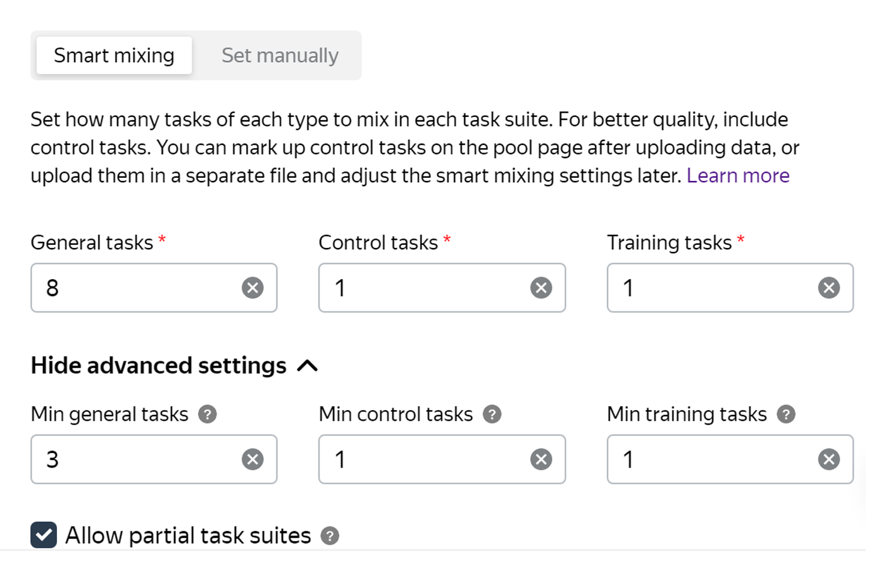

# Ways to combine tasks in suites

There are few ways to combine tasks into suites. You can choose a suitable way, and also specify the values of additional settings.

##  Set manually  {#by-empty-row}

Enter the number of tasks per suite. Task suites are formed from the tasks in the order they are placed in the file.

This method is appropriate if you need your tasks to have a certain number of suites and don't want to divide them into suites yourself.

##  Smart mixing  {#smart-mixing}

Specify how many tasks of each type should be in each task suite. For example, 8 general tasks, 1 training and 1 control task. If necessary, specify the minimum number of tasks for each type in additional settings.

#### When to use

This method is useful if the created pool:

- Contains [control](../../glossary.md#control-task-ru) or [training](../../glossary.md#training-task-ru) tasks in addition to the [general](../../glossary.md#general-task-ru) tasks.
- Has [dynamic overlap](dynamic-overlap.md) (incremental relabeling, IRL) enabled.

#### Sample settings

#### Features

- Tasks are divided into lists: regular, control, and training.

- The number of tasks of the given type that you specified in the settings is added from each list. By default, tasks are randomly selected.

- If the **Keep task order** option is enabled, tasks are added in the same order as they were listed in the source file. This takes into account the overlap: the task that goes first will be assigned until it reaches the desired overlap.

- Tasks in the suite are mixed up before the page is shown to the Toloker.

- If there aren't enough general tasks and the **Assign partial page** option is set, the Toloker is given an [incomplete task suite](../../glossary.md#incomplete-page-ru). Please note that the number of control and training tasks in this case must be complete.



If you upload a file via “Smart mixing”, you won't be able to use other ways of task distribution on the pages in this pool.



After uploading the tasks with **smart mixing** you will be able to [mark up tasks](task_markup.md) and set selective [majority vote checking](mvote.md).

#### Smart mixing and keeping the task order

[More info](save-order.md) about keeping task order.

#### Smart mixing without "Keep task order"

If the **Keep task order** option is disabled, task suites won't be formed in order (from top to bottom), and users will get different control tasks within identical suites.

#### Smart mixing + "Keep task order"

If the **Keep task order** option is enabled, task suites will be formed in order (from top to bottom) and users will get the same control tasks within identical suites.

## How to distribute tasks as suites {#smart-mixing}
Characteristics/upload type | Set manually | Set manually (keep task order) | Smart mixing | Smart mixing (keep task order)
----- | ----- | ----- | ----- | -----
To generate task suites, tasks are taken in the order of rows (from top to bottom) in an uploaded file | Yes | Yes | No | Yes
Tasks are mixed within a suite | No | No | Yes | Yes
Task suites are distributed to Tolokers in the same order | No | Yes | Yes | Yes
Within identical task suites, control tasks are the same for all Tolokers | Yes | Yes | No | Yes

## Control tasks {#gs}

#### How many control tasks do I need to add?

We recommend adding at least 1% of control tasks in the pool. And for small pools — 5-10%.

#### Why's that?

Each control task is shown to the Toloker only once. If you use smart mixing, you determine how many control tasks should be in a suite. If each suite contains one control task, then the maximum number of suites the Toloker can complete is equal to the number of control tasks in the pool. If you increase the number of control tasks in a suite, the number of suites available to the Toloker decreases by the same number.

There shouldn't be too few pages available. Otherwise:

- You won't be able to correctly evaluate the quality of the Toloker's responses.
- The Toloker won't be interested in completing such tasks because they'll spend a lot of time studying instructions but won't earn much.

#### Example

#### A large pool with 1% of control tasks (good)

There are 10,000 tasks in the pool, and 100 of them are control tasks (1%). Each suite contains 10 tasks, and 1 of them is a control task. Hence, a user can complete up to 100 suites.

#### A small pool with 1% control tasks (bad)

There are 100 tasks in the pool, and 1 of them is a control task (1%). Each suite contains 10 tasks, and 1 of them is a control task. Hence, each user can only complete 1 suite.

#### A small pool with 10% control tasks (good)

There are 100 tasks in the pool, and 10 of them are control tasks (10%). Each suite contains 10 tasks, and 1 of them is a control task. Hence, each user can complete up to 100 suites

If there are few control tasks in the open pool, [add new control tasks](../troubleshooting/pool-setup.md#add-gs).

#### What for

In a large pool with few control tasks, a situation might occur when users who have completed a lot of tasks in the project stop getting new task suites. This happens when the Toloker completes all control tasks in the pool.



To filter out Tolokers, use the [Control tasks](control.md) quality control rule. To rank Tolokers by the quality of responses in control tasks, use a [skill](nav.md).



#### Setting overlap

If you upload tasks from the Toloka interface, infinite overlap is set automatically for control and training tasks, so that there is enough to mark up all general tasks.

You can set the overlap via the [Toloka API](../../glossary.md#api-yandex-toloka-ru) or use the way to combine tasks **Set manually**.



Set infinite overlap for control tasks.

If another overlap value is set, control tasks may end during labeling and the pool will stop being labeled.



## Tips and recommendations {#tips}

- If you used **Set manually**, you can find out the number of tasks per suite in the pool settings. But some suites may be [incomplete](../../glossary.md#incomplete-page-ru).

- If you uploaded tasks in a different way, you can check how they're grouped into suites in the Toloka interface for requesters. To do this, on the pool page, click **files** → **Download all tasks**. You can also check task distribution across suites using the [Toloka API](../../glossary.md#api-yandex-toloka-ru).

## Troubleshooting {#troubleshooting}

#### How do I specify smart mixing settings in the interface when uploading a file?

Smart mixing settings are specified for the file rather than for the pool.

The settings specified during the first file upload are applied to all the files that are uploaded to this pool later on.

#### What is the maximum number of tasks per suite?

It depends on the task. Technically, you can use as many tasks you want.

But users are reluctant to take lengthy tasks. They'd rather do 10 tasks that take one minute each than one task that takes 10 minutes.

In addition, if you use a large number of tasks on the page, there might be issues with uploading the files to be labeled. This problem might occur with images.

The third thing to consider is quality control and assignment review. If you use recompletion of assignments from banned users, you should split the task into smaller parts so that fewer assignments are recompleted. You are more likely to meet your budget this way.

#### The same task appeared on different pages

The same task may appear on different pages if:

- Dynamic overlap is used (incremental relabeling, IRL). As an example, let's say there were 5 tasks on a page. For 4 of them, responses coincided and the common response was counted as correct. The fifth task was mixed into another set because it didn't get into the final response and it needs to be “reassessed”.
- Different tasks have different overlap. Tasks with higher overlap will be additionally shown in sets with the other remaining tasks in the pool.
- If a [quality control rule](../../glossary.md#quality-control-rules-ru) changes a task's overlap, it will appear in a different set.

#### How do I upload the file with the accepted assignments back to Toloka for projects with non-automatic acceptance? Where do I find the format of the upload data?

Use the button **Upload review results** to upload your file. You can see the format [here](accept.md).

Assignments are reviewed in a file.

