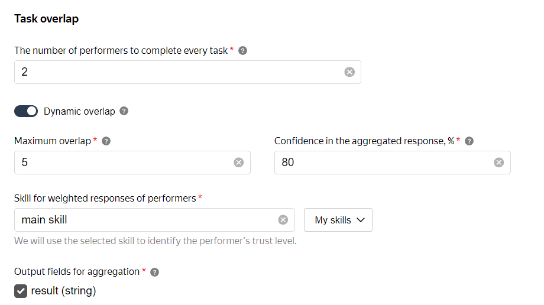

# Dynamic overlap

## Theory {#theory}

Dynamic overlap lets you change overlap depending on:

- How well the Tolokers do on the task.
- How well Tolokers' task responses match each other.

First the task is distributed with minimal overlap. As Tolokers complete the task, their responses are assigned confidence. If it is less than specified in the **confidence in aggregated response** field, overlap will be increased until confidence reaches the set value, or overlap reaches the maximum.

Dynamic overlap uses 5 main parameters:

1. **Overlap** is the minimum number of Tolokers who should complete each task in the pool.

1. **Maximum overlap** is the maximum number of Tolokers who should complete each task in the pool.

1. **Confidence in aggregated response** is the percentage of confidence required to stop showing the task to Tolokers.

    When **confidence** reaches the required level, the system considers the task response correct and stops collecting other Tolokers' responses.

1. **Skill** reflects how much you trust the Toloker's responses.

1. **Output fields for aggregation** are output data fields that are used to calculate confidence in the response.



Terms

- $q[i]$ is a Toloker's accuracy.
- $K$ is a smoothing constant.
- $z[j]$ is the most popular task response.
- $z[x]$ — the probability that the estimate is correct
- $EPS,$ — confidence in the aggregate response

A Toloker's accuracy $q[i]$ is calculated as:

$q[i] = \frac{K+correct.golden.sets[i]}{2×K+total.golden.sets[i]}$

Where:

$K$ is a smoothing constant (starting from 0.5) if there are not enough responses to control tasks.

If there are several estimates, the most popular task response is determined by adding together $q[i]$ of the Tolokers who selected each task response option. The task response with the largest total is considered more correct. Let's call this estimate $z[j]$.

[Using Bayes' theorem]({{ baies }}), we calculate the posterior probability that the estimate $z[j]$ is correct.

A uniform distribution of estimates is assumed a priori. For the $z[x]$ the a priori probability is calculated as $P(z[x]) = \frac{1}{Y}$

where:

$Y$ is the number of task response options.

Next, we calculate the probability that the estimate $z[j]$ is correct.

If the Toloker responded $z[j]$, then the probability of this is equal to the Toloker's accuracy $q[i]$. If they responded differently, then the probability of this is:

$\frac{1-q[i]}{Y-1}$

Where:

$(1-q[i])$ is the remaining probability;

$(Y-1)$ is the number of remaining task responses.

It ensures that the probability of an error is distributed evenly among the remaining estimates.

We take all Tolokers' task responses and, for example, option $z[x]$ and calculate the probability that Tolokers will select this task response, provided that the correct task response is $z[x] estimate,$:

```javascript
func z_prob(x int) : float {
    d = 1,0
    for w[i]: workers
         if answers[w[i]] == z[x]
            d *= q[i]
         else
            d *= (1 - q[i]) / (Y - 1)
    return d
}
```

Next, using Bayes' theorem, we calculate the probability that the task response $z[j]$ is correct:

```javascript
r = 0
for z[i]: answer_options
    r += z_prob(i) * (1 / Y)

eps = z_prob(j) * (1 / Y) / r
```

Next, we look at $EPS,$. If the expected result is less than the value of $EPS,$ we increase overlap until the result is equal to the confidence in the aggregated response or overlap reaches the maximum.



## Practice {#practice}

Before setting up dynamic overlap, you need to prepare the output data fields.



- Strings and numbers with allowed values.

    The allowed value must match the `value` parameter in the corresponding interface element.

- Boolean.

- Integers with minimum and maximum values. The maximum difference between them is 32.

    If there are too many possible task responses in the output field, the dynamic overlap mechanism won't be able to aggregate the data.





- Array.
- File.
- Coordinates.
- JSON objects.



#### Setting up overlap

1. [Create a pool](pool-main.md) and fill in the [parameters](pool_poolparams.md).

1. Set the minimum overlap in the **Overlap** field.

1. In the advanced settings, enable the **Use dynamic overlap** option.

1. Set **Max overlap**.

1. Specify **Confidence of aggregated response**. The higher the value, the more matching Tolokers' responses are needed for the aggregated response. Set this value to at least 70.

1. Choose **Skill for users' scoring**.

1. Check **Output fields for answers agreement**.

1. Save the pool.

1. Upload tasks via [smart mixing](distribute-tasks-by-pages.md#smart-mixing).

1. After the pool is completed, start [Aggregation of results by skill](result-aggregation.md#aggr-by-skill).



**Approximate budget** in the [pool statistics](pool_statistic-pool.md) is calculated based on the minimal overlap.





Configuring dynamic overlap for [simple classification](../tutorials/image-classification.md).



The `result` has three allowed values: `OK`, `BAD`, and `404`.

#### Task 1

Toloker _A_ with a skill value of 70 responded with `OK`.

Toloker _B_ with a skill value of 90 also responded with `OK`.

The confidence in the aggregated `OK` response is 97.7. The task is considered completed.

#### Task 2

Toloker _A_ with a skill value of 70 responded with `OK`.

Toloker _B_ with a skill value of 90 responded with `BAD`.

The confidence in the aggregated `BAD` response is 76.1. The overlap is increased by 1.

Toloker _C_ with a skill value of 80 responded with `BAD`.

The confidence in the aggregated `OK` response is 96.2. The task is considered completed.



## Tips and recommendations {#help}

- Don't use the [Recompletion of assignments from banned users](restore-task-overlap.md) quality control rule together with dynamic overlap. This increases the maximum overlap value.

- Set confidence in the aggregated response at between 70 and 95 percent.

    - When the value is `< 70%`, the average accuracy of the aggregated response isn't sufficient to trust the Tolokers' responses.

    - When the value is `> 90%`, the average accuracy of the aggregated response doesn't increase, and the labelling costs increase.

    Optimal confidence is at 80% for the best “price/quality” ratio.

- Upload tasks via **smart mixing**. Otherwise, the tasks are assigned with minimum overlap.

    This is necessary for overlap to increase because [control](../../glossary.md#control-task) and [training](../../glossary.md#training-task) tasks uploaded via **smart mixing** have infinite overlap.

- Use a skill calculated as the [percentage of correct responses to control tasks](goldenset.md). This will give you the most accurate results.

- If you edit a required field, the changes apply only to new pools. Existing pools will continue using the previous version of the project.

## What's next {#what-next}

- [Adding tasks](pool.md) in the pool.

- Learn more about how to set up overlap:

    - Selective [majority vote](selective-mvote.md) control.

## See also {#see-also}

- [{#T}](distribute-tasks-by-pages.md)
- [{#T}](pool-main.md)
- [{#T}](result-aggregation.md)

## For developers {#for-developers}

- [Toloka-Kit: Dynamic overlap setting](../../toloka-kit/reference/toloka.client.pool.dynamic_overlap_config.DynamicOverlapConfig.md)

## Troubleshooting {#troubleshooting}







