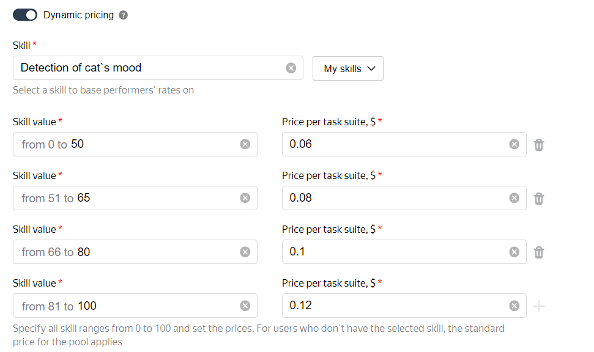

# Setting up pricing

The price is indicated per [task suite](../../glossary.md#task-suite) in US dollars. For cents, use the dot (“.”) as a separator.

If the **Pool type** is **General tasks**, the minimum price per task suite is $0.005. For other pool types, you can set the price to zero. The fee is 30% of the price, but not less than $0.005.

In Toloka, there are two ways to set the task price:

- _Fixed pricing_: Sets the price per task suite. The price will be the same for any Toloker, regardless of their [skills](../../glossary.md#skill) and experience.

- _Dynamic pricing_: Allows you to additionally set other prices that depend on the Toloker's skill. For example, to pay more to those who have a higher skill.

    Create a skill, and then assign it to Tolokers automatically or manually. For more information, see [Skills](nav.md). [How do I set up dynamic pricing?](dynamic-pricing.md#section_ucl_3hl_vlb)

## How do I determine the optimal price? {#section_wb1_lhl_vlb}

Every Toloker wants to earn more, so it is difficult to give exact figures. To find out the price to set, answer a few questions:

- Turn on the stopwatch and measure how long it will take to read the [instructions](../../glossary.md#instructions) and complete several of your tasks. Calculate how many task suites you would complete in an hour and think what price would be fair.

- If your task is not urgent, set a minimum price and see how many Tolokers get interested. This way you can determine the optimal price based on the demand for your tasks.

- [Register]({{ register-toloka }}) as a Toloker (you will need an additional account on Yandex) and estimate the average earnings per hour for different tasks. Try to find tasks similar to yours.



The high task price doesn't guarantee a good quality of the result. Increasing the price allows you to attract more Tolokers, but the quality of the result depends on the quality of the Tolokers themselves. Good Tolokers can be paid more using dynamic pricing.



## Setting up dynamic pricing {#section_ucl_3hl_vlb}

To set up dynamic pricing:

1. For dynamic pricing, you need a skill. Learn how to create and assign skills in the [Skills](nav.md) section.

    To increase the Toloker's motivation, make the skill [public](nav.md#public). The Toloker will see the full list of prices and their level.

1. When creating or editing a [pool](../../glossary.md#pool), go to the **Price per task suite, $** section.

1. Specify a fixed price for the task. This price will be used if the skill is not assigned to the Toloker.

1. In the advanced settings, enable the **Use dynamic pricing** option.

1. Choose a skill in the window that opens.

1. The skill value is a number from 0 to 100. Set the price for each range of skill values.



The price is calculated when the task suite is issued to the Toloker. If the skill changed or was assigned after the Toloker submitted a completed assignment, only the next assignment will be at the new price.



#### Example of dynamic pricing settings

## What's next {#what_next}

- [Add tasks to the pool](pool.md)
- Learn more about how to set up a pool:

    - [Dynamic overlap](dynamic-overlap.md).
    - Selective [majority vote](selective-mvote.md) control.
    - [Filters](filters.md).
    - [Speed/quality balance](adjust.md).
    - [Setting up quality control](qa-pool-settings.md).
    - [Reviewed assignments](offline-accept.md).

## Troubleshooting {#troubleshooting}



You can set a price for your task **page** on the pool editing page. The minimum price for regular pools is $0.005.





Here's the general rule of pricing: the more time is needed to complete the task, the higher the price is.

If the task is simple, like if the Toloker spends a few seconds to assess product relevance, then set the price to $0.01–$0.02 for 10 tasks (products) on the page.

If you register in Toloka as a Toloker, you can compare offers from other requesters.

Define the page price, multiply it by the overlap (it's usually 3-5 for a classification task) and add 20% VAT. Try topping up your account by $10 first, then continue topping it up based on the performance dynamics.





You can issue rewards after completion and describe the criteria for increased rewards in your task instructions. You can't change the task suite price dynamically based on the completion results.





Track your money debited for rewards in **Profile** → **Spent** tab.





No. The price per task suite is the same for all tasks in the pool. You can create multiple pools with different prices or [change the price](dynamic-pricing.md) depending on the Toloker skill using **Dynamic pricing**. You can [pay rewards](bonus.md) to good Tolokers.



[Get closing documents and invoices](../troubleshooting/support.md#feedback_g3b_vj3_qjb)

[Return the funds transferred to the Toloka account](../troubleshooting/support.md#feedback_khw_wc3_qjb)

