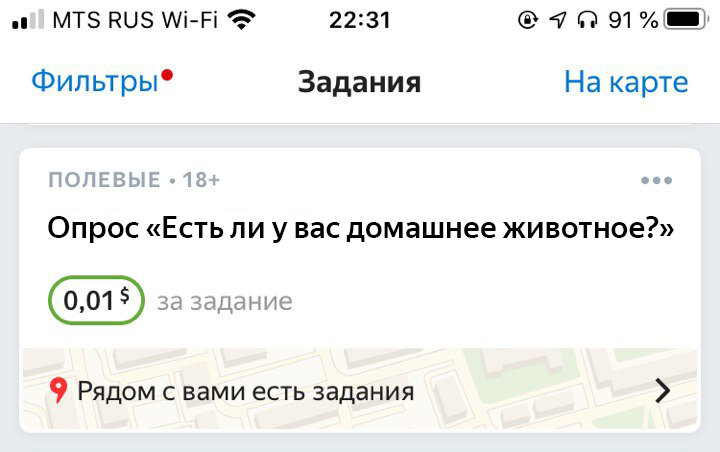
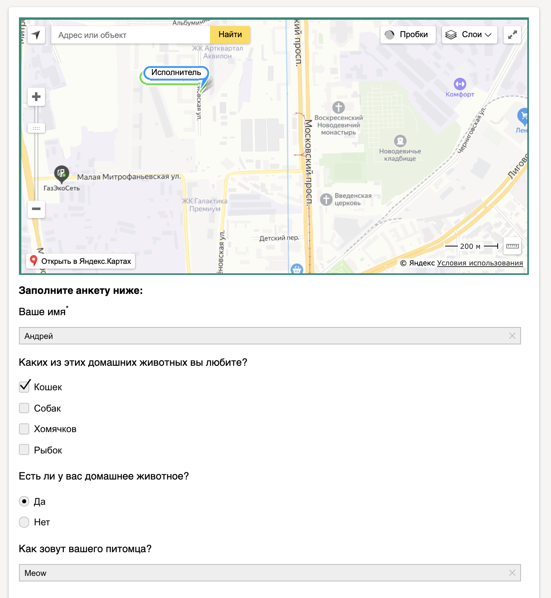
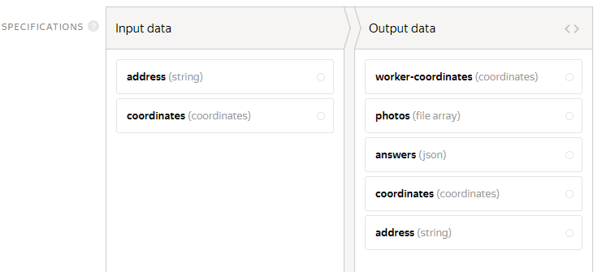
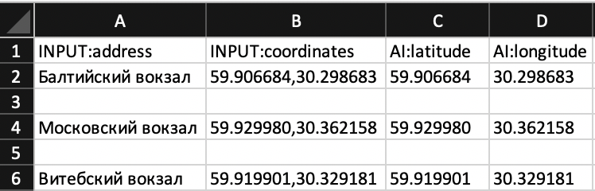

# Survey



Run the project in the [Sandbox]({{ sandbox }}) first. This helps you avoid making mistakes and spending money on a task that isn't working right.




Field tasks are completed in the Toloka mobile apps for [Android]({{ android-app }}) and [iOS]({{ ios-app }}). A Toloker chooses a point on the map where they need to go to check something and take photos.

You may need additional projects for your task, such as dataset pre-check or checking Tolokers' responses. Learn more about this in [Decomposition of the task](solution-architecture.md).

You may need additional settings for your project, like to add a new button with a particular scenario or a section for attaching files. Learn more in [Customization examples](advanced-features.md).

Use this template when you need to:

- Identifying product flaws.
- Loyalty evaluation.
- Getting feedback.
- Identifying key features as in the example.

To do this, create this task: the Toloker will need to come to the point, find the respondents according to the given description (and among them those who agree to pass the survey), ask questions according to the questionnaire and confirm the respondent identity with a phone number or a photo.

#### Example of a prepared task

#### In the task list

#### On the map

#### Task interface

#### Toloker's response


To run tasks and get responses, follow the instructions:

## Create a project {#project}

The project defines what the task will look like for a Toloker.

1. Click the **+ Create a project** button and choose the **Survey** template in the field task block.

1. Enter a clear name and a short description for the project. Tolokers will see this in the task list.

1. Write short and comprehensive instructions (see [recommendations](faq.md)). Use HTML tags to insert links, pictures, and so on. Field task instructions should be easy to read on a mobile phone screen.

1. In the template, the **Map** option is enabled automatically. So a user will see tasks as points on the map and be able to choose the ones they want.

    **Address** and **Coordinates** will be displayed when the Toloker chooses a point on the map. These fields contain an input field that will be changed [later](#name-desc).

1. To show the name and description of the point, edit the fields:
    - **Address**: `{{inputParams["address"]}}`;
    - **Description**: `Location: {{inputParams["coordinates"]}}` .

1. 

    This tutorial shows how to create a task interface in the **HTML/JS/CSS editor**. You can try creating a task interface in [Template Builder]({{ tb-quickstart }}).

    

    Define which objects you are going to pass to the Tolokers and receive from them in response. To do this, add input and output fields in the **Data specification** section.

    The template includes these fields:

    1. Input data fields:
    - `address` — The address in the task.
    - `coordinates` — Coordinates of the point that the Toloker should go to.

    1. Output data fields:
    - `photos` – Array of files. Photos uploaded by the Toloker.
    - `answers` – A JSON file with Toloker's responses.
    - `address` — The address in the task.
    - `coordinates` — The coordinates in the task.
    - `worker_coordinates` — The Toloker coordinates at the moment of task completion, with the **Current location** option turned on.

    #### Graphic mode
    
    #### JSON
    

1. The task **interface** describes how the task elements should be arranged, what they should look like, and what logic they should follow.
    You can use standard HTML tags and [special expressions](spec.md) in double curly brackets for input and output data fields in the **HTML** block. HTML describes how the task elements should be arranged in the task.

    **JS** is used to describe the task logic. Also, the main content of this task is embedded in JS for ease of editing.

    In this project, the `translates` variable stores all texts from the task suite.

    Here you can add, delete, or change survey items.

    **Translates:**
    
    ```
    **var** translates = {
    'header': 'Fill out the form below',
    'surveyConfirmation': 'Survey confirmation',
    'firstName': 'Your name',
    'photo': 'Photo',
    'responseTextPlaceholder': 'Response text',
    'phone': 'Your mobile phone number',
    'phoneExamplePlaceholder': '+79000000000',
    'petPreferences': 'Which of these pets do you like?',
    'petsList': [
    'Cats',
    'Dogs',
    'Hamsters',
    'Fish',
    ],
    'petHave': 'Do you have a pet?',
    'petName': 'What is your pet's name?',
    'yes': 'Yes',
    'no': 'No',
    'user': 'Toloker',
    'placeOfSurvey': 'Survey location',
    //validation errors
    'firstNameEmpty': 'Enter the respondent's name',
    'surveyConfirmationProofsMissing': 'You haven't confirmed the survey',
    'petNameEmpty': 'Enter the pet's name',
    'firstNameIncorrect': 'The respondent's name must contain only Cyrillic letters',
    'phoneIncorrect': 'You entered an incorrect phone number',
    'tooFar': 'You're too far away from the survey location'
    }

    ```
    
    The template already contains **CSS** styles, you don't need to change them.

    The `MAX_DISTANCE` variable specifies the maximum distance from a designated point, where the toloker can move during the task completion, in kilometers.

    The template logic includes checking the respondent's phone or photo. This means that the Toloker will have to enter the respondent's phone number or take a photo.

1. Click the **Preview** button to see the Toloker's view of the task.
1. Save the project.

## Add a task pool {#pool}

A pool is a set of paid tasks sent out for completion at the same time.

1. Open the project and click **Add pool**.
1. Give the pool any convenient name and description. The pool info is only available to you. Tolokers can view only the project name and description.
1. In the **Audience** block, add **Filters** to select Tolokers. To make your tasks available in the Toloka mobile app to English-speaking Tolokers located in Moscow, set the language and region.
1. In the **Price** block, set the price per task (for example, $0.2). For field tasks, always add one task per suite.
    #### What is a task suite?

    A task suite can contain one or several tasks that are shown on the same page. If the tasks are simple, you can add 10-20 tasks per suite. Don't make task suites too long because it slows down loading speed for Tolokers.

    Tolokers get paid for completing the entire task suite.

    The number of tasks per suite is set when [uploading tasks](#tasks_upload).

    #### What is a fair price for a task suite?

    The general rule of pricing is the more time the Toloker spends to complete the task, the higher the price is.

    You can register in Toloka as a Toloker and find out how much other requesters pay for tasks.

1. In the **Quality control** block, set **Overlap**, which is the number of Tolokers to complete the same task. For field tasks, it is usually 1.
1. In the **Quality control** block, enable the **Non-automatic acceptance** option and specify the number of days for checking the task in the **Review period** parameter. (for example, 7).
    #### What is non-automatic acceptance (assignment review)?

    The [non-automatic acceptance](offline-accept.md) option allows you to review [completed assignments](../../glossary.md#submitted-answers-ru) before accepting them and paying for them. If the Toloker didn't follow instructions, you can reject the assignment. The maximum allowed period for the review is set in the **Deadline** field.

1. In the **Additional settings** block, specify the **Time** allowed for completing a task suite. It should be enough to get to the place, find the specified point and upload photos. For field tasks, we recommend allocating a day — 86,400 seconds.
1. Save the pool.

## Upload tasks {#tasks_upload}

1. Click **Upload**. In the window that opens, you can also download a sample TSV file by clicking **Sample file for uploading tasks**.

    #### What is TSV?
    A TSV file presents a table as a text file in which columns are separated by tabs.
    You can work with it both in a table editor and a text editor, and then save it to the desired format. [More about working with a TSV file](pool_csv.md). There is a CSV format that is similar to TSV, but you should use a TSV file for uploading.
    

    Before uploading the file, make sure it is saved in UTF-8 encoding.

    

1. Add input data in it. The header of the input data column contains the word `INPUT`. For field tasks, you also need to specify the latitude `AI:latitude` and longitude `AI:longitude` of the point. You can use a service like [Yandex.Maps]({{ ya-maps-object-search }}) to get the coordinates
1. Upload the tasks by choosing **Set manually** and set 1 task per suite.

## Start the pool and get the results {#launch}

1. Start the pool by clicking .
1. Track the completion of tasks in the **Pool statistics** section.
1. When the first results come in, you can start reviewing.
    To review assignments, go to the pool and click **Download results**. To download attachments, click the button next to  and choose **Download attachments**.

    

    After the specified time period, all responses are automatically accepted, regardless of their quality.

    

