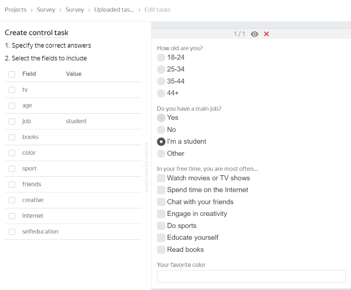

# Filters

You can use filters to select Tolokers for your project. Tasks will only be shown to matching Tolokers rather than all of them. Properly configured filters help you send tasks to a target group of Tolokers. As a result, you'll get your results faster and spend less money.

To select Tolokers for a [pool](../../glossary.md#pool-ru), click **Add filter** on the pool editing page.

From the drop-down list, select filters by profile data and device specifications.



To add filters faster, copy them from another pool (the **Copy settings from…** button).



All filters added to the pool are applied simultaneously. The criteria within a single filter are combined with the logical OR operator.



Tasks in pools are automatically available in the web version of Toloka and the mobile app. If you want to change the default settings and limit the visibility of the task for any of the versions, add the **Client** filter and select the desired value: **Toloka web version** or **Toloka for mobile**.



## Skill {#filter-skill}

You can select Tolokers with or without a [skill](../../glossary.md#skill-ru) and filter them by skill value.

You can use [global skills](nav-cross-project.md) as a filter to recruit Tolokers who are good at certain types of tasks. To do this, select  and specify the restriction for the selected skill in the filter.

Examples of using a skill filter:



Use the `=` operator and leave the value empty.





Use the `≠` operator and leave the value empty. For example, use this to choose Tolokers who are already familiar with the type of tasks like those in your pool.





Add a filter, enter a value from 0 to 100, and use a set of operators. For example, you can select only those Tolokers who previously completed a certain number of tasks of the type like in your pool.





Add a global level filter, enter a value from 0 to 100, and use a set of operators. For example, you can select only those Tolokers whose responses were on average better than the responses of 80% of annotators in similar projects.



## Toloker profile {#filter-user-profile}

Use filters from this group to select Tolokers by the main profile data.



Make sure to add the **Languages** filter and specify the language of the [instructions](../../glossary.md#task-instruction-ru) and text in the task.

If you want to be sure that Tolokers can read and understand the basic vocabulary, select those who passed a language test.





If there is adult content in the pool tasks, they will only be shown to Tolokers who have agreed to see them. To select such Tolokers, add the **Adult content** filter and select the **On** option.





You can choose Tolokers who live in certain cities. Use this filter for field tasks or to search for data online.





Use this filter when the Toloker's citizenship may affect the quality of responses, like if your project asks Tolokers to complete a survey, transcribe audio, or search for information online. You can also use this filter to restrict Tolokers' access to tasks.





Using a set of operators, you can select an age-based audience among available Tolokers.





Add this filter if the Toloker's education may affect the quality of responses. Use the `=` or `≠` operator and select **Secondary**, **Vocational secondary**, or **Higher** education from the drop-down list.





You can choose Tolokers of a certain gender if this matters for your project.





Add this filter to restrict the audience by region.





Use this filter if you need additional guarantees when selecting Tolokers. Your tasks will only be available to Tolokers whose personal details are verified in Toloka.



## Calculated data {#filter-calc-data}

Use filters from this group to select Tolokers by device type, browser, or software versions.



Use this filter if your tasks are intended for users with certain web browsers.





If the type of the Toloker's device matters, use the `=` and `≠` operators to set the requirements.





Tasks in pools will automatically be available in the web version of Toloka and the mobile app. If you want to change the default settings and limit the visibility of the task for any of the versions, add the **Client** filter and select the desired value: **Toloka web version** or **Toloka for mobile**.

If your project contains field tasks, you need to select mobile Toloka users among the Tolokers.





Add this filter to select users of certain operating systems.



To select the most popular desktop operating systems — MacOS, Windows, and Linux, add the **Operating system** filter. Use the `=` operator to set the value as `Windows`. Use the  button to add the second value, `MacOS`. Then click  again and set the third value, `Linux`.







To make a task available to users with IP addresses of a particular region, add the **Region by IP** filter and enter the region name. This is useful for field tasks.





To more effectively choose Tolokers by location, add the **Region by phone** filter.





Select this filter if the browser type determines whether Tolokers match your project tasks.



## What's next {#what_next}

- [Add tasks to the pool](pool.md)
- Learn more about how to set up a pool:
    - [Setting up pricing](dynamic-pricing.md).
    - [Dynamic overlap](dynamic-overlap.md).
    - Selective [majority vote](selective-mvote.md) control.
    - [Speed/quality balance](adjust.md).
    - [Setting up quality control](qa-pool-settings.md).
    - [Reviewed assignments](offline-accept.md).

### Troubleshooting {#troubleshooting}





Requesters can't see the full details about specific Tolokers. So you can't see information like the date of birth, gender, last name, or first name. However, you can use filters by date of birth and gender (in the pool settings). This way you can select a group of Tolokers without accessing the personal information of individual Tolokers. This decreases the risk of user de-anonymization.





You can do that. To select Tolokers for the pool, use [filters](filters.md).





If the Toloker mismatches your preset filter, they can't see the task. You can only remove the restricting filter from the pool. You can test the task in the [Sandbox](sandbox.md) by adding the desired user to your trusted list.





Tasks from an open pool are available to all Tolokers matching your pool [filters](filters.md). You can restrict access, like by using a skill.





Yes, you can do that. In the [filters](filters.md), select **Profile → City**. Please note that the profile data is entered by the Toloker when they register in Toloka. We recommended that you use the filters **Region by phone number** and **Region by IP**.





Yes, of course — you can use the same skill for different projects. But most often, a skill is intended for a specific project. If the Toloker completes a certain task well, this doesn't mean that they will complete other ones successfully. Another disadvantage is that if you filter by skills that were set long ago, you will artificially limit the number of available Tolokers.









If you mean multiple different projects, you can't do that.

You can merge all the projects into one and use **History size** in the quality control rules. See examples in the [Control tasks](goldenset.md) post.

You can use **Aggregation by skill**, but you'll need to list all the possible values, which is probably not the best choice. Perhaps you'll find [another method of aggregation](result-aggregation.md) helpful.





In the main Toloka version, you can only assign a skill to Tolokers who have completed at least one of your tasks. There is no way to assign a skill to just any annotator. To limit the visibility of your project, use [filters](filters.md). For example, specify the city, date of birth, gender, or some other parameters of your target Tolokers.





The validity period of the training skills is controlled by the **Retry after** parameter. The skill is deleted after a period specified in days in the **Retry after** field, if the Toloker:
- Has a skill value lower than the one specified in the **Level required** field.
- Didn't complete any tasks linked to training during this period.

Your Tolokers will need to complete the training again.





You can assign a skill to these people based on their performance in the previous pools. Use this skill as a [filter](filters.md) in the new pool.





Specify this skill as a [filter](filters.md), but leave the value field empty (this is equivalent to absence of the skill).





If the Toloker already has a skill, you can't add the same skill to them from the task review interface. You can open the Toloker's profile and edit the skill value.





If it's a public or training skill, they see it and they get a message about it.





There is no such option. If the skill is public, the Toloker sees it in their profile.





You can do that using the [Control tasks](goldenset.md) rule.
1. Upload the task file using **Smart mixing**.
1. Specify `student` as the correct answer to the question. Don't take other questions into account (leave the fields empty or unselected).
1. Add the [Control tasks](goldenset.md) rule to the pool: `if the percentage of correct control answers = 100, then set the skill value Student = 1`.











Tasks in pools are automatically available in the web version of Toloka and the mobile app. Check the pool settings. You might have the `Client = Mobile Toloka`[filter](filters.md) on.





Tasks in pools are automatically available in the web version of Toloka and the mobile app. Check the pool settings. You might have the `Client = Toloka web version`[filter](filters.md) on.




