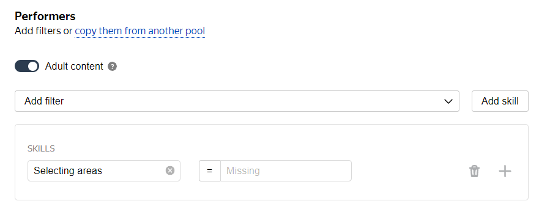
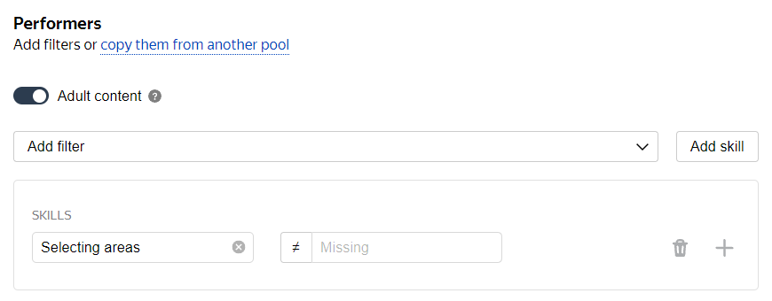
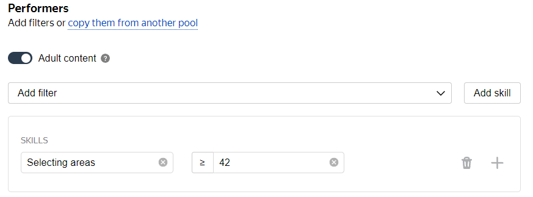
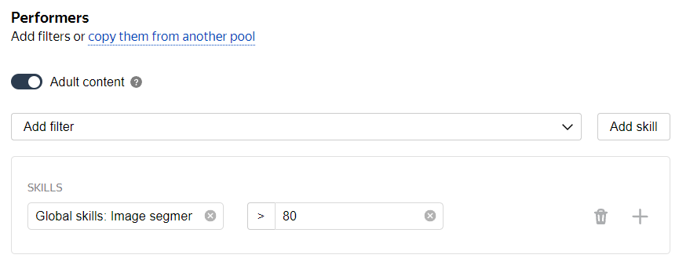

# Filters

You can use filters to select Tolokers for your project. Tasks will only be shown to matching Tolokers, rather than to all of them. Properly configured filters help you send tasks to a target group of Tolokers. As a result, you'll get your results faster and spend less money.

To select Tolokers for the [pool](../../glossary.md#pool), click **Add filter** at the **Select the audience for your task** step of creating a pool or on the pool editing page.

From the drop-down list, select filters by profile data and device specifications.



Copy filters from another pool to add them faster. Click **Copy audience filters and quality settings** and select the pool you want to copy filters from.



All filters added to the pool are applied simultaneously. The criteria within a single filter are combined with the logical OR operator.







The number of Tolokers selected with your filters is shown in the **The task is available to N active Tolokers** line, which is in the **Audience**.

## Calculated data {#filter-calc-data}

Use this group of filters to select Tolokers by device type, browser, or software version. The data in this group of filters might differ from the one Tolokers specify in their profiles and shows the values detected by the platform.



To more effectively choose Tolokers by location, add the **Region by phone number** filter and choose the name of the country in the drop-down list.





To make a task available to users with IP addresses in a particular region, add the **Region by IP** filter and enter the area or city name. This is useful for field tasks.







If your project has field tasks, you need to select Mobile Toloka users among the Tolokers.





If the type of the Toloker's device matters, use the `=` and `≠` operators to set the requirements. Choose the device type from the drop-down list.

Use `≠` and `Other` to filter out the Tolokers with devices that don't fall into any of the categories. Use `≠` and `Unknown` to filter out Tolokers with devices that the platform can't recognize.

Refer to [this page](http://uadetector.sourceforge.net/modules/uadetector-core/apidocs/net/sf/uadetector/ReadableDeviceCategory.Category.html) for the list of device types that the platform uses to detect Tolokers' devices.





Add this filter to select users of certain operating systems (desktop or mobile operating systems).



If you're looking to select MacOS, Windows, and Linux, the most popular operating systems for PCs, add the **Operating system** filter. Use the `=` operator to set the value as `Windows`. Use the  button to add the second value, `MacOS`. Then click  again and set the third value, `Linux`.







Select this filter if the client application type determines whether Tolokers match your project tasks. You can choose from various browser types or specific client applications, like mail client, media player, bot and others.

Use `≠` and `Other` to filter out the Tolokers with client applications that don't fall into any of the categories. Use `≠` and `Unknown` to filter out Tolokers with client applications that the platform can't recognize.

Refer to [this page](https://uadetector.sourceforge.net/modules/uadetector-core/apidocs/net/sf/uadetector/UserAgentType.html) for the list of client application types that the platform uses to detect client applications.





Use this filter if your tasks are intended for users with certain web browsers or browser families.

Refer to [this page](http://uadetector.sourceforge.net/modules/uadetector-core/apidocs/net/sf/uadetector/UserAgentFamily.html) for the list of browser types that the platform uses to detect browsers and their families.





Use this filter if you want to make sure Tolokers have the right browser for your project. For example, if you want to choose only Tolokers that use the latest mobile application for Android version, choose **Toloka for mobile** in the `Client` filter and set `Client application version` together with the `=` or `≥` and the **2.45.0** application version as a value (use the exact version number from the mobile application). If you prefer Tolokers with a certain browser version, choose the browser type in the `Browser` filter together with `=` or `≥` and the browser version as a value.





Use the **Experiment group (1-100)** filter to select Tolokers from one or several independent groups.

To learn more, see [Using A/B experiments](ab-experiment.md).



## Toloker profile {#filter-user-profile}

Use filters from this group to select Tolokers by the main profile data. Please note, that the data Tolokers set in their profiles might be different from the [calculated data](#filter-calc-data) if the Tolokers specify incorrect or false information.



Add this filter to restrict the audience by their residence region.





Use this filter when the Toloker's citizenship may affect the quality of responses, like if your project asks Tolokers to complete a survey, transcribe audio, or search for information online. You can also use this filter to restrict Tolokers' access to tasks.





Make sure to add the **Languages** filter and specify the language of the [instructions](../../glossary.md#instructions) and text in the task.

If you want to be sure Tolokers can read and understand the basics of your language, limit your selection to those who have passed a test on it.





Use this filter if you need additional guarantees when selecting Tolokers. Your tasks will only be available to Tolokers whose personal details are verified in Toloka.





If there is adult content in the pool tasks, they will only be shown to Tolokers who have agreed to see them. To select such Tolokers, add the **Adult content** filter and activate this option.





Using a set of operators, you can select an age-based audience among available Tolokers.





You can choose Tolokers of a certain gender if this matters for your project.



## Skill {#filter-skill}

You can select Tolokers with or without a [skill](../../glossary.md#skill) and filter them by skill value.

You can use [global skills](nav-cross-project.md) as a filter to recruit Tolokers who are good at certain types of tasks. Do that by selecting **Add filter → Skills → Choose global skill**, and then set a skill limit in the filter.

Examples of using a skill filter:



Use the `=` operator and leave the value empty.





Use the `≠` operator and leave the value empty. For example, use this to choose Tolokers who are already familiar with the type of tasks like those in your pool.





Add a filter, enter a value from 0 to 100, and use a set of operators. For example, you can select only those Tolokers who previously completed a certain number of tasks of the type like in your pool.





Add a global level filter, enter a value from 0 to 100, and use a set of operators. For example, you can select only those Tolokers whose responses were on average better than the responses of 80% of annotators in similar projects.



## What's next {#what_next}

- [Add tasks to the pool](pool.md)
- Learn more about how to set up a pool:

    - [Setting up pricing](dynamic-pricing.md).
    - [Dynamic overlap](dynamic-overlap.md).
    - [Selective majority vote check](selective-mvote.md).
    - [Speed/quality balance](adjust.md).
    - [Setting up quality control](qa-pool-settings.md).
    - [Manual review](offline-accept.md).

## See also {#see-also}

- [Efficiency indicators: Project availability](efficiency-metrics/available-performers.md)

## For developers {#for-developers}

- [Toloka API: Filtering by profile data](../../api/concepts/filter-profile.md)
- [Toloka API: Filtering by computed data](../../api/concepts/filter-computed.md)
- [Toloka API: Filtering by skills](../../api/concepts/filter-skill.md)
- [Toloka-Kit recipe: Filter Tolokers](../../toloka-kit/recipes/filter-tolokers.md)
- [Toloka-Kit recipe: Filter Tolokers with confirmed language knowledge](../../toloka-kit/recipes/filter-tolokers-languages.md)

## Troubleshooting {#troubleshooting}













































