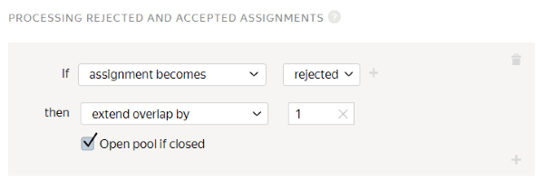

# Project 2. Find a similar item in an online store

In this [project](../../glossary.md#project), Tolokers will search an online store for shoes that are similar to the ones shown in the task. Use the results from [project 1](contain_item.md#get_results) as source images.

## Create a project {#create_project}

To create a project, open [Toloka for requesters]({{ yandex-toloka }}).

#### In the interface:

1. Choose a template:

    1. Click **Create project**.

    1. Select the **Product photo search** template.

1. Provide general information:

    1. In the **Project title** field, enter `Find the same or similar shoes in an online store`.

    1. In the **Description** field, enter `Go to an online store and provide a link and an image of the same or similar pair of shoes`.

    1. Optionally add a **Private comment**.

    1. Save the changes.

1. Edit the task interface in the editor you selected:

    

    - Template Builder

      1. Use the [ready-made code](https://ya.cc/t/G4tBYKz63ttEYj) for this project with pre-configured validation and task layout.

          The Toloker won't be able to submit the response until they:

          - Click the button to go to the online store.
          - Add a link to the product.
          - Upload an image of the product.

      1. Click **Show specifications** to see the input and output data fields.

          - Input data field: `image` — A link to an image.

          - Output data fields:

              - `found_link` — The link to the product in the online store.
              - `found_image` — For uploading the image of the product.

    - HTML/CSS/JS editor

      1. In the **Task Interface**, delete the template code from the **HTML** block and paste the following code:

          

          ```html
          {{img src=image width="50%" height="400px"}}
          <div class='answers'>
          <p>Find similar shoes <b>shoes</b> in the ASOS online store</p>
          {{field type="button-clicked" name="button" label="ASOS" href="https://www.asos.com" action=true}}
          <p>Shoes must be similar in color, material, length, and style.</p>
          <p>Paste the link here</p>
          {{field width="100%" type="input" name="found_link"}}
          <p>Upload the image here</p>    <div>
          {{field width="100%" type="file-img" name="found_image" preview=true}}
          </div>
          </div>
          ```

          

      1. To check if the link and image submitted by the Toloker are valid, go to line 5 in the **JS** block and replace the following code:

          `if (!solution.output_values.image && !solution.output_values.no_image) {`

          with

          `if (!solution.output_values.found_image) {`

          

          Be careful when changing the code. If you have issues with the preview, contact **support** or compare your code with the code sample in the [Appendix](appendix-expanded-code.md).

          

      1. Replace the template code in the **CSS** block with the following code, which is responsible for setting the proportional image size.

          ```css
          .task {
          display: block;
          height: 500px;
          width: 800px;
          }
          .img {
          float: left;
          width: 50%;
          }
          .answers {
          float: left;
          width: 40%;
          margin: 5%;
          }
          ```

      1. Edit the [input and output data](../../glossary.md#input-output-data) in the **Data specification** block.

          1. Click  to switch graphic mode to JSON format.

          1. In the **Input data** field, enter:

              ```json
              {
              "image": {
              "type": "url",
              "hidden": false,
              "required": true
              }
              }
              ```

          1. In the **Output data** field, enter:

              

              If you want to choose a different online store, change `"pattern": "https://www.asos.com/.*"` to `"pattern": "your_store.*"`.

              

              ```json
              {
              "button": {
              "type": "boolean",
              "hidden": false,
              "required": true,
              "allowed_values": [
              true
              ]
              },
              "found_link": {
              "type": "string",
              "hidden": false,
              "pattern": "https://www.asos.com/.*",
              "required": true
              },
              "found_image": {
              "type": "file",
              "hidden": false,
              "required": true
              }
              }
              ```

              Learn more about the **Specification** parameters in [Input and output data](incoming.md).

          1. Click  to see the Toloker's view of the task.

              

              The project preview shows one task with standard data. You can define the number of tasks to show on the page later.

              

          1. In the window that opens, check if the task options work correctly. In the lower-right corner, click **Submit**.

          1. Exit preview mode.

              In the lower-left corner, click **Exit**. If there were errors when testing, check the code blocks that you entered.

    

1. Save the changes.

1. In **Instructions for Tolokers**, enter the [instructions](../../glossary.md#instructions).

    1. **Instructions:**

        

        ```plaintext
        Look at what the person is wearing in the picture.
        Then go to the ASOS online store and search for the same pair of shoes.
        It should be similar in category, style, color, and length.
        ```

        

    1. Save the changes.

1. To go back to the **Projects** page, click **Finish editing**.


Learn more about working with the project in the [Project](project.md) section.

## Create a pool {#create_pool}

To create a [pool](../../glossary.md#pool):

1. Open the page of the project titled **Find the same or similar shoes in an online store**.

1. Click **Add a pool** on the project page.

1. 

1. 

1. 

1. Click **Create**.

1. 

    1. 

    1. 

    1. 

    1. Click **Add skill**.

    1. In the **Title** field of the window that opens, enter `Found_shoes`.

    1. Click the **Add** button.

1. (optional) In the **Speed/quality balance** section, specify the desired quality level. Improving quality may reduce the speed of task completion because the pool will be available to fewer Tolokers. Learn more in the [Speed/quality balance](adjust.md) section.

1. 

    1. In **Price per task suite, $**, set the amount of money to pay per task suite done by one Toloker. For example, `0.01`.

    1. Enter `3` in the **Overlap** field.

1. 

    1. Turn on the **Review task responses manually** option.

    1. Set the **Deadline** field to `7`.

    1. Click **Add a quality control rule**.

    1. Find the **Rules** block in the list and select **Processing rejected and accepted assignments**.

    1. Set a rule for rejected tasks: if **a task is rejected**, **increase overlap** by **1**. In addition, turn on the **Open pool if closed** option:

    

    1. Add another quality control rule. Click **Add a quality control rule**.

    1. Find the **Rules** block in the list and choose **Submitted responses**.

    1. Set a rule for completed assignments: if the number of **submitted assignments is ****greater than or equal to 1**, **set the value of the ****Found_shoes** skill to **1**.

    

    

    If the **Found_shoes** skill is missing from the list, save the pool and reopen it to edit it.

    

    [Control tasks](../../glossary.md#control-task) and [majority vote](../../glossary.md#majority-vote) aren't used in this type of project, because links submitted by Tolokers must match, which is practically impossible. Learn more in [Quality control](control.md).

1. 

    1. In the text or spreadsheet editor, open the file that you received after aggregating the results in [project 1](contain_item.md#get_results).

    1. Select images that are appropriate for the current project (**OK** or your value if you changed it for the **result** field).

    1. Copy the column with the selected links to a new sheet or document.

    1. Name it `INPUT:image`. If you want to set a different name, rename the column in the source file with the results, too.

    1. Save the file.

    1. Upload the resulting [file](../../glossary.md#tsv).

        1. Click **Drop file here or select**, and upload the file you’ve just made.

        1. Click **Continue**.

        1. Choose **Set manually**.

        1. In the **Tasks per suite** field, specify`1`.

        1. Click **Combine tasks into suites**.

1. 

    

1. Click  to start the pool.

## What's next {#what-next}

- Create [Project 3](item_look_similar.md) to compare the original image with the results from Project 2.

