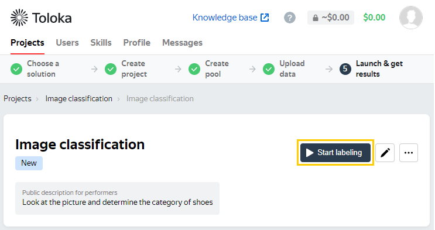
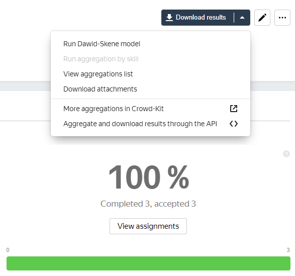

# Your first project

Learn your way around Toloka with the following steps:

1. [Create a project](#create-project).
1. [Configure a task pool](#configure-pool).
1. [Upload a file with tasks](#upload-tasks).
1. [Launch the pool and get the results](#get-results).

## Before you start {#before-start}

Make sure you're [registered](access.md) as a requester.

Log in to the [Sandbox](sandbox.md) to create and test your project for free. This helps you avoid making mistakes and spending unnecessary money on a task that doesn't work.

## Step 1. Create a project {#create-project}

In the project, you'll customize an appearance of the tasks.

1. On the **Projects** tab, choose a project preset that matches your task. The preset has preconfigured settings, a template for the task interface, and sample instructions for Tolokers. You will need to make a few changes in the interface and instructions to fit your data.

    

    - **Image classification**

        Designed to determine which category an image belongs to.

    - **Product search relevance**

        Intended to rate how relevant products are to specific search queries.

    - **Object recognition & detection**

        Used to outline objects on images for training computer vision to detect them.

    - **Customer survey**

        Designed to collect information for research purposes.

    

    

    If you unsure which preset to choose, you can ask Toloka experts to create a project for you. To do that,

    - click **Get expert help**,
    - select the way Toloka can contact you (WhatsApp, Telegram, Viber, email, or phone),
    - enter your phone number or email address,
    - briefly describe the project and the results you want to get.

    Toloka engineering team will contact you for more details and explain your further steps.

    

    If you can't find a preset that works for you, choose **Blank** to set up a project from scratch. To learn how, see the [Initial project settings](project.md) section.

1. In the **General information** section, fill in the project name and a brief explanation of what will happen within the project.

1. In the **Task interface** section, do the following:

    1. Select **Template builder**.

    1. Edit the preset task interface to configure the task appearance.

    1. Click **Show specifications** to see the generated input and output data fields.

    To learn more, see the [Template Builder Help](../../template-builder/index.md).

1. In the **Instructions for Tolokers** section, edit the ready-made instructions if needed.

1. Click **Create a project**.

## Step 2. Configure a task pool {#configure-pool}

A pool is a set of tasks sent out for completion at the same time. Create and configure the pool as follows:



## Step 3. Launch the pool and get the results {#get-results}

1. Start the pool by clicking **Start labeling**. This assigns the tasks to the Tolokers.

    

1. [Complete your tasks](sandbox.md#self) as a Toloker by yourself.

1. Track your project with the real-time statistics on the pool and project pages.

1. When the tasks are completed, get the results:

    - Download a [TSV file](result-of-eval.md) with the responses.

    - If you have used overlap, run [aggregation](result-aggregation.md) to get the final results.

    - Get the [files](result-of-eval.md) that Tolokers have attached to the tasks.

## What's next {#what-next}

- When you complete the testing in the Sandbox, [move](sandbox.md#export) your project to the Toloka production version and launch the pool for real Tolokers.

- View our [tutorials](usecases.md). Perhaps there is an instruction that fits your task, and you will only need to insert your own data.

- If you don't like Template Builder, try out the [HTML/JS/CSS editor](spec.md).

- See the [Toloka API](../../api/index.md) documentation to learn how to manage your projects via the API.

- If you have questions or problems, see the [Troubleshooting and support](../troubleshooting/troubleshooting.md) section.

## See also {#see-also}

- [Crowdsourcing concepts](https://toloka.ai/knowledgebase/crowdsourcing-concepts/)
- [Crowdsourcing course](https://toloka.ai/academy/self-study-guide/)