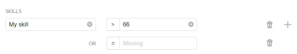

# Control tasks

[Control tasks](../../glossary.md#control-task) contain samples of correct responses. They allow you to monitor the quality of task completion without having to check all the responses. Control tasks simplify the verification process, help identify Tolokers' qualifications, and save your time.



To save time, you can opt for having your control tasks edited by [Toloka experts](task_markup.md#auto-markup). In this case, markup is performed within the pool.



## When to use {#when-use}

Use control tasks to assign a [skill](../../glossary.md#skill) to Tolokers based on their responses and [ban](../../glossary.md#banning-tolokers) Tolokers who submit incorrect responses.

Don't use it if:

- You have a lot of response options.
- Tolokers need to attach a file to their assignment.
- Tolokers need to transcribe text.
- Tolokers need to select objects in a photo.
- Tasks don't have a correct or incorrect response. For example: “Which image do you like best?” or “Choose the page design option that you like best”.

## How to configure {#rule-golden}



The **If** and **then** fields in this rule are required. If you don't fill in at least one field, you won't be able to save the rule.



#|
||**Field** | **Overview**||
||**Recent control and training task responses to use** | The number of the Toloker's last responses to control tasks.

If this field is not filled in, the calculation includes only control task responses in the pool to which the rule applies.

If the field is filled in, the corresponding number of control task responses is used. The rule takes into account responses from both the current pool and other pools where this field is filled in.

[Learn more](remember-values.md) about how this field works.||
||**If** | A condition for performing the action in the **then** field:

- **number of responses** — The number of completed control and [training](../../glossary.md#training-task) tasks.

- **correct responses (%)** — The percentage of correct responses in training and control tasks (from 0 to 100).

- **incorrect responses (%)** — The percentage of incorrect responses in training and control tasks (from 0 to 100).

- **number of control responses** — The number of completed control tasks.

- **correct control responses (%)** — The percentage of correct responses in control tasks (from 0 to 100).

- **incorrect control responses (%)** — The percentage of incorrect responses in control tasks (from 0 to 100).

To add multiple conditions, click .||
||**then** | Action to perform for the **If** condition:

- **assign skill from the field** — Save the percentage of the Toloker's correct responses in control tasks as a skill value.

- **assign skill value** — Assign a fixed value to the Toloker's [skill](nav.md).

- **accept all assignments from this Toloker in the pool** — Requires the [manual review](offline-accept.md) option to be set.

    Useful if the Toloker completes most tasks well. Example: The Toloker completed more than 80% of the tasks correctly and you're satisfied with this result. The rule will work automatically and accept all responses in the pool.

- **suspend** — Suspend the Toloker's access to the pool for the specified number of days. Only the requester can view the reason.

- **ban** — Block access to the project or all of the requester's projects for the specified number of days. Only the requester can view the reason.

    If access to tasks is blocked temporarily (for example, for 7 days), the history of the Toloker's responses is not saved after the ban is lifted. The skill level is calculated based on the new responses.||
|#

## Examples {#examples}

Purpose: filter out Tolokers who often make mistakes.

Solutions:

- [Ban Tolokers based on control tasks and the percentage of correct responses](goldenset.md#qcr-control_example1)

- [Set a skill and deny access to Tolokers with a low skill level](goldenset.md#nav)

- [Ban Tolokers if their percentage of correct responses to control tasks is less than 40%](goldenset.md#qcr-control_example3)



The assignments submitted by banned Tolokers will be taken into account if you don't reject them using manual review. They can be reassigned by setting up the [Recompletion of assignments from banned users](restore-task-overlap.md) rule.



### Ban Tolokers based on control tasks and the percentage of correct responses {#qcr-control_example1}



- Correct settings

  

  

  Both rules work independently:

  1. If the Toloker gives at least 3 responses to the control tasks, the percentage of correct answers is assigned as the skill value. This is useful if you want to prevent Tolokers with a low skill level from completing your tasks.

  1. If the Toloker gives at least 3 responses to the control tasks and the percentage of correct answers is less than 60%, they lose access to the project.

  The calculation uses up to 10 of the Toloker's recent responses to the project's control tasks.

- Incorrect settings

  

  

  The Toloker is banned after the first incorrect response to the first, second or third control task. The skill is not assigned. Since the ban reason is not specified, there is no way to find out why the Toloker is banned.

- Alternative settings

  

  

  

  

  All rules are applied independently:

  1. If the Toloker gives at least 3 responses to the control and training tasks, the percentage of correct answers is assigned as the skill value.

  1. If the Toloker gives 2 incorrect answers to 3 control tasks, they lose access to the pool for 10 days.

  1. If the Toloker gives 2 incorrect responses to 4 control tasks, they lose access to the pool for 10 days.

  1. If the Toloker gives 5 or more responses to the control tasks and the percentage of correct responses is less than 80%, they lose access to the pool for 10 days.

   A set of rules like this prevents Tolokers from being banned for one incorrect response and lets you maintain high accuracy.



### Set a skill and deny access to Tolokers with a low skill level {#nav}

Skills help identify how well Tolokers do your tasks. You can ban Tolokers with low skill levels from completing tasks in your pool or project.



- Correct settings

  

  If the Toloker completes 3 control or training tasks, they get a skill. Use the skill value to set access to other pools with [filters](filters.md).

  

  

  

- Incorrect settings

  

  This rule will never take effect because the number of responses counted (**Recent control and training task responses to use**) is less than the number of responses in the rule (**number of control responses**).



### Ban Tolokers if their percentage of correct responses to control tasks is less than 40% {#qcr-control_example3}



- Correct settings

  

  If the percentage of correct responses in the control tasks is less than 40%, the Toloker loses access to the project for 30 days.

  This rule doesn't take into account responses in the training tasks for banning.

- Incorrect settings

  

  If the percentage of correct responses in the control tasks is less than 40%, the Toloker loses access to the project for 30 days. The rule will be applied once — after the fifth response in the control task.



## See also {#see-also}

- [{#T}](qa-pool-settings.md)
- [{#T}](remember-values.md)

## For developers {#for-developers}

- [Toloka API: Control tasks](../../api/concepts/goldenset.md)
- [Toloka-Kit: Control and training task statistics collector](../../toloka-kit/reference/toloka.client.collectors.GoldenSet.md)

## Troubleshooting {#troubleshooting}



















