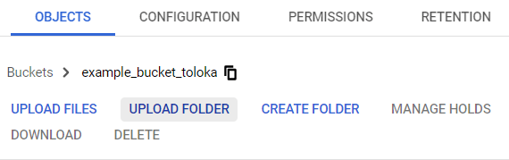

# Google Cloud Storage



You can use any photo hosting service to add a small number of images, such as [wampi]({{ wampi }}), [imgbb]({{ imgbb }}), [ImageShack]({{ imageshack }}), or [imgur]({{ imgur }}).  This way you can quickly get direct links to your images to add them to the task file or instructions.



To try out [Google Cloud Storage]({{ google-cloud-storage }}), you can activate [Free trial]({{ google-cloud-free-trial }}).

#### Trial terms

Length | Free storage size | Grant amount
----- | ----- | -----
90 days | 5 GB | $300

## Steps to follow {#workflow}

To get links to files:

1. Create a [Google]({{ google-account }}) account.
1. Create a [Google Cloud]({{ google-cloud-free-trial }}) account.
1. Go to the [Console]({{ google-cloud-home }}).
1. Click **Create project**.
1. Enter the project name. Select the organization from the drop-down list and click **Create**.
1. [Create a bucket](#create-account).
1. [Upload files](#upload).
1. [Copy links](#get-files).

## Create a bucket {#create-account}

1. Select a project and click **Create bucket**.

   

1. Enter the bucket name. The name should be unique and contain only lower-case Latin letters, numbers, hyphens, and underscores.

    Learn more about the [Bucket naming rules]({{ google-cloud-about-bucket }}).

1. In **Choose where to store your data** select **Location type → Region** and select the region closest to your Tolokers. For example, for Tolokers from Germany: **Location → europe-west3 (Frankfurt)**.

1. Leave the **Choose a default storage class for your data** section unchanged.

1. In **Choose how to control access to objects**, disable the option **Enforce public access prevention on this bucket**.

   

1. Click **Create**.

1. To make objects accessible by link, on the **Permissions** tab click **Add**.

    

    Files will be accessible to anyone with a link. We recommend using hashed file names to keep your files secure. You can generate hashes using online tools (for example, [Online MD5 Hash Generator]({{ hash-function-wiki }})). Learn more about [hashing]({{ hash-function-wiki }}).

    

1. In the **New members** field, enter **allUsers**.

1. Select **Cloud Storage → Storage Object Viewer**.

    

1. Click **Save → Allow public access**.



You can set the lifetime of files in the bucket so that they are automatically deleted after a specified number of days. [Learn more]({{ google-cloud-ttl }}).



## Upload files {#upload}



On the **Object** tab, click **Upload files** and select the files on your computer.





On the **Object** tab, click **Upload folder** and select a folder on your computer.





On the **Object** tab, click **Create folder** and enter the folder name.







All spaces and symbols in the file names will be replaced with codes.



## Copy links {#get-files}

1. Choose the file you uploaded and click **Copy URL** in the **Public access** column.

   

1. All file links are created by the same template.

    Links look like this:

    

    ```plaintext
    https://storage.googleapis.com/<bucket>/<file-name>
    ```

    

    The link in the folder looks like this:

    

    ```plaintext
    https://storage.googleapis.com/<bucket>/<file-path>/<file-name>
    ```

    

    

    To quickly get links to other files, copy the link to one of them and replace `<file-name>` with the names of other files.

    

1. In the [file with tasks](pool_csv.md), paste the links in the column that matches the input data field to which this data is passed.

    For example, if you want to use images in the `image` field, specify the file links in the `INPUT:image` column:

    ```plaintext
    INPUT:image
    https://storage.googleapis.com/mytolokabucket/newfolder/image1.png
    https://storage.googleapis.com/mytolokabucket/newfolder/image2.png
    ```

## See also {#see-also}

- [{#T}](task_upload.md)

