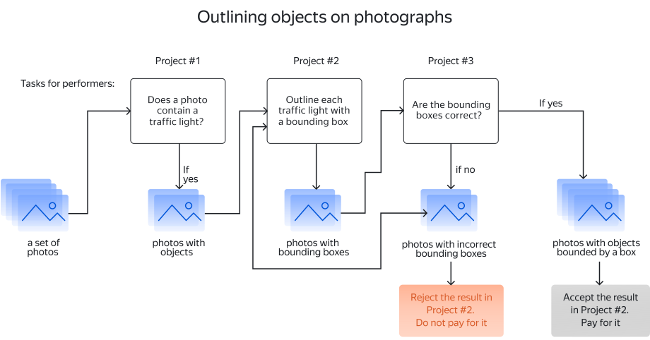

# Object recognition and area selection (example with decomposition)

This is an example of decomposing the [Object recognition and area selection](../tutorials/selection.md) task. Decomposition can improve the quality of results and reduce the cost of performing complex tasks.

Let's say you have photos of streets and you need to select traffic signs in them. But you don't know if there are traffic signs in all the photos, so you want to filter them first. You also don't want to check the Tolokers' responses yourself afterwards.

In this example, the solution consists of the following steps:

- [Project 1](image-segmentation-project1.md): Use this project if some images don't contain the intended object and you want to filter them out.

- [Project 2](image-segmentation-project2.md) — in this project, Tolokers will select areas with the desired object in the images. Toloka provides an editor for selecting an image area. It lets the Toloker select a polygon or rectangle area.

- [Project 3](image-segmentation-project3.md) — this project allows you to ask Toloka Tolokers to review the tasks instead of reviewing them yourself.

Each project consists of the following basic steps:

1. **Create a project**. In the project, you describe the [input and output data](../../glossary.md#input-output-data), [task interface](../../glossary.md#task-interface), and [instructions](../../glossary.md#instructions) for completing a task.

1. **Create a [task pool](../../glossary.md#pool) in the project**. In the pool, you set up [quality control](../../glossary.md#quality-control) and [filters](../../glossary.md#filters) for Tolokers.

1. **Upload a [file with tasks](https://tlk.s3.yandex.net/wsdm2020/dataset_1.tsv) to the pool**.

1. **Start the pool.**

1. **Obtain and aggregate the results**.

Find out how to top up your account in the [Topping up your account](refill.md) section.

If you need help rating tasks, read about [setting up pricing](dynamic-pricing.md#section_wb1_lhl_vlb).

## What's next {#what-next}

- Create [Project 1](image-segmentation-project1.md) to filter images.
- Create [Project 2](image-segmentation-project2.md) to select objects.
- Create [Project 3](image-segmentation-project3.md) to check the results.
- Learn more about [decomposition](solution-architecture.md).

## See also {#see-also}

- [Crowdsourcing concepts](https://toloka.ai/knowledgebase/crowdsourcing-concepts/)

