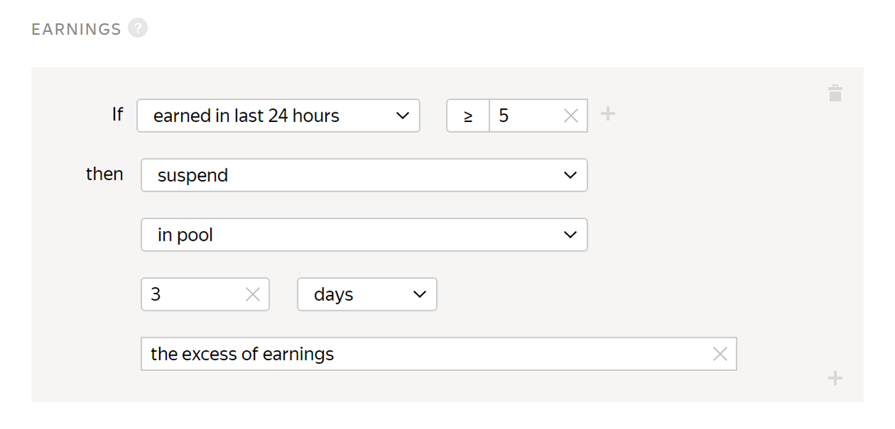

# Earnings

If you want to have a large number of Tolokers in a project, limit the number of [completed tasks](submitted-answers.md) or daily earnings in the [project](../../glossary.md#project).

Ban by earnings works for the pool. If you set up a blocking rule for the project, the earnings are calculated separately for each pool.



The project has a rule set up that bans the Toloker if their earnings exceed $5 in the last 24 hours. If the Toloker earns more than $5 in one of the pools, they can no longer access this pool. If they earn $2 in each of three project pools, they won't be banned.



## When to use {#when-use}

Limit the Toloker's daily earnings in the [pool](../../glossary.md#pool) if you want to:

- Get responses from as many Tolokers as possible (for this purpose, you might want to set the maximum amount of earnings equal to the price for a single [task suite](../../glossary.md#task-suite)).

- Provide protection from robots (for this purpose, set maximum earnings to a higher amount, like 10% of the entire pool cost).

#### Usage recommendations

Set an amount that Tolokers can realistically earn in a day, otherwise the rule will be pointless.

## Rule settings {#rule}



All fields in this rule are required. If you don't fill in at least one of them, you won't be able to save the rule.



#|
|| **Field** | **Overview** ||
||**If** | A condition for performing the action in the **then** field:

- **latest 24 hours income** — The Toloker's earnings for [completed tasks](../../glossary.md#submitted-answers) in the pool over the last 24 hours.||
||**then** | Action to perform for the condition:

- **assign skill value** — Assign a fixed value to the [skill](nav.md).

- **accept user's answers** — Requires the [non-automatic acceptance](offline-accept.md) option to be set.

    Useful if the Toloker completes most tasks well. Example: The Toloker completed more than 80% of the tasks correctly and you are satisfied with this result. The rule will work automatically and accept all responses in the pool.

- **suspend** — Suspend the Toloker's access to the pool for the specified number of days. Only the requester can view the reason.

- **ban** — Block access to the project or all of the requester's projects for the specified number of days. Only the requester can view the reason.

    If access to tasks is blocked temporarily (for example, for 7 days), the history of the Toloker's responses is not saved after the ban is lifted. The skill value is based on new responses.||
|#



The assignments submitted by banned Tolokers will be taken into account if they are not rejected manually using assignment review They can be reassigned by setting up the [Recompletion of assignments from banned users](restore-task-overlap.md) rule.



## Rule example {#examples}

**Task**: you're conducting a sociological survey. To collect responses from as many Tolokers as possible, set up the **earnings** rule.

#### Correct settings

If the Toloker's earnings exceed 5 dollars in the last 24 hours, they lose access to the pool and can't complete your tasks.

## Troubleshooting {#troubleshooting}



It is better to use one [skill](../../glossary.md#skill) in a project. You can choose the way to calculate the skill:

- Calculate the skill for each pool separately. The current skill value is the value of the skill in the pool the Toloker completed last. This option is convenient if:

    - The pools are intended for different groups of Tolokers (for example, there are filters by city or country).

    - Pools are started one by one and you don't want to take into account the responses in the previous pools to calculate the skill in the current pool.

    This calculation method is used by default when adding a quality control rule to a pool. For the control tasks block, leave the **Recent control task responses to use** field empty.

- Calculate skill based on all tasks in a project This option is good if the pools are small and you don't need to have skill calculated for each pool.

    This option is available only for skills on control tasks. To use it, fill in the **Recent control task responses to use** field in pool quality control rules.





Yes, of course — you can use the same skill for different projects. But most often, a skill is intended for a specific project. If the Toloker completes a certain task well, this doesn't mean that they will complete other ones successfully. Another disadvantage is that if you filter by skills that were set long ago, you will artificially limit the number of available Tolokers.



