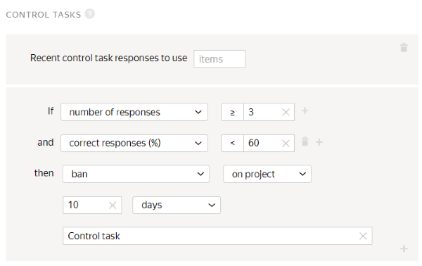
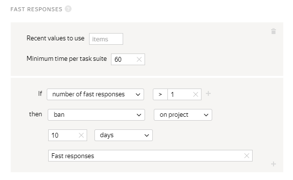
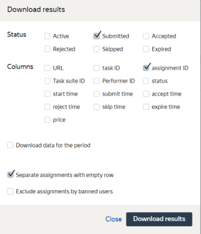

# Project 3. Does the item found look similar to the original?

In this [project](../../glossary.md#project), Tolokers will compare shoes from the original image (shown in project 1) with shoes found in project 2.



Since the **Assignment review** option is enabled in the [pool](../../glossary.md#pool) settings for project 2, you should complete all the steps and check the Tolokers' responses within the time limit set in the **Review period** field.



## Create a project {#create_project}

To create a project, open [Toloka for requesters]({{ yandex-toloka }}).

#### In the interface:

1. Choose a template:

    1. Click **Create project**.

    1. Select the **Image classification** template.

1. Provide general information:

    1. In the **Name for Tolokers** field, enter `Are these shoes similar to each other?`.

    1. In the **Description for Tolokers** field, enter `Take a look at two pairs of shoes and decide whether they look similar or not.`.

    1. Optionally add a **Private comment**.

    1. Save the changes.

1. Edit the task interface in the editor you selected:

   

    - Template Builder

      1. Use the [ready-made code](https://ya.cc/t/-ratdOH63ttEa4) for this project with pre-configured validation and task layout.

          The Toloker won't be able to submit the response until they:

          - Click the button to go to the online store.
          - Select one of the response options.

      1. Click **Show specifications** to see the input and output data fields.

          - Input data fields:

              - `image` — A link for uploading the image of the original product.
              - `found_link` — A link to the product in the online store.
              - `assignment_id` — A link to previous projects.

          - Output data field: `result` — string for saving the Toloker's response.

    - HTML/CSS/JS editor

      1. In the **Task Interface**, delete the template code from the **HTML** block and paste the following code:

          

          ```html
          {{img src=image height="400px"}}
          {{iframe src= found_link height="600px"}}

          <p>Check that the uploaded image matches the product in the store.</p>
          {{button label="Check the product"  href=found_link action=true}}

          <p>Are <b>these shoes</b> similar to each other?</p>
          <p>The shoes must be similar in color, material, length, and style.</p>
          {{field type="radio" name="result" value="Yes" label="Yes"}}
          {{field type="radio" name="result" value="No" label="No"}}
          ```

          

      1. Leave the **JS** block unchanged.

      1. In the **css** block, insert the following code that is responsible for setting the proportional image size:

          ```css
          .task {
            display: block;
          }
          .img {
            float: left;
            width: 50%;
          }
          .iframe {
            float: left;
            width: 50%;
          }
          ```

      1. Edit the [input and output data](../../glossary.md#input-output-data) in the **Data specification** block.

          1. Click  to switch graphic mode to JSON format.

          1. In the **Input data** field, enter:

              ```json
              {
                "image": {
                  "type": "url",
                  "hidden": false,
                  "required": true
                },
                "found_link": {
                  "type": "url",
                  "hidden": false,
                  "required": true
                },
                "assignment_id": {
                  "type": "string",
                  "hidden": true,
                  "required": true
                }
              }
              ```

          1. In the **Output data** field, enter:

              ```json
              {
                "result": {
                  "type": "string",
                  "hidden": false,
                  "required": true
                }
              }
              ```

              Learn more about the **Specification** parameters in [Input and output data](incoming.md).

          1. Click  to see the Toloker's view of the task.

              

              The project preview shows one task with standard data. You can define the number of tasks to show on the page later.

              

          1. In the window that opens, check if the task options work correctly. In the lower-right corner, click **Submit**.

          1. Exit preview mode.

              In the lower-left corner, click **Exit**. If there were errors when testing, check the code blocks that you entered.

    

1. Save the changes.

1. In **Instructions for Tolokers**, enter the [instructions](../../glossary.md#instructions).

    1. **Instructions:**

        

        ```plaintext
        Take a look at the pictures that show two pairs of shoes. Decide whether they look similar or not.

        Shoes are considered similar if they have a similar color, fabric, length, and style.
        If you don't see a pair of shoes in any of the pictures, click **Yes**.
        ```

        

    1. Save the changes.

1. To go back to the **Projects** page, click **Finish editing**.

Learn more about working with the project in the [Project](project.md) section.

## Create a pool {#create_pool}

To create a pool:

1. Open the page of the project titled **Are these shoes similar to each other?**.

1. Click **Add a pool** on the project page.

1. 

1. 

1. Click **Create**.

1. 

    1. 

    1. 

    1. 

    1. Add another filter. Click **Add filter**.

    1. Find the **Skills** block in the list and click **Choose your skill**.

    1. In the **Skill** field, select **Found_shoes**.

    1. In the **?** field specify `=`.

    1. Leave the **Absent** field empty.

1. (optional) In the **Speed/quality balance** section, specify the desired quality level. Improving quality may reduce the speed of task completion because the pool will be available to fewer Tolokers. Learn more in the [Speed/quality balance](adjust.md) section.

1. 

    1. In **Price per task suite, $**, set the amount of money to pay per task suite done by one Toloker. For example, `0.01`.

    1. Enter `3` in the **Overlap** field.

1. 

    1. Click **Add a quality control rule**.

    1. Find the **Rules** block in the list and choose **Control tasks**.

    1. Set a rule for [control tasks](../../glossary.md#control-task): If the **number of responses** to control questions **is greater than or equal to 3** and the **percentage of correct responses** to control questions **is less than 60**, then **restrict the Toloker's access** to the **project for 10 days**. Specify the **Control task** as a reason.

        

    1. (optional) Add another quality control rule. Click **Add a quality control rule**.

    1. Find the **Rules** block in the list and choose **Fast responses**.

    1. In the **Minimum time per task suite** field, specify `60`.

    1. Set a rule for fast responses: if the **number of fast responses is more than 1**, then **restrict the Toloker's access** to **the project for 10 days**. Specify **Fast responses** as the reason.

        

    Learn more in [Quality control](control.md).

1. At the **Add optional pool settings** step:

    1. 

        The time should be long enough to read the instructions and wait for task data to load. For example, `300` seconds.

    1. Turn on the **Keep task order** option.

1. 

    1. Wait for the pool from project 2 to complete.

    1. Open the pool page from [project 2](find_an_item_in_store.md).

    1. Click **Download results**.

        1. In the **Status** block, only leave the **Not checked** option enabled.

        1. In the **Fields** block, only leave the **response ID** option enabled.

        1. Disable the **Separate assignments with empty row** option.

            

        1. Click **Download results**.

    1. Prepare a [file](../../glossary.md#tsv) with tasks.

        1. Leave the `INPUT:image` column unchanged.

        1. Rename the `OUTPUT:found_link` column to `INPUT:found_link`.

        1. Rename the `ASSIGNMENT:assignment_id` column to `INPUT:assignment_id`.

        1. Delete all the other columns.

        1. Save the file.

    1. Upload the resulting file to the **Are these shoes similar to each other?** pool.

        1. Open the **Are these shoes similar to each other?** pool.

        1. Click **Upload**. 

        1. Click **Drop file here or select**, and upload the file you’ve just made.

        1. Choose **Smart mixing**.

        1. In the **General tasks** field, specify `9`.

        1. In the **Training tasks** field, specify `0`.

        1. In the **Control tasks** field, specify `1`.

        1. Click **Upload**.

        1. Click **Combine tasks into suites**.

1. 

    1. In the left column, turn on the **result** option.

    1. Choose the correct answer to the question.

    1. Click **Save and go to next**.

    1. Click **Are these shoes similar to each other?** to exit [task markup](../../glossary.md#task-markup) mode.

        

        In small pools, [control tasks](../troubleshooting/pool-setup.md#how-many-control-tasks) should be 5–10% of all tasks. Include different versions of correct responses in equal amounts. See the distribution of responses on the **Edit tasks** page, **Control tasks** tab.

        
        
1. 

    



## Download the reviewed results {#get_results}

To get the results:

1. Next to the **Download results** button, click .

1. Choose the **Dawid-Skene aggregation model**. Learn more about [Result aggregation based on the Dawid-Skene model](result-aggregation.md#dawid-skene).

1. In the window that opens, click **Yes**.

1. At the top of the page, click **View operations list**.

    

    To track the progress, refresh the page from time to time. Aggregation takes from 5 to 20 minutes. You can start designing another project meanwhile.

    

1. When the operation is complete, download the file with the results. To do this, click **Download** in the **Files** column.

1. Use the file with the results from [project 2](find_an_item_in_store.md#upload_file).

## Check the completed tasks {#check_results}

You can check the results in two ways:

- In the file with the results.
- In the pool interface.

#### Review assignments in the file with the results

To review the [submitted assignments](../../glossary.md#completed-tasks):

1. In the text or spreadsheet editor, open the file that you received after aggregating the results.

1. Prepare the file:

    1. Add a column named `ACCEPT:verdict` with the review results.

    1. Add a column named `ACCEPT:comment` with comments for Tolokers if responses were rejected. For example, comment on which part of the instructions wasn't followed.

    1. Rename the `INPUT:assignment_id` column to `ASSIGNMENT:assignment_id`.

1. Fill in the `ACCEPT:verdict:` and `ACCEPT:comment:` columns:

    - If the aggregate result of the assignment is OK, put `+` to accept it.

    - If the aggregate result of the assignment is incorrect or it doesn't open, put `-` to reject it. Specify the reason for assignment rejection in the `ACCEPT:comment:` field (for example, `The item provided is incorrect or doesn't open.`).

1. Delete all the other columns.

1. Save the file.

1. Open the pool page in project 2.

1. Click **Review assignments**.

1. Click **Upload results**.

1. In the window that opens, choose the file with the results to upload and click **Open**.

1. In the window that opens, compare the number of assignments in the **Processed successfully** field with that in the **Total submitted** field on the pool page.

1. Click the **Add** button.

1. In the window that opens, click **Close**.

1. When setting up the pool in project 2, you enabled the **Recompletion of the rejected tasks** option.

    In this case, the pool automatically reopens and the assignments are reassigned to other Tolokers. When they're completed, send the results for verification. Then download the results, check them, and upload the reviewed results. You can reject assignments as many times as you want to get more accurate results.

#### Review assignments in the pool interface

To check submitted assignments:

1. Open the pool page in project 2.

1. Click **View assignments**.

1. Hover over the line of the assignment you want to check.

1. In the **Status** column, you'll see the buttons for accepting () or rejecting () the completed assignment. If you reject the assignment, enter a comment in the window that opens and click **Done**.

## What's next {#what-next}

- Create [Project 4](item_more_similar.md) to compare matching images.

