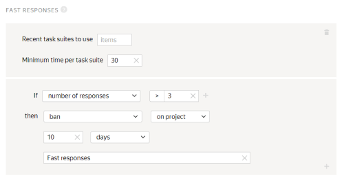
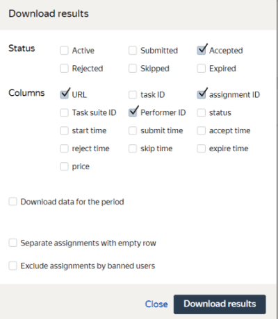

# Project 4. Which of the found items is most similar to the original?

In this [project](../../glossary.md#project-ru), Tolokers compare images of shoes with the original image and decide which pair of images is most similar. To make a comparison in the project, add the results from the [second project](find_an_item_in_store.md). To learn how, see **Prepare and upload a [file](../../glossary.md#tsv-file-definition-ru) with tasks**.

## Create a project {#create_project}

To create a project, open [Toloka for requesters]({{ yandex-toloka }}).

#### In the interface:

1. Choose a template:

    1. Click **Create project**.

    1. Select the **Image comparison (Side-by-side)** template.

1. Provide general information:

    1. In the **Name for Tolokers** field, enter `Which object is similar to the original one?`.

    1. In the **Description for Tolokers** field, enter `Decide which pair of shoes is most similar to the original shoes.`.

    1. Optionally add a **Private comment**.

    1. Save the changes.

1. Edit the task interface in the editor you selected:

    #### Template Builder

    1. Use the [ready-made code](https://clck.ru/U7feQ) for this project with pre-configured validation, keyboard shortcuts, and task layout.

    The Toloker won't be able to submit the response until they:

    - Visit the online store.
    - Select one of the response options.

    1. Click **Show specifications** to see the input and output data fields.

    - Input data fields:

    - `image` — A link for uploading the image of the original product.
    - `left_link` — A link to the product in the online store for the left button.
    - `right_link` — A link to the product in the online store for the right button.

    - Output data field: `result` — string for saving the Toloker's response.

    #### HTML/CSS/JS editor

    1. In the **Task Interface**, delete the template code from the **HTML** block and paste the following code:
    
    ```
    <div class="header">
    <div class="left caption">
    {{button label="Go to site" href=uploaded_link_left size="L"}}
    <p class="url">{{uploaded_link_left}}</p>
    </div>
    <div class="right caption">
    <p class="url">{{uploaded_link_right}}</p>
    {{button label="Go to site" href=uploaded_link_right  size="L"}}
    </div>
    </div>

    {{img src=image}}

    <div class="content clearfix">
    <div class="left page">
    {{iframe src=uploaded_link_left width="100%" height="700px" real-size=true screenshot=true}}
    </div>
    <div class="right page">
    {{iframe src=uploaded_link_right width="100%" height="700px" real-size=true screenshot=true}}
    </div>
    </div>

    <div class="footer">
    {{field type="radio" name="result" label="Left image is better" value="result_left" hotkey="1"}}
    {{field type="radio" name="result" label="Right image is better" value="result_right" hotkey="2"}}
    </div>
    ```
    
    1. In the **js** block, edit the code by adding the following lines before `OnRender`.
    

    Don't remove the existing code.

    

    ```
    getTemplateData: function() {
    var data = TolokaHandlebarsTask.prototype.getTemplateData.apply(this, arguments),
    input = this.getTask().input_values;
    var left_link = input.left_link;
    var right_link = input.right_link;
    var uploaded_link_left = '',
    uploaded_link_right = ''
    if (Math.floor(Math.random() * 2)) {
    uploaded_link_left = left_link
    uploaded_link_right = right_link
    } else {
    uploaded_link_left = right_link
    uploaded_link_right = left_link
    }
    data.uploaded_link_left = uploaded_link_left;
    data.uploaded_link_right = uploaded_link_right;
    data.result_left = uploaded_link_left;
    data.result_right = uploaded_link_right;

    return data;

    },
    ```

    1. In the **css** block, insert the following code that is responsible for setting the proportional image size:

    ```
    .task {
    display: block;
    text-align:center;
    }

    .header {
    overflow: hidden;
    background-color: #FFCC00;
    }

    .caption {
    width: 50%;
    }

    .url {
    white-space: nowrap;
    overflow: hidden;
    text-overflow: ellipsis;

    max-width: calc(100% - 182px);

    display: inline-block;
    vertical-align: bottom;
    }

    .button {
    margin: 10px;
    max-width: 182px;
    }

    .button__label {
    white-space: nowrap;
    overflow: hidden;
    text-overflow: ellipsis;
    max-width: 150px;
    }

    .content {
    margin: 10px 0;
    }

    .page {
    display: inline-block;
    width: 50%;
    }

    .left {
    float: left;
    text-align: left;
    }

    .right {
    float: right;
    text-align: right;
    }

    .clearfix {
    overflow: hidden;
    width: 100%;
    }
    ```

    1. Edit the [input and output data](../../glossary.md#input-output-data-ru) in the **Data specification** block.

    1. Click  to switch graphic mode to JSON format.

    1. In the **Input data** field, enter:

    ```
    {
    "image": {
    "type": "url",
    "hidden": false,
    "required": true
    },
    "left_link": {
    "type": "url",
    "hidden": false,
    "required": true
    },
    "right_link": {
    "type": "url",
    "hidden": false,
    "required": true
    }
    }
    ```

    1. In the **Output data** field, enter:

    ```
    {
    "result": {
    "type": "url",
    "hidden": false,
    "required": true
    }
    }
    ```

    Learn more about the **Specification** parameters in [Input and output data](incoming.md).

    1. Click  to see the Toloker's view of the task.

    

    The project preview shows one task with standard data. You can define the number of tasks to show on the page later.

    

    1. 1. In the window that opens, check if the task options work correctly. In the lower-right corner, click **Submit**.

    1. Exit preview mode.

    In the lower-left corner, click **Exit**. If there were errors when testing, check the code blocks that you entered.

1. Save the changes.

1. In **Instructions for Tolokers**, enter the [instructions](../../glossary.md#task-instruction-ru).

    1. **Instructions:**
    ```
    Look at 2 pictures with different shoes and decide which pair of shoes looks most similar to the original pair.
    Rely on your own sense of style, but also remember that the shoes look alike if
    they are the same color, fabric, length, and style.
    ```
    

    1. Save the changes.

1. To go back to the **Projects** page, click **Finish editing**.


Learn more about working with the project in the [Project](project.md) section.

## Create a pool {#create_pool}

To create a [pool](../../glossary.md#pool-ru):

1. Open the page of the project titled **Which shoes look more alike**.

1. Click the **Add pool** button.

1. Specify the **pool name**.

1. (optional) Add a **Private comment**. This information is available only to you.

1. Filter Tolokers in the **Tolokers** section of the **Audience** block.

    1. Click **Add filter**.

    1. Find the **Toloker profile** block in the list and choose the **Languages** skill.

    1. In the **?** field specify `=`.

    1. Add another filter. Click **Add filter**.

    1. Find the **Skills** block in the list and click **Choose your skill**.

    1. In the **Skills** field, select **Found_shoes**.

    1. In the **?** field specify `=`.

    1. Leave the **Absent** field empty.

    Tasks in pools will automatically be available in the web version of Toloka and the mobile app. If you want to change the default settings and limit the visibility of the task for any of the versions, add the **Client** filter and select the desired value: **Toloka web version** or **Toloka for mobile**.

1. (optional) In the **Speed/quality balance** section, specify the desired quality level. Improving quality may reduce the speed of task completion because the pool will be available to fewer Tolokers. Learn more in the [Speed/quality balance](adjust.md) section.

1. Enter `0.01` in the **Price per task suite** field in the **Price** block.

1. In the **Quality control** block, specify quality control settings for the pool:

    1. Click **Add a quality control rule**.

    1. Find the **Rules** block in the list and choose **Fast responses**.

    1. Set a rule for fast responses: if the **number of fast responses**** is more than 3**, then **restrict the Toloker's access** to **the project for 10 days**. Specify **Fast responses** as the reason for ban.

    Learn more in [Quality control](control.md).

1. Enter `10` in the **The number of Tolokers to complete each task ** field in the **Task overlap** section.

1. In the **Additional settings** block:

    1. Enter `300` in the **Time per task suite** field.

    1. Turn on the **Keep task order** option.

1. Click **Create a pool**.


## Prepare and upload a file with tasks {#upload_file}

1. Download the file received in the [third project](item_look_similar.md).

1. Create pairs for each input image so that you can compare the two found images with the original one and decide which one is more similar.

    You can create pairs manually using a text editor or automatically, like using Python or Jupyter Lab.

    As an example, you can use our results [https://tlk.s3.yandex.net/wsdm2020/SbS_Toloka_prep&aggr_data.ipynb](https://tlk.s3.yandex.net/wsdm2020/SbS_Toloka_prep&aggr_data.ipynb).

1. Open the **Which item is more similar?** pool.

1. Click **Upload**. In the window that opens, configure the file upload settings.

1. Choose **Set manually**.

1. In the **Tasks per suite** field, specify`1`. You can experiment with the number of tasks per suite.

1. Click **Upload**.

1. In the window that opens, choose the file with tasks to upload and click **Open**.

1. Click  to start the pool.

    

    The tasks will be completed by real Tolokers in Toloka. Recheck your project setup before you start the pool.

    


## Get the results {#get_results}

To get the results:

1. Click **Download results**.

    1. In the **Status** block, only leave the **Accepted** option enabled.

    1. In the **Fields** block, leave the **link**, **response ID**, and **Toloker ID** options enabled.

1. Disable the **Separate assignments with empty row** option.

1. Try to use the [Bradley-Terry model](https://en.wikipedia.org/wiki/Bradley–Terry_model) based on the results. As an example, you can use our [https://tlk.s3.yandex.net/wsdm2020/SbS_Toloka_prep&aggr_data.ipynb](https://tlk.s3.yandex.net/wsdm2020/SbS_Toloka_prep&aggr_data.ipynb)results.


## What's next {#what-next}

- Learn more about [decomposition](solution-architecture.md).



