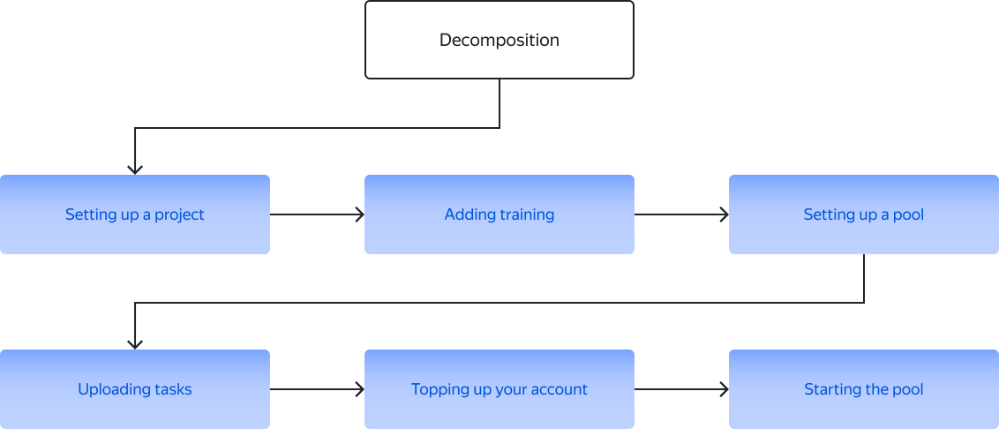

# Starting and tuning a project

This section describes the general steps for posting a task and provides links to the appropriate instructions.

## Before you start {#before-begin}

Make sure you're [registered](access.md) as a requester.

If you have a complex project, register in the [sandbox](sandbox.md) and create a project there. This is where you can test your project settings as a Toloker before moving them to the [Toloka production version]({{ production-version }}) and running the project for real Tolokers. This helps you avoid making mistakes and spending unnecessary money on a task that doesn't work.

## Steps to follow {#procedure}

1. [Think through the solution architecture](solution-architecture.md). Perhaps you should create a number of small interrelated projects instead of one project. This will simplify a task and hence reduce its cost and improve the quality of results.

1. [Create a project](project.md). Project settings define the [task interface](../../glossary.md#task-interface) and the [input and output data](../../glossary.md#input-output-data).

1. [Add training](train.md) (optional). The training pool will allow Tolokers to practice before starting work, and you will be allowed to the main pool (there may be several) only those who have mastered the training.

1. [Add a task pool](pool-main.md). Pool settings define all other settings, such as pricing, rules for displaying tasks to Tolokers, and quality control.

1. [Add tasks](pool.md) to the pool.

    

    First, make a small trial pool (10–100 tasks).

    

1. [Top up your account](refill.md) in Toloka.

1. [Start the task pool](pool-run-and-stop.md) so that Tolokers can see your tasks.

    After starting the pool, watch for incoming [messages](messaging.md) from Tolokers during the first hour. Usually Tolokers report problems with tasks quickly.

1. [Check the responses](accept.md) if you chose to [review assignments](../../glossary.md#left-off-acceptance) when configuring the pool.

1. [Process the results](result-of-eval.md). If the response quality is poor, try to find out why. You may need to edit the instructions or add more tasks to the training.

