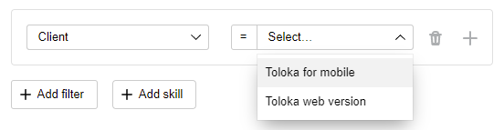

# Adapt a task for mobile devices



The task interface configuration guide describes the features of the HTML/JS/CSS editor. You can also try creating a task interface in [Template Builder]({{ tb-quickstart }}).



By default, the task is available in both the web version of Toloka and the mobile app.

To run the task on mobile apps, follow these steps:



The following tasks don't work on mobile devices:

- Tasks with embedded web pages (iframes).
- Area selection in an image.
- Video quality rating.
- Tasks with large images.
- Side-by-side image comparison where images should be placed next to each other on the screen.
- Tasks that require typing a lot of text.

Tasks that work well on mobile devices include classification, surveys, evaluation of short texts, moderation of comments, and so on.





We recommend that you use the [Template Builder]({{ tb-quickstart }}). It will make it easier for you to adapt your tasks for mobile devices.

Add the following code to the **CSS** block:

```css
@media screen and (max-width: 800px) {

 .task {
  width: 93%;

 }
 .popup__text {
  width:auto;
 }

 .field{
  white-space: normal;
  display: block;
  width: 100% !important;
 }

 br {
  display: none
 }
}

@media (pointer: coarse) {
  .field__hotkey, .inplace_instruction  {
    display: none;
  }
}
```

This code changes the [task interface](../../glossary.md#task-interface) for devices with the screen width of less than 800 pixels:

- Accommodates all interface elements on the smartphone screen.
- Makes sure that the hints don't go beyond the screen.
- Removes keyboard shortcuts.
- Adds line breaks for fields.
- Removes empty rows.







- Chrome

  1. Press F12 or right-click anywhere on the page and choose **Inspect**.
  1. Click the phone and tablet icon to enable display mode for mobile devices.
  1. See what the task looks like on popular mobile platforms.

  [For more information, see the browser documentation](https://developers.google.com/web/tools/chrome-devtools/device-mode).

- Firefox

  1. Press F12 or right-click anywhere on the page and choose **Inspect**.
  1. Click the phone and tablet icon to enable display mode for mobile devices.
  1. See what the task looks like on popular mobile platforms.

  [For more information, see the browser documentation]({{ mobile-mozilla }}).

- Opera

  1. Right-click anywhere on the page and choose **Inspect element**.
  1. Click the phone and tablet icon to enable display mode for mobile devices.
  1. See what the task looks like on popular mobile platforms.

- Safari

  1. [Go to the developer tools]({{ developer-tools-safari }})
  1. [Enable display mode for mobile devices.]({{ safari-mobile }})

- Yandex Browser

  1. Press F12 or right-click anywhere on the page and choose **Inspect**.
  1. Click the phone and tablet icon to enable display mode for mobile devices.
  1. See what the task looks like on popular mobile platforms.





If the task doesn't display well, go back to the CSS block and add the missing styles to `@media screen and (max-width: 800px)`. If you aren't familiar with the CSS and HTML languages, use professional services or contact support. For more information, see [Get help creating a project](get-help.md).







Tasks in pools will automatically be available in the web version of Toloka and the mobile app. If you want to change the default settings and limit the visibility of the task for any of the versions, add the **Client** and select the desired value: **Toloka web version** or **Toloka for mobile**.





## What's next {#what-next}

- [Create a task pool](pool-main.md) in the project.
- Learn more about how to set up a [project](../../glossary.md#project):

    - [Writing instructions](instruction.md).
    - [Input and output data](incoming.md).
    - [Task interface](spec.md).
    - [Setting up quality control](project-qa.md).

