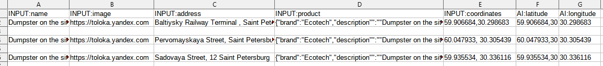

# Monitor outdoor items of interest



Run the project in the [Sandbox](https://sandbox.toloka.yandex.com/) first. This helps you avoid making mistakes and spending money on a task that isn't working right.




Field tasks are completed in the Toloka mobile apps for [Android]({{ android-app }}) and [iOS]({{ ios-app }}). A Toloker chooses a point on the map where they need to go to check something and take photos.

You may need additional projects for your task, such as dataset pre-check or checking Tolokers' responses. Learn more about this in [Decomposition of the task](solution-architecture.md).

You may need additional settings for your project, like to add a new button with a particular scenario or a section for attaching files. Learn more in [Customization examples](advanced-features.md).

Use the "Monitoring outdoor objects of interest" template when you need to:

- Monitor equipment quality and condition.

- Check if equipment is installed at a particular address.


Let's say you need to check if certain facilities or equipment are available outdoors.

To do this, create the following task for Tolokers: go to the location, photograph the facilities from different angles, and take photos of the address sign. If the facilities are not available, photos are needed as proof. If there is no access to the facilities, take a picture of the surroundings and indicate the reason.

To run tasks and get responses:

1. [Create a project](#create)

1. [Create a task pool](#create-task-pull)

1. [Upload tasks](#download-task)

1. [Start the pool and get the results](#get-the-results)


## Create a project {#create}

The project defines what the task will look like for a Toloker.

#### In the interface:

1. Choose a template:

    1. Click **Create project**.

    1. Select the **Monitoring field objects** template in the **Spatial Crowdsourcing** block.

1. Provide general information:

    1. Enter a clear name and a short description for the project. Tolokers will see this in the task list.

    1. Optionally add a **Private comment**.

    1. Click **Save**.

1. Edit the task interface in the editor you selected:

    #### Template Builder

    1. The task interface describes how the elements should be arranged in the task.

    Use the [ready-made code](https://tb.yandex.net/editor?config=N4Igxg9gdgZglgcxALhMAOlABF9IBucApgO57JYbY64gAuAngA5Hm2GkB0ANnAM508AGkw1acOkQC2fNgG1RYyoqW1GLNng4lOAQ25EAToJAjqqvJCiTrbKqrF51rFO2I7JADxNmHNS9A2JhR4ALLQEhCGcFAIWPBE3AAmWBAARgBWRGB0siAqSgC+vg5OABbSLiEgMTAQeAU4xY3K5kpOzFVuXF4+LTh43LppiZogACoSBsjC-bRWQXZzA-SdY0m6dLqcMUwArn1tFiBMm2VjULpSLnOFLc1HrX4dGq5a7pxJcIRJRg2PD1U9lKq1e1W0nF6s0eKyGI24YwAgkkkoYiHw+DNTHMAtYiLZXMDnqCungNlsdlB9oc-CtTnRzm8QLoUWiMf8-HcASUxET2iSxhCvj8-vluS0+Y4BUyIVDsTDaHDRkyAJKSKRYX58MDRJh0ODQLE8-kLfHBJ60l6kkDk7a7A7Q2m0emM6pMQwQJJ7HIchxc1SApSS-zS8EfYVwX6GX1iQO8nGh7o6XhQADWjpBe0MCKZZTodCYmIA9EWGLoBJs4GBOFAiHQi3wAMxFugQbgQVO6ItMItogCOe3RkkMRd0ADYxwAWACcACYAAwARgAHLpF4350kAOyNxtbpIAVi3ui3y6306385ge7HnAyTAQGeOpoJ1QAMjFU1hW9+Klg4FIugIEQqQwL+IESNIMY0HGNDBisziCh8ug5AaUAALRpAcrZQE+-JKjm1QAMplLoaJYAwEBZlgkBRF8lySHkxpSih+rQEsCoIWsTKsWhnB8HWeHHKcDDtiyHFOlxYK0AAAmWUC-J46Gtu2nZFraPAQGAlbsWKTqwcctoSZJVrrJs2xUQWDrypJzpnGMJBRKmRgAPq0YY9GbOi0EBrczEhvg+iRjpuGEssajcdUVhfGxUB6NwOb+VK0USGheQUAonFweFUqIUyKWxZw-Z7HAaJJEJlogGUMTmngADCvBgF+P58KR5GUdR7meYxFXEkZYVZcceXVBplnUr1lUug5TmuV1MReXkOUwUtBkOPBILDbJ8mKcpbYdl2BV8V8FZQGALhJSC1WvrQHVYGRIGthA8RkXdJC6Aw8QehqDIge22mFRNxwwF9xm2VJ1pyboClEEpKn7ep5maf9aE+bSq3Eq2oNg6ZTIafaNJg3S9n5RAdHzT1elg+jIKAZ4bAHvOK3hQAurc9z+etONhlwEZRqjq2c4m7xcPoRgE8+gRmljQ2RbQCTJJwWH5tA6GGCyBroQgHp7EwgOKsMyrEYk2R0OB37ll+kBSEwBixakepoUa4V4BADvQOlWCZbZ63HARYwqgA5PgIF1HsClm5BUh61KgXcIOYwdqjAYXfGg0hn7qoBxqFRokIWBKxH6r-nwWBSPwfAxI+NnYwQ+jx0yUAQC56QZEnRQp9laewgbhG0OMf6RzRUMB6bIxYGiKEVOV1e2VodfWo3LkoWd7KU-pLMd3PvDkijA2z0L4DQDFfHFaVRDTx3KxXbVIBEcbOSpLWoFm67sWYlg7pVg9QHxFRCl543D+0QzrmwQAAp67pPTejoHnAQUQQJgHbAJJInA25NE3jacy0sNqyzJIjMa1lL52QZIKIwXwfRrz9H5BMP1rhjFqPUSh6CJQ0NwVVRILBDD8RIBIMAjILqWHLN5VwXtaQ+xDIdXSFBxG5TYZIuKRABz6CYktBCjDqiJxniZTBWxsFOi5rQUaBxxpaP3lNGUZCqwmFUVgf0klqZSjZHsbg5oZEhk2sLZM-BxbaMjh7URhM3Ey2kp4zggFDCpiSBAEgoUiESzxNdPAAAqJJAAFMoEBWwlwgGBH6-51QpLQX6OJndCayJCQQD44TInRNiTY5KktEkgCSeMXQzk7qmwMOWU2k4P4ZKyc-PJLcTafQgBqL4MAYBGDNFgCuWpZlPQZJscCH1EFEDItwD6rVokv0yCbPOEgS58LIqxIw3iqx8Dzi+XIWAAAUcAwJQwYAASjzlDFIf0Qr-mwGiIYdsfx5L4FmbWClK53QnpwJJRTk71ItGUiKFSIQpnTKYmuWZe54DzAWYsRYpB0HQtc9C+w0iNX4o2Tg20YY1jrEWGIAhDDQLSi2PanYXLyySC5dUNsFpFhbmy4gyQXKLnQmXOKTBYjRxBNcsYABRTwVwbY3C7jBEpOAgn8g8SAdlYTz5wF0OheABhJXHFjsFWKeia6avkUVRRJUyrGsujVJE+ZJ59MyRAbJuS-zDJyKgphVNVUhmXkQPUFqzH9PUd+BlrBlWxkDSsfq0jYXlOtEYqyPj4V4HMdUACCA+DN0yNC4pybaBSGcfqRVbA6DRthQ4taJaDGhOqVEmJDqGkJJvik5Ex9oD6G+XUQwgFYqFP9fpQN6qU1IS4M22pbaJGNJvgACWmQHEueTei-mWRbNdf5OEDuuIYb8T0zRGDNr8oggVrD9qiEOtCd00iWV2VkB+UR8lHLaqc6IAgLnfLNuy-OiRomQqLXG2FE73FsO1b0e6ug50JqwXveFEGKlppMfGkM2bS3wJcgwzgVtrgEhLXW4kpqd5SLhUhxth9QWFVPva1FhNMVOqZAAdWiJIO6NExkEboH6ojtbx0NoPtqtWXwICa21rrBj2iM7VH7vwYunGK6xAMDRDJX8sADiHI7ODtBX5pXkCWtVRn049zGAAeTdtgRcumY7zzGFIbDDChU2dHQGkz4HfZmaZJZu2s5bMBXs0yRzaIcOwCboufzbnbLEbESZ7u8ILNWawI2ALKxY712qCFogYW6hCtS9F+xJbmbobwboxDSGEWpvwcYwhJms3Eyy058Lnx0Q6jgFZoVIH25CdIyFMN2irVH1StAG1A4z4X3q1VZjRsDAPyhndKAfASBGD47G5a63Yup0q1R7VfDsipgfUpLWVEpOlZALJvu1US4Kd0KXctHXVN8IgBprT37DS6ZdlZ-xHn4v60Sz55Lrn0N2bjtabLuWm6zlcyZrb9b1teYB9UXzd6osg8C2DhzzW8uzii7D9Hnn8LeeR8lgr6P0tBaa6F5zs4Cuw+K+dxNFHM0H1Q3VhHGHGtYepy1rU7XOt4453D0HZrd5Jo5+DMY1q6PnwC0xppd85umwW1DZbq3uuxgE2BoTmqIQztbdJ-R1HFhMhSek91gy-wslROiEuFcEBQBHVr9bhOqN67IjUg353pWm9ae0u7TAI2W5AtbtkdvEDYFfXk0PtuP5-JAjkzjtZEBlAfdEWI+cSrJDBdAM2fArggXpUQOswHCswpdzrthSLPyfZAOisYWLCzIBLHiglC6iV7BJVWMlFL3lUtrPWOl1bGXu2ZapXQ-LEgcq5fHvgvLMiT8FbOFyjYXKThFTETg4qq7e4XbK+V1sjVl56xXjnu2BUoOuF8fVhrzq9aCmR0K4vKuS5JjRk+tqJty+m00xELq+GcaB4W6J7R6six7cqSBraVbC5BpgBnShoVaUYnARpVo1pC6M4IbP4v5UZs4ZplINYkJMi5r5ox6rxEbnZlouKPZdDD4xrwowGu4Hzu4RItp1Jn7G5Sym5JJ1TcZmh8BO6baCbsG65VIe6sG14+7VBJIqhgQdSHpAEDJRJQAjxcbWC6AxB3QJRmy1grz56GAfQMKDohRvIoiah1jqHcAlw5xECl7O7wqMGapQYwxbATy15M6E6v4jQ1bprf6YYBBSA8Ya4bb0E2Ksxpx2KcgdxuK4g9pP7M6VRDbv6ja2rKIOpOCRp4CLwtxpE6KwaIH7yaq4FzoEGujsCWIUI2IRFoxEJ4BOIuIDaToygfC8ACA5F+KGan47ZMGiEsGzqG6VSSG0AtJtIgQKEerB5x4oQJ6HqArAp-z0RxAwajIaj6DcCzKRjogLKbqmw-SrJdLZhbIZIkDbFPojIKZlwYiVy2GCHa7CGQYX46rX4GpwBH7nZ9bmr5H4EHzS6f70bo7y43x-5bAAFjGep55zFhwLF8BQFIYwErDBoIFYFdFjGoHxzoFCbuFTaFHeFoZTZ+E1BSB5pLwgocrZHH7l5dGUEVpH4UC0F2FlIOFV49Ge5sFdGDHJJ+4h5uo-ggFW5gEYjrEO6pAzF8k24CkQEJ6PJYDJ4ICp5RBgpYQvELGPx54F6zLVrF68ZQrkkqq3FdEiFcDIq17165j5hN4t74qErEqkpNi97QyeDUqD5LbD6oSj5wysrsqcrSASlz58qenL6r7r6ipb4Sr9HEjskgByoKpH70mBKV4VLapX56rPGvH37bz9afGMbfHDa0a-Gy5hmVTXzOrAllCAFB68kh78klwSkwn0HnYImuJ4koGuB0nonsGYkS5VZmQUgEJ4FZn4nEFLxVlBHMLsFUnUGol0FlIMHxnWjMEskSF75cE8EBF8ECF1l6lIEGk6D66slIERnjD6FHrxAxApCPokBlAfR5KDznHlxgrvKzIsBgAPJXl-gTx8C54aF5L4Zmi1nuadFbn3FT6QjOEwZuGYHxFZnYk9m1Z9k1z4k-mEZC61qhFMxZR1rRHUaxENHIbWjWopGWE5GYwNxNzBqrwlJlZ5FImWpsJFEFlSj4nBweRWLdZVGRFLS1Hojlo4WeFJg8DeJtHqg-YAUs7blhJiF9G74dpjBJJAmuoB5B5LKmzbIkA7qF4QmgoZ5LEPl5Lvm54XkfS3SQDOJJDKGmwTwAFDJ7K+ramxlgyMmIrNE170X8gmnVCN44qt5Wmd42nkqUoOkD60rOkMqulLZj77SL7T7emz7z4ZCRUuQHgb5iqhlSUm7VBRmH5KobkiVfGOEPFJk34vF37sHvFi6QU0UVI-HjZ-FTZFlMhyUAEKXAFerqWGAkn3kQojm2L1lwEhqNmdlZrNm0loHQEYHlbUWiW0U4ns4v7EKlF4CDlkTzEuSLxkWLRtmUkPaVotkjXTlCH6lMnToSVe5CYRnDH+7clPQVl3RVmCmR4imVlinVnx7Px3Yylynp5xCKnZ4Z656ApqlF4l62U3E5VQWHVeJpjGnZgN5mmeWWnt7Wnd62n+WOlBX0oj5hXukT6ekz48p+kX4uQBlr5JUhk76nVLnpUH7bV2XeyzljCJm6qFWpklUP4ZkTW5VyI5kf7VX5n-E-6An-6llNU8ktU3VPWTGQFdVwm0ANk8Uggok7VomjUYkQUeFdm4zTVwVmJc4LWEkkHDk6mgZjlbU0lRpK17WbmTWOVHW9EnXsFnVJKhDvKbBRCrK8HWD8HA3ZX2F01NE20LkuXtppVDFyrcoaEGUURURcYmVmXjzrKWXerWValBEzl3EJkPHQauGB0hgdmzU4Ga2+E62HyrlIXK0s3pkfHs1g2VVc2jYy6TYDX81jBsaQScaIW8ZS0oXKphExbhRsU0A91FAFCD2BhZpxwIB0odHbYapsI2x7AT1xRY0VSDDvSWQWp4CpinljDagegJQTROAWwsaRiEEUDLjziMwAgFB2JhGFCmA1BUgHAoBoDoDRhtCZEF5jDjDOHLG4DoDv10J-0gAnlT6zCv1SgARATWgeXN6ljdKVjViBVNjhVqQ9jFRDhGCjgTgzgLgrhrgbjbi7j7hHgnhngXhXg3h3gPigMFB4CkEex4Bf3eA-1-20PDmAPAPJDUNv0nAehegUJybf3AxjK-1Zq8PQIsNAPspcMNJkwMTCLVAHgHicBbizgHgXjLgMyNhjg7iKNCB7icBjjzjLi47LgXi7jLjLhjjLgNCv232FBAA) for this project with pre-configured validation and task layout.

    The Toloker won't be able to submit the response until they:

    - Are within 50 meters of the specified location.

    - Select one of the three task completion options.

    - Upload photos of the object or photos confirming that it is missing.

    - Write a comment if there's no access to the object.

    1. To specify what data you will pass to the Toloker and receive in response, create input and output data fields.

    #### What are input and output data?

    **Input data** is types of objects that are passed to the Toloker for completing the task. For example, this could be a text, an image, or geographic coordinates.

    **Output data** is types of objects that you receive after the task is completed. For example, this could be one of several response options, typed text, or an uploaded file.

    Input data fields are created from the code on the **Example of input data** tab.

    The output data fields depend on the components that use `data.output` and values supported by it.

    Click **Show specifications** to see the input and output data fields.

    Learn more about [input and output data fields]({{ tb-create-specs }}) in the Template Builder Help.

    In this project:

    - Input data fields:

    - `name` — A string with the name of the organization.

    - `image` — A link to object image.
    - `address` — A string with the task address.
    - `product` — A string with the object description.
    - `coordinates` — Coordinates of the point that the Toloker should go to.

    - Output data fields:

    - `address` — A string with the task address.
    - `comment` — A string for the Toloker's comment.
    - `verdict` — A string with the task completion status.
    - `imgs_obj` — Array of files with photos of the object uploaded by the Toloker.
    - `more_info` — JSON object with additional information about the object.
    - `coordinates` — A string with the task coordinates.
    - `imgs_address` — Array of files with photos of the address sign uploaded by the Toloker.

    - `imgs_around_obj` — Array of files with photos of the object surroundings uploaded by the Toloker.
    - `worker_coordinates` — The Toloker's coordinates at the moment of task completion, with the **Current location** option turned on.
    - `imgs_around_no_access`— Array of files with photos of the surroundings if there's no access to the object uploaded by the Toloker.

    1. The **Settings for displaying field tasks** block is used to help the Toloker distinguish one task from another when they select a task on the map. In this project, the **Header format** and **Short description format** fields contain links to the input data fields to show the point's name and address. You can leave these fields unchanged or write something else in them.

    1. Click **Save**.

    #### HTML/CSS/JS editor

    1. The task interface describes how the elements should be arranged in the task.

    In the HTML interface, use the standard HTML tags and [special expressions](t-components.md) in double curly brackets for input and output data fields.

    For this project, leave the **HTML**, **JS**, and **CSS** blocks unchanged.

    **JS** is used to describe the task logic. In addition, the main content of this task is embedded in **JS** for ease of editing.

    The template logic specifies a minimum number of photos of the object, its surroundings, and, if there is no access to the object, the photos of the surrounding area and the address sign. If you want to change these values, find all strings and change the minimum number of photos for each task completion option:

    ```html
    if (solution.output_values.imgs_obj.length < 4)
    if (solution.output_values.imgs_around_obj.lrngth < 4)
    if (solution.output_values.imgs_around_no_access.length < 4)
    ```

    In this project, the `texts` variable stores the texts for the information block and three variants of the task completion option: **I found the object**; **I'm on the spot, but there is no object**; **There is no access to the object**.

    The `MAX_DISTANCE` variable specifies the maximum distance from the designated point (in kilometers by default) that the Toloker must stay within during task completion. You can specify whatever value you prefer.

    You can change the number of radio buttons for options. To do this, add or delete an object that looks like this:
    
    ```html
    {
    'name': 'more_info.radio',
    'value': 'radio_1',
    'label': 'Option 1'
    }
    ```
    
    where `name` is the output data path, `value` is the value of a separate radio button in the output data, and `label` is the name displayed in the template.

    You can change the number of checkboxes. To do this, add or delete an object that looks like this:
    
    ```html
    {
    'name': 'more_info.checkboxes.checkboxe_1',
    'label': 'Option 1'
    }
    ```
    
    where `name` is the output data path, and `label` is the name displayed in the template. The checkbox value is `true/false`.

    1. In the **Data specification** section, you can configure the input and output data fields.

    #### What are input and output data?

    **Input data** is types of objects that are passed to the Toloker for completing the task. For example, this could be a text, an image, or geographic coordinates.

    **Output data** is types of objects that you receive after the task is completed. For example, this could be one of several response options, typed text, or an uploaded file.

    In this project:

    - Input data fields:

    - `name` — A string with the name of the organization.

    - `image` — A link to object image.
    - `address` — A string with the task address.
    - `product` — A string with the object description.
    - `coordinates` — A string with the coordinates of the point that the Toloker should go to.

    - Output data fields:

    - `address` — A string with the task address.
    - `comment` — A string for the Toloker's comment.
    - `verdict` — A string with the task completion status.
    - `imgs_obj` — Array of files with photos of the object uploaded by the Toloker.
    - `more_info` — Additional information about the object (JSON type).
    - `coordinates` — A string with the task coordinates.
    - `imgs_address` — Array of files with photos of the address sign uploaded by the Toloker.

    - `imgs_around_obj` — Array of files with photos of the object surroundings uploaded by the Toloker.
    - `worker_coordinates` — The Toloker's coordinates at the moment of task completion, with the **Current location** option turned on.
    - `imgs_around_no_access`— Array of files with photos of the surroundings if there's no access to the object uploaded by the Toloker.

    1. The **Settings for displaying field tasks** block is used to help the Toloker distinguish one task from another when they select a task on the map. In this project, the **Header format** and **Short description format** fields contain links to the input data fields to show the point's name and address. You can leave these fields unchanged or write something else in them.

    1. Click  to see the Toloker's view of the task.

    

    The project preview shows one task with standard data. You can define the number of tasks to show on the page later.

    

    1. To exit preview mode, click **Exit** in the lower-left corner.

    1. Click **Save**.

1. Write short and clear instructions. Describe what needs to be done and give examples.

    You can prepare instructions in HTML format, then copy and paste into the editor. Click **<>** to switch to HTML mode.

    Field task instructions should be easy to read on a mobile phone screen.

1. To go back to the **Projects**page, click **Finish**.

Learn more in the [Project](project.md) section

## Add a task pool {#create-task-pull}

A pool is a set of paid tasks sent out for completion at the same time.

1. Open the project and click **Add pool**.
1. Give the pool any convenient name and description. The pool info is only available to you. Tolokers can view only the project name and description.
1. In the **Audience** block, add **Filters** to select Tolokers. To make your tasks available in the Toloka mobile app to English-speaking Tolokers located in Moscow, set the language and region.
1. In the **Price** block, set the price per task (for example, $0.2). For field tasks, always add one task per suite.
    #### What is a task suite?

    A task suite can contain one or several tasks that are shown on the same page. If the tasks are simple, you can add 10-20 tasks per suite. Don't make task suites too long because it slows down loading speed for Tolokers.

    Tolokers get paid for completing the entire task suite.

    The number of tasks per suite is set when [uploading tasks](#tasks-upload).

    #### What is a fair price for a task suite?

    The general rule of pricing is the more time the Toloker spends to complete the task, the higher the price is.

    You can register in Toloka as a Toloker and find out how much other requesters pay for tasks.

1. In the **Quality control** block, set **Overlap**, which is the number of Tolokers to complete the same task. For field tasks, it is usually 1.
1. In the **Quality control** block, enable the **Non-automatic acceptance** option and specify the number of days for checking the task in the **Review period** parameter. (for example, 7).
    #### What is non-automatic acceptance (assignment review)?

    The [non-automatic acceptance](offline-accept.md) option allows you to review [completed assignments](../../glossary.md#submitted-answers-ru) before accepting them and paying for them. If the Toloker didn't follow instructions, you can reject the assignment. The maximum allowed period for the review is set in the **Deadline** field.

1. In the **Additional settings** block, specify the **Time** allowed for completing a task suite. It should be enough to get to the place, find the specified point and upload photos. For field tasks, we recommend allocating a day — 86,400 seconds.
1. Save the pool.

## Upload tasks {#download-task}
 
Download the sample upload file on the pool page. There are links to **files** with regular, control, and training tasks. Use it to prepare your own [file with tasks](../../glossary.md#tsv-file-definition-ru).

1. Click **Upload**. In the window that opens, you can also download a sample file.

1. Add input data in it. The header of the input data column contains the word `INPUT`. For field tasks, you also need to specify the latitude `AI:latitude` and longitude `AI:longitude` of the point. You can use a service like [Yandex.Maps]({{ ya-maps-object-search }}) to get the coordinates.
1. Upload the tasks by choosing **Set manually** and set 1 task per suite.


## Start the pool and get the results {#get-the-results}

1. Start the pool by clicking .
1. Track the completion of tasks in the **Pool statistics** section.
1. When the first results come in, you can start reviewing.
    To review assignments, go to the pool and click **Download results**. To download attachments, click the button next to  and choose **Download attachments**.

    

    After the specified time period, all responses are automatically accepted, regardless of their quality.

    



