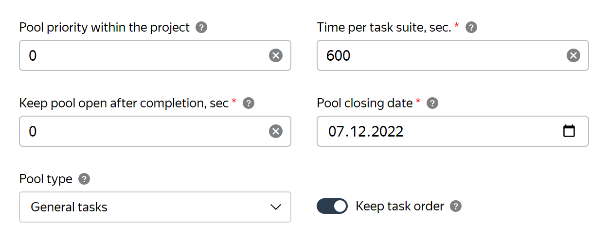
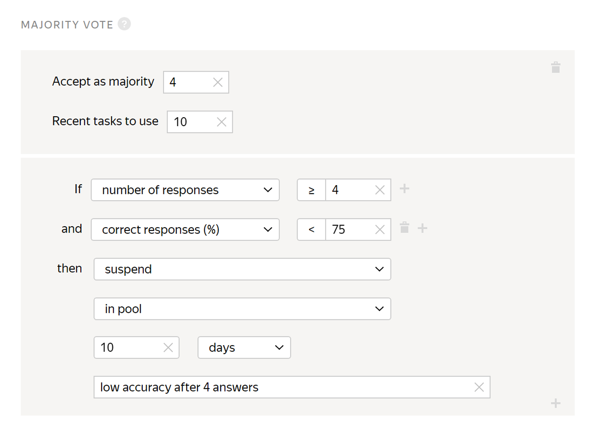
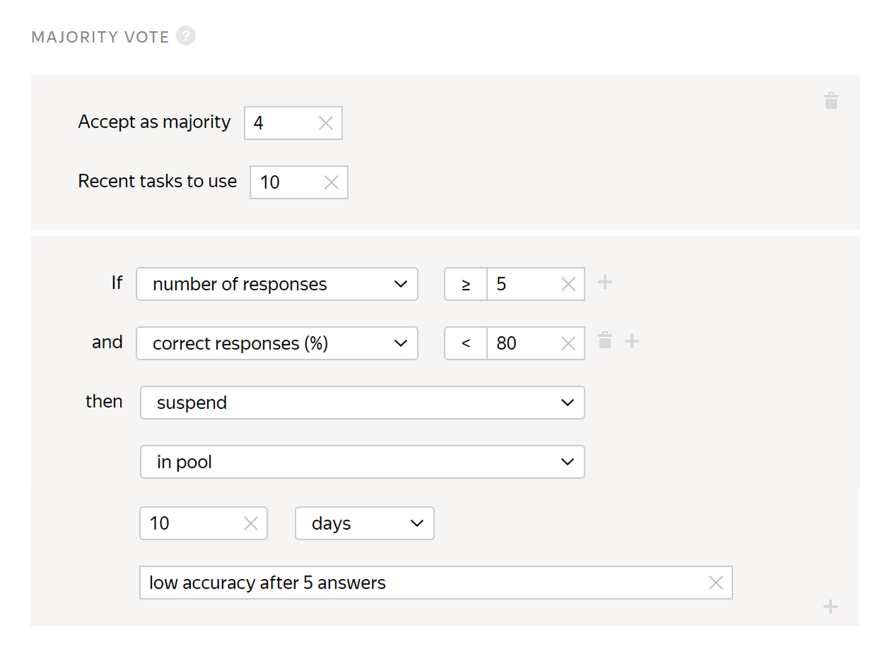
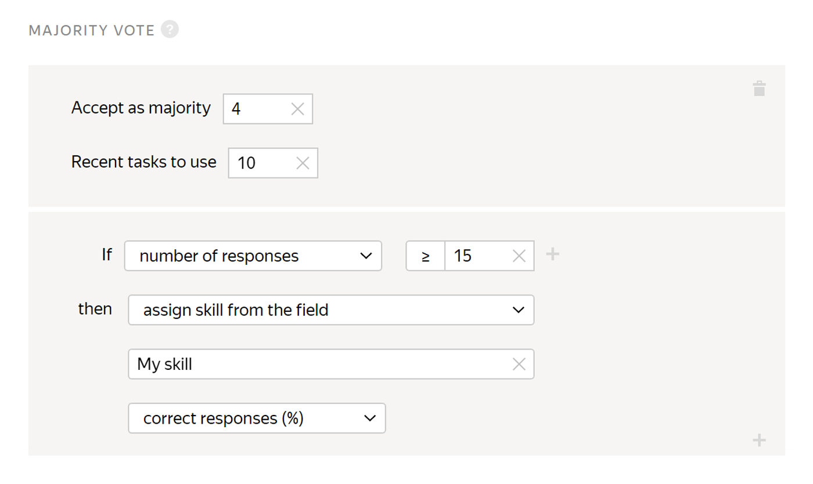

# Majority vote

Majority vote is a [quality control](../../glossary.md#quality-control) method based on matching responses from the majority of Tolokers who complete the same task. For example, if a task has an [overlap](../../glossary.md#overlap) of “5” and three Tolokers selected the same answer, this is considered indirect confirmation of the correct response.



It only takes into account [regular tasks](../../glossary.md#general-task), ignoring the responses to [control](../../glossary.md#control-task) and [training](../../glossary.md#training-task) tasks.



Based on the percentage of correct responses, you can change the value of the Toloker's [skill](../../glossary.md#skill) or block their access to tasks.

The rule is activated when the task overlap is complete.



Let's say we set up this rule in a pool with `overlap=5`:

It is activated when at least three of the tasks completed by the Toloker reach full overlap. When responses have been received from all five task Tolokers, the system determines which response was selected by the majority. If the Toloker's responses to two out of three tasks differ from the responses of the majority, the Toloker is banned from the project for 10 days. To collect all the responses needed to trigger the rule, enable **Keep task order** in [the pool settings](pool_poolparams.md#keeptaskorder).

The number of tasks per suite doesn't affect how the rule works. Responses are evaluated separately for each task. Only the speed of collecting results can be affected, because the more tasks you put on each page, the longer it takes to do them.



## When to use {#when-use}

#### Use the **Majority vote** rule if:

- You can't regularly create and add control tasks.
- You want to make an additional review of the Toloker's responses.

#### Don't use it if:

- You have a lot of response options.
- Tolokers need to attach a file to their assignment.
- Tolokers need to transcribe text.
- Tolokers need to select objects in a photo.
- Tasks don't have a correct or incorrect response. For example: “Which image do you like best?” or “Choose the page design option that you like best”.

## Usage recommendations {#advice}

#### Don't use too many response options or too many questions in the task.

The more options you have, the lower the probability that **majority vote** will be calculated correctly.

To calculate the **majority vote** for the task, all the responses to all the questions inside the task must match. If a task has multiple questions or the questions have more than just a few response options, it will be unlikely to have enough exactly matching task responses from different Tolokers in order to calculate the skill. As a result, the task won't be used for skill calculation. If the **majority vote** hasn't been calculated for the task, the Toloker isn't penalized for mismatching the majority vote.



|        | Toloker 1 | Toloker 2 | Toloker 3 | Toloker 4 | Toloker 5 |
|--------|-----------|-----------|-----------|-----------|-----------|
| Task 1 | OK        | BAD       | OK        | BAD       | OK        |
| Task 2 | BAD       | OK        | OK        | BAD       | 404       |
| Task 3 | 404       | OK        | 404       | OK        | OK        |
| Task 4 | OK        | BAD       | OK        | 404       | 404       |
| Task 5 | OK        | BAD       | OK        | 404       | OK        |

The requester has five tasks, each completed by five Tolokers. Each task has one output field with three response options.`Overlap = 3`. In this case, tasks 1, 3, and 5 match the threshold, but the other tasks are not included in the **majority vote** calculation.

The Tolokers will be assigned the following skills based on **majority vote**:

#|
||Toloker 1 | (1+0+1)/3=66% correct ||
||Toloker 2 | (0+1+0)/3=33% correct ||
||Toloker 3 | (1+0+1)/3= 66% correct||
||Toloker 4 | (0+1+0)/3=33% correct ||
||Toloker 5 | (1+1+1)/3=100% correct||
|#



Let's say the task Toloker has to select at least three matching categories out of twenty or report that the image is not displayed. Since there can be multiple combinations of categories, the rule calculation will mostly include tasks where all the Tolokers responded **Not displayed**. Those might be either correct or “fraudulent” responses from Tolokers who just clicked through the tasks in a hurry. In any case, it would be unreliable to base the skill on these responses.

Try using [decomposition](solution-architecture.md) or [control tasks](../../glossary.md#control-task). This way you can better assess the quality of your Tolokers.

#### Don't set the threshold **Accept as majority** below 50% of the overlap or equal to the overlap.

If the response threshold is equal to the overlap, the rule will only use the tasks where all the Tolokers gave the same responses, ignoring tasks with mismatching votes.



Let's say the pool has `Overlap = 5` and `Accept as majority = 2`. The Tolokers completed the task.

|           | Task response |
|-----------|---------------|
| Toloker 1 | OK            |
| Toloker 2 | OK            |
| Toloker 3 | BAD           |
| Toloker 4 | BAD           |
| Toloker 5 | 404           |

In this case, Tolokers 1, 2, 3, and 4 responded correctly, but Toloker 5 failed. However, you don't have any way to know which response is correct.



#### Don't use the **majority vote** if:

- You have a lot of response options.
- Tolokers need to attach a file to their assignment.
- Tolokers need to transcribe text or select objects in a photo, or other tasks where the Tolokers can't possibly provide the same responses.

## Rule settings {#rule}



In this rule, all fields are required except **Recent tasks to use**. If you don't fill in at least one of them, you won't be able to save the rule.



#|
|| **Field**  | **Overview** ||
||**Accept as majority** | The number of matching responses that is considered the "majority vote" (for example, 3).||
||**Recent values to use** | How many recent responses from the Toloker to use.

If this field is not filled in, the calculation includes only task responses from the pool to which the rule is applied.

If the field is filled in, the corresponding number of responses is used. The rule takes into account responses from both the current pool and other pools where this field is filled in.

[Learn more](remember-values.md) about how this field works.||
||**If** | A condition for performing the action in the **then** field:

- **number of responses** — The number of completed tasks.

- **% correct answers** — The percentage of correct responses, meaning responses that matched the majority opinion (from 0 to 100).

- **% incorrect answers** — The percentage of incorrect responses, meaning responses that didn't match the majority opinion (from 0 to 100).

To add multiple conditions, click .||
||**then** | Action to perform for the condition:

- **ban** — Block access to the project or all of the requester's projects for the specified number of days. Only the requester can view the reason.

    If access to tasks is blocked temporarily (for example, for 7 days), the history of the Toloker's responses is not saved after the ban is lifted. The skill level is calculated based on the new responses.

- **suspend** — Suspend the Toloker's access to the pool for the specified number of days. Only the requester can view the reason.

- **assign skill value** — Assign a fixed value to the [skill](nav.md).

- **assign skill from the field** — Save the percentage of the Toloker's correct responses in tasks as a skill value.

- **accept user's answers** — Requires the [non-automatic acceptance](offline-accept.md) option to be set.

    Useful if the Toloker completes most tasks well. Example: The Toloker completed more than 80% of the tasks correctly and you are satisfied with this result. The rule will work automatically and accept all responses in the pool.

[Learn more](remember-values.md) about how this field works.||
||**If** | A condition for performing the action in the **then** field:

- **number of responses** — The number of completed tasks.

- **% correct answers** — The percentage of correct responses, meaning responses that matched the majority opinion (from 0 to 100).

- **% incorrect answers** — The percentage of incorrect responses, meaning responses that didn't match the majority opinion (from 0 to 100).

To add multiple conditions, click .||
||**then** | Action to perform for the condition:

- **ban** — Block access to the project or all of the requester's projects for the specified number of days. Only the requester can view the reason.

    If access to tasks is blocked temporarily (for example, for 7 days), the history of the Toloker's responses is not saved after the ban is lifted. The skill level is calculated based on the new responses.

- **suspend** — Suspend the Toloker's access to the pool for the specified number of days. Only the requester can view the reason.

- **assign skill value** — Assign a fixed value to the [skill](nav.md).

- **assign skill from the field** — Save the percentage of the Toloker's correct responses in tasks as a skill value.

- **accept user's answers** — Requires the [non-automatic acceptance](offline-accept.md) option to be set.

    Useful if the Toloker completes most tasks well. Example: The Toloker completed more than 80% of the tasks correctly and you are satisfied with this result. The rule will work automatically and accept all responses in the pool.||
|#

## Examples of rules {#examples}

Examples are provided for simple [classification](../tutorials/image-classification.md). There are 10 tasks per suite.



The assignments submitted by banned Tolokers will be taken into account if they are not rejected manually using assignment review They can be reassigned by setting up the [Recompletion of assignments from banned users](restore-task-overlap.md) rule.



#### Calculating a skill and banning for incorrect responses



- Correct settings

  

  

  Both rules work independently:

  1. If the Toloker gives at least 3 responses to the tasks, the percentage of correct answers is written as the skill value.
  1. If the Toloker gives at least 3 answers to tasks and the percentage of correct answers is less than 65%, they are banned on the project.

  The calculation uses up to 10 Toloker's responses to the project tasks.

- Incorrect settings

   

   

   The Toloker is blocked after the first incorrect response to the first, second or third task. However, the skill isn't set. Since the ban reason is not specified, there is no way to find out why the Toloker is banned.

- Alternative settings

  

  

  

  

  All rules are applied independently:

  1. If the Toloker gives at least 3 responses to the tasks, the percentage of correct answers is written as the skill value.

  1. If the Toloker gives 2 incorrect responses to 3 tasks, they are blocked in the pool for 10 days.

  1. If the Toloker gives 2 incorrect responses to 4 tasks, they are blocked in the pool for 10 days.

  1. If the Toloker gives 5 or more responses to tasks and the percentage of correct responses is less than 80%, they are blocked in the pool for 10 days.

  A set of rules like this prevents Tolokers from being banned for one incorrect response and lets you maintain high accuracy.



#### Setting the skill



- Correct settings

  

  If the Toloker completes 3 tasks, the skill is set to the percentage of correct answers.

  Use the skill value to set access to other pools with [filters](filters.md).

  

  

  

- Incorrect settings

  

  This rule will never take effect because the number of responses counted (**Recent values to use**) is less than the number of responses in the rule (**number of responses**).



#### Blocking for incorrect responses



- Correct settings

  

  If the percentage of correct responses is less than 40%, the Toloker is blocked on the project for 30 days.

- Incorrect settings

  

  If the percentage of correct responses is less than 40%, the Toloker is blocked on the project for 30 days. The rule will be applied once, after the fifth response.



## See also {#see-also}

- [{#T}](check-performers.md)

## For developers {#for-developers}

- [Toloka API: Majority vote](../../api/concepts/mv.md)
- [Toloka-Kit: MajorityVote collector class](../../toloka-kit/reference/toloka.client.collectors.MajorityVote.md)

## Troubleshooting {#troubleshooting}











