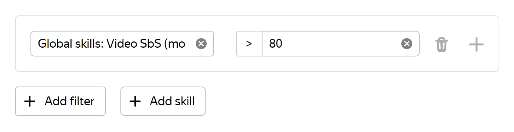

# Global skills

This is a special type of [skills](../../glossary.md#skill) in Toloka that show the general competencies of Tolokers, such as text processing or selecting objects in images.

## Benefits {#benefits}

- Use global skills if you want to quickly launch a [project](../../glossary.md#project) and recruit Tolokers who are good at certain types of tasks.

- Our experiments show that global skills combined with traditional quality control methods increase the correctness and consistency of labeling.

## Features {#features}

- Requesters don't create this type of skills. Global skills are created by the system.

- Projects created from certain templates are taken into account. For example, if the project is based on the **Video comparison (Side-by-side)** template, then the Tolokers will receive the **Video SbS** global skill.

- Global skills are assigned according to the percentage of correct answers. 

- Global skills are updated daily by the Toloka team.

## Usage {#usage}

To use this feature, select **Add a filter → Skills → Choose a global skill** and specify the restriction for the selected skill in the added filter.

For example, restriction `skill >80` mean “Select Tolokers who completed similar projects better on average than 80% of other Tolokers”.

## See also {#see-also}

- [{#T}](nav-create.md)
- [{#T}](nav-edit.md)
- [{#T}](nav-delete.md)

