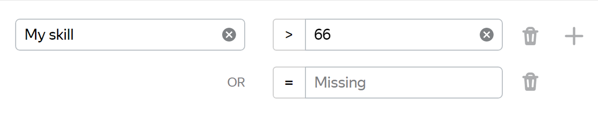

# Using the skill

You can use skills to filter and select Tolokers when assigning tasks, issuing rewards, and sending out messages.

## Selecting Tolokers for tasks {#selection}

When setting up a pool, you can use skills in [filters](filters.md) to:

- Select Tolokers without a skill. To do this, use the `=`, and leave the value empty.
- Select Tolokers with any skill value. Use the `≠` operator, and leave the value empty.
- Select Tolokers who have a skill value greater than or less than the specified one.

For example, you can select only those Tolokers whose skill is more than 66 or is missing:

For [global skills](nav-cross-project.md), the restrictions of the `skill >80`type are used to select “Tolokers who completed similar projects 80% better on average than other Tolokers”.

## Extra rewards {#awarding}

To select Tolokers by skill and give them [rewards](../../glossary.md#bonus):

1. Go to the [Tolokers]({{ users }}) page.
1. Select Tolokers using the skill filter. To do this, use [filters](../../glossary.md#filtering):

    1. Click **Add filter**.
    1. Scroll down and choose **Choose skill**.
    1. Specify the skill and the required skill value.

1. To credit rewards to one Toloker, click the link to their ID in the **Toloker ID** field.

    On the page that opens, click .

    To credit rewards to a group of Tolokers click **Issue bonus**.

1. Fill in the fields in the **Issue bonus** window that appears:

    - **Bonus per user** in dollars.

    - **Topic** and **Message** for Tolokers. Specify the projects and accomplishments the reward was granted for. To send messages in different languages, use the button for switching languages.

1. Click **Grant**.

    Before doing this, check the number of people who will receive the reward, and the total amount.

    
	
    
	
	

## Sending out messages {#messaging}

To select Tolokers for [sending messages](qa-assign.md) about changes in the project or new tasks:

1. Go to the **Messages** page.
1. Click .
1. Enter the skill name.

## What's next {#what-next}

If necessary, you can:

- [Edit](nav-edit.md) the skill value manually.
- [Remove](nav-delete.md) skill for a specific Toloker.
- [View the history](nav-history.md) of skill changes.

## Troubleshooting {#troubleshooting}



It is better to use one [skill](../../glossary.md#skill) in a project. You can choose the way to calculate the skill:

- Calculate the skill for each pool separately. The current skill value is the value of the skill in the pool the Toloker completed last. This option is convenient if:

    - The pools are intended for different groups of Tolokers (for example, there are filters by city or country).

    - Pools are started one by one and you don't want to take into account the responses in the previous pools to calculate the skill in the current pool.

    This calculation method is used by default when adding a quality control rule to a pool. For the control tasks block, leave the **Recent control task responses to use** field empty.

- Calculate skill based on all tasks in a project This option is good if the pools are small and you don't need to have skill calculated for each pool.

    This option is available only for skills on control tasks. To use it, fill in the **Recent control task responses to use** field in pool quality control rules.





Yes, of course — you can use the same skill for different projects. But most often, a skill is intended for a specific project. If the Toloker completes a certain task well, this doesn't mean that they will complete other ones successfully. Another disadvantage is that if you filter by skills that were set long ago, you will artificially limit the number of available Tolokers.





The pool shows the total number of Tolokers that completed at least one assignment. A training skill can be lost over time if you set repeated training in the pool settings. This setting allows a Toloker to pass the training again after a certain period if the Toloker didn't complete any tasks in associated pools or if there was a large time gap between completing tasks (for example, because of the [ban](../../glossary.md#banned-worker)). The training skill displays the Tolokers who either recently completed training, or regularly complete your tasks so that the skill doesn't expire.




