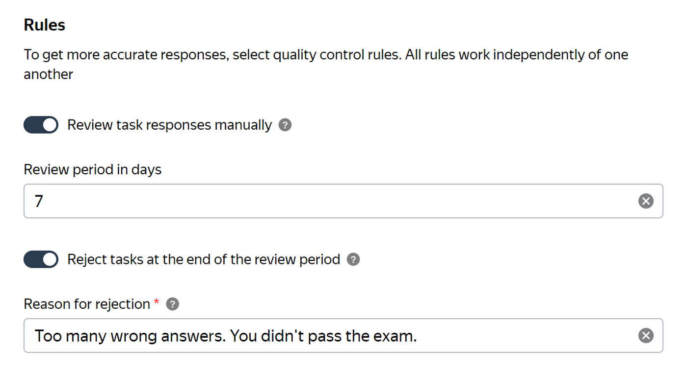
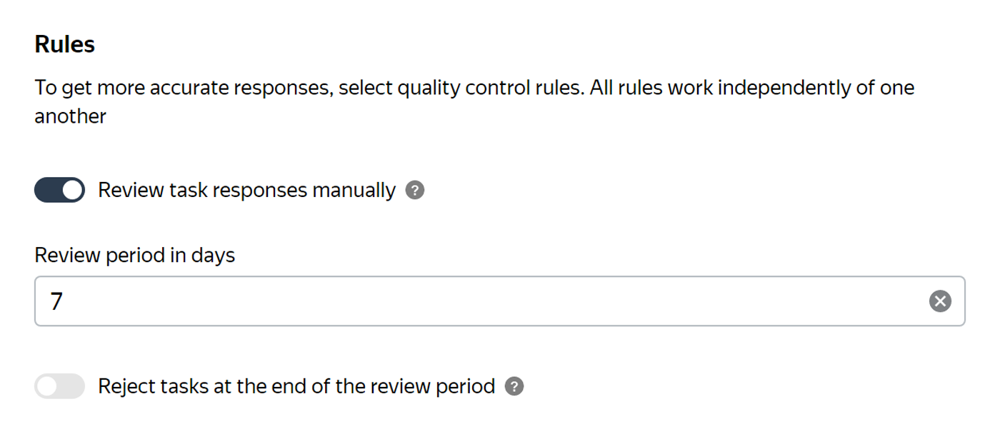

# Non-automatic acceptance

Non-automatic acceptance is a [pool](../../glossary.md#pool) setting that allows you to check responses and not pay for poorly completed tasks.

You can find the [Review methods](accept.md#acception) in the  section.

## How does it work? {#how-it-works}

You set up assignment review for your pool in the [project](../../glossary.md#project).

As the Tolokers complete the tasks, their responses come for review. You can accept or reject a Toloker's response. If you reject responses, the Toloker can:

- Challenge the review result by writing a message to the requester — submit an [appeal](accept.md#appeal).

- Write to the platform support service.

- Put a low rating to your project.



- Write a clear instruction with a clear algorithm of actions, requirements for results and possible reasons for their rejection.

- Check the responses well — according to your own instructions.

- Reject assignments if the result is largely inconsistent with the instructions.

    

    If the task is to label 20 pictures according to the instructions, and the Toloker labeled 18 of them correctly, and 2 were incorrect, the result is considered incorrect to a small extent, or mostly correct.

	

- Explain the mistake to the Toloker so they can learn and do better next time.



You can review responses manually or with the help of Tolokers by posting [a separate review task](find_an_item_in_store.md).



30 days after the tasks are completed the pool is automatically sent to the archive. It isn't possible to change the review result in an archive pool, so you won't be able to accept a previously rejected assignment.



## Rejecting responses {#declined}

- If **you reject responses, assignments aren't sent automatically** to other Tolokers.
- You can't **reject (or accept)** one response on the page — **only the entire page** with all responses on it.
- If [the Toloker is banned](../../glossary.md#banned-worker) by [the quality control rules](../../glossary.md#quality-control-rules), their responses still need to be checked.



Rejecting the Toloker's responses in one task doesn't result in rejecting responses of this Toloker.



## Automatic rejection and acceptance of responses {#auto-reject_auto-accept}

If your [pool type](pool-main.md#table_n3q_vhz_jlb) is set to **Exam** or **Retry**, then at the end of the review period, all responses that haven't been reviewed can be accepted or rejected automatically.

#### Automatic rejection

When setting or editing the pool, enable the **Reject tasks at the end of the review period** option and specify the reason for rejection. It will be shown to Tolokers whose responses are rejected.





#### Automatic acceptance

Leave the option in the **No** position, and the tasks will be automatically accepted.





## How do I turn on assignment review? {#accept-params}

Take the following steps before starting the pool:

1. Choose the **Non-automatic acceptance** parameter on the pool page in edit mode.

1. Specify the **Review period in days** — the number of days for the [review](accept.md) (from 1 to 21 days from the task completion date). The Toloker will see the deadline in the task information on the main Toloka page.

    

    Set the review period up to 14 days. Tolokers are reluctant to accept assignments with a longer review period.

    

1. Save the settings — the **Save** button is at the bottom of the pool parameters page.

As the Tolokers start completing the tasks, you will start receiving responses.



- **Set the deadline so that you have enough time to review the responses.** After the deadline expires, the responses that haven't been reviewed are accepted and paid automatically, except for the cases described [above](#auto-reject_auto-accept).
- **Explain the acceptance criteria in the instructions for Tolokers.** This will improve the quality of the results, as well as reduce the number of appeals and questions about rejection reasons from the Tolokers.



## More settings {#additional-params}



If responses are rejected, Toloka can automatically send the task to other Tolokers. To set it:

1. Add the **Recompletion of rejected assignments** quality control rule to the pool.
1. Set the following values in the rule block:





You can also [filter out Tolokers](control.md) based on the percentage of rejected responses.

You can restrict the Tolokers' access to tasks:

- Block them (set up a quality control rule).
- Suspend their access to projects (set up a quality control rule).
- Assign them a skill and use it as a filter in other projects (set up filters in pool parameters).

Learn more about this in the [**Review results**](reviewing-assignments.md) rule settings.



## What's next {#next-steps}

- [Add tasks to the pool](pool.md)
- Learn more about how to set up a pool:
    - [Setting up pricing](dynamic-pricing.md).
    - [Dynamic overlap](dynamic-overlap.md).
    - Selective [majority vote](selective-mvote.md) control.
    - [Filters](filters.md).
    - [Speed/quality balance](adjust.md).
    - [Setting up quality control](qa-pool-settings.md).


