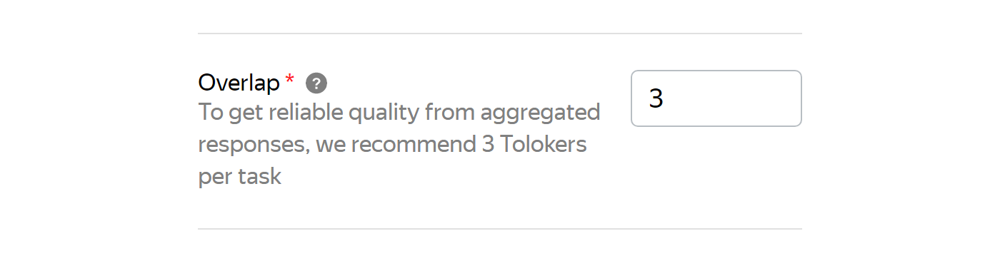

# What is overlap?

Overlap is the number of Tolokers who should complete each [task](../../glossary.md#task) in the [pool](pool-edit.md).

You can set overlap in the [pool settings](pool-edit.md):





To change overlap using Toloka API, send a `PATCH` request with the updated overlap value:

```bash
curl -X PATCH 'https://toloka.dev/api/v1/task-suites/000012e4ca--62eadb541b54e36b45b7a117?open_pool=true' \
     -H 'Authorization: ApiKey PlaceYourRealApiKey_Here' \
     -H 'Content-Type: application/json' \
     -d '{"overlap":5,"infinite_overlap":false}'
```

Refer to the [Edit task suite overlap or priority](https://toloka.ai/docs/api/api-reference/#patch-/task-suites/-id-) section of the Toloka API documentation for more details about the request, its parameters, and possible responses. You will find examples of the requests for [Toloka-Kit](../../toloka-kit/index.md) and other code samples there.



## Tips and recommendations

| Task type                            | Recommended overlap |
|--------------------------------------|---------------------|
| Most tasks have automatic acceptance | from 3 to 5         |
| Simple task                          | 3                   |
| Reviewed task                        | 1                   |

You can change overlap after the pool is started. To do this, open the pool editing mode and set the new overlap value. You don't need to restart the pool. Updating the settings is usually fast, but if there are many tasks, it may take several minutes.

## Advanced overlap types

- Dynamic overlap lets you change [overlap](dynamic-overlap.md) depending on:

    - How well the Tolokers do on the task.
    - How well Tolokers' [task responses](../../glossary.md#task-response) match each other.

    This type of overlap helps you save money without reducing the quality of data labeling.

- [Selective majority vote verification](selective-mvote.md) allows you to set up [majority vote check](mvote.md) for only a portion of tasks.

    This type of overlap helps you save money and speed up pool completion.
    
## Setting up the overlap for an individual task {#individual-overlap}

You can set the overlap for each task using the `TASK:overlap` column values in the file with tasks.

To learn more, see the [Tasks file structure](pool_csv.md#structure) section.

## For developers {#for-developers}

- [Toloka API: Changing task suite overlap](https://toloka.ai/docs/api/api-reference/#patch-/task-suites/-id-)
- [Toloka-Kit recipe: Set overlap](../../toloka-kit/recipes/set-overlap.md)

## Troubleshooting {#troubleshooting}











