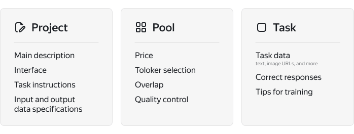
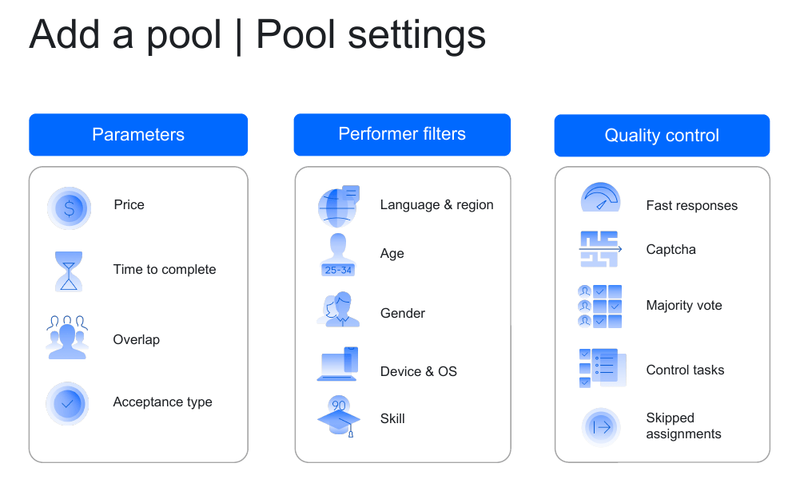

# How does Toloka work?

To place a task in Toloka, create three different entities: a project, a pool, and your tasks. Each of these entities is responsible for its own task settings block. This section explains why Toloka works this way and what its advantages are.

## Project {#project}

A _project_ contains instructions, task interface settings, and a specification for input and output data. You can also set up quality control rules that apply to the entire project.

Projects make it easier for you to post similar tasks in the future, because you don't have to re-configure the interface. You can also view aggregate statistics for all tasks in the project.

## Pool {#pool}

A _pool_ is a set of tasks to be assigned to Tolokers simultaneously. Main pool settings: pricing, selection of Tolokers, overlap, and quality control.

Dividing tasks into pools lets you:

- Select various Tolokers for tasks.

    For example, text in tasks for comment moderation can be in different languages: some comments in Russian and others in English. You can split these comments into different pools and use filters to specify the language that Tolokers should know.

- Set a price, the overlap, and configure quality control based on the complexity of tasks.

    For example, tasks for transcribing audio files that are 10-20 seconds and 50-60 seconds long should have a different price.

- Manage task priority by assigning one pool before another.

- Group tasks to view separate statistics for each group.

## Task {#task}

A _task_ is the data you need to mark up. Each image or comment is a separate task.

There are different types of tasks: general, control (with correct responses), and training (with hints).

You upload tasks to Toloka as a [file](../../glossary.md#tsv-file-definition). The file structure must match the input and output data specification that you set up in the project.



If you want multiple Tolokers to complete a task, you don't need to include it in the input data multiple times. Instead, set the [overlap](../../glossary.md#overlap) in the pool settings.



## Task suite {#tasks-page}

Tasks are assigned to Tolokers page by page. A page may contain one or several tasks. You specify their number when uploading tasks in the pool.



- A Toloker can submit responses only after completing all tasks on a page.
- You specify the price per task suite. Аnnotators are only paid for the entire page of completed tasks.



Some Tolokers have a slow internet connection, so adding multiple tasks lets them update a page less often, which means they'll complete your tasks faster.

However, don't include too many tasks on a page: quality will be worse and Tolokers will get tired. Place 5-10 simple tasks or 1-4 complex ones on a single page.



You can separate tasks on a page yourself. It lets you group tasks, such as by simultaneously assigning all similar photos to Tolokers for annotation. In this case, the number of tasks on each page may differ.



## What does it look like for Tolokers? {#appearance}

When you start a pool, Tolokers can see it in the **Tasks** section. They select the pool, read the instructions, and complete tasks.

Each task in a task suite is part of a web page that can include various objects, such as images, text, and input fields.



Tolokers don't know the difference between pools, tasks, or task suites. They might call all this a “task”.



For more information, see [How Tolokers see pools](pool-main.md).

## Payment {#payment}

For each accepted task, an amount of money is deducted from your account: payment for the task, plus the [fee for using Toloka](budget.md). The amount to pay for the task is set when [creating a pool](pool-main.md).

You can also [give a reward](bonus.md) to one or more Tolokers.

## Toloka API {#api}

If you need to frequently post similar tasks, automate this process with the [Toloka API]({{ toloka-api }}).

If you want more flexibility when posting tasks, the Toloka API has additional features that are not yet available in the interface. For example, use the API to specify overlap for individual tasks and add multiple correct responses to control tasks.

