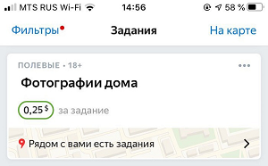
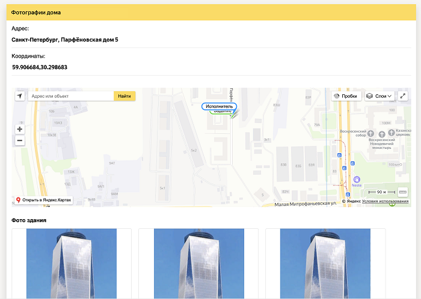
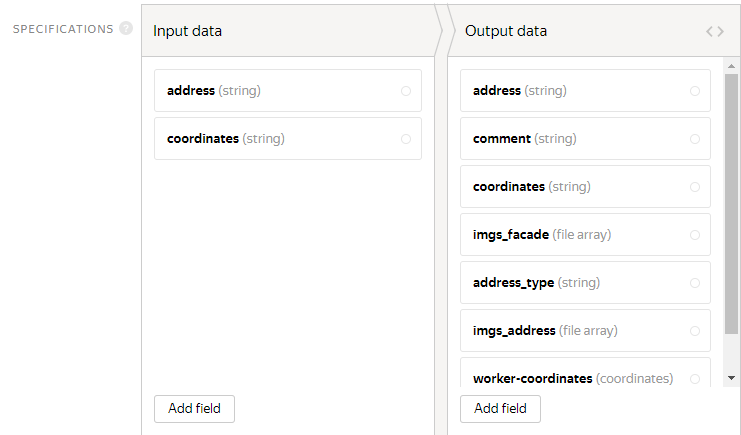

# Photos of organizations

Walking surveys (field tasks) are completed in the Toloka mobile apps for [Android]({{ android-app }}) and [iOS]({{ ios-app }}). They get a task with a point on the map where they need to come and take a photo (or, for example, [check for anything](../tutorials/walk.md)).

You may need additional settings for your project, like to add a new button with a particular scenario or a section for attaching files. Learn more in [Customization examples](advanced-features.md).

Use this template when you need to:

- Check information like address, phone numbers, signs, opening hours, location, and so on.
- Check how easy it is to find a business or store.
- Verify information with a photo of the real object.

Let's say you need to check if there is a building at a specific address. To do this, create a task where the Toloker:

1. Uses coordinates to go to a specific point.
1. Photographs the building from all sides.
1. Also takes a photo of the address sign.
    

    If there is no sign at this address, the Toloker should take a photo of a neighboring building sign and write this in the task.

    

#### Example of a prepared task

#### In the task list

#### On the map

#### Task interface

#### Toloker's response

To run tasks and get responses, follow the instructions.

## Create a project {#project}

In the project, you define what the task will look like for the Toloker.

1. Click the **+ Create a project** button and choose the **Secret shopper** template in the field task block.

1. Enter a clear name and write a short description for the project. Tolokers will see this in the task list.

1. Write short and clear [instructions](../../glossary.md#task-instruction-ru).

    Use HTML tags to insert links, pictures, and so on. Instructions for the field task should be easy to read, even on a mobile phone screen.

1. In the template, the **Map** option is enabled automatically. So a user will see tasks as points on the map and be able to choose the ones they want.

    **Address** and **Coordinates** will be displayed when the Toloker chooses a point on the map. These fields contain an input field It will be changed later.

1. To show the name and description of the point, edit the fields:

    - **Address**: `{{inputParams['address']}}`.
    - **Coordinates**: `{{inputParams['coordinates']}}`.

1. 

    This tutorial shows how to create a task interface in the **HTML/JS/CSS editor**. You can try creating a task interface in [Template Builder]({{ tb-quickstart }}).

    

    Define which objects you are going to pass to the Tolokers and which one you want to receive from them in response. To do this, add input and output fields in the **Specifications** block.
    #### What are input and output data?

    **Input** — Types of objects the Toloker receives for the task completion. In this template, you need text. In other tasks, it can be a picture or geographical coordinates.

    **Output data** is types of objects that you receive after the task is completed. For this template, it is one of the two response options. If the Toloker chooses the second response, a list of checkboxes opens — the Toloker should choose appropriate options from them. In other tasks, the output data can contain entered text or an uploaded file, for example.

    Learn more about [input and output data fields](incoming.md).

    The template includes:

    - Input data — fields:
    - `address` — The task address.
    - `coordinates` — Coordinates of the point where toloker should come.

    - Output data — fields:
    - `worker_coordinates` — The Toloker coordinates at the moment of task completion, with the Current location option turned on.
    - `address` — The task address.
    - `coordinates` — The task coordinates.
    - `imgs_address` — Array of files, photos of the plate uploaded by the Toloker.
    - `imgs_facade` — Array of files, photos of the house uploaded by the Toloker.
    - `address_type` — The type of plate photographed by the Toloker (the plate on the desired or neighboring house).
    - `comment` — Text field, Toloker's comment.

    #### Graphic mode
    
    #### JSON
    

1. Create the task interface in the **HTML** block. It describes how the task elements should be arranged in the task.

    **Rules for working with the task interface in the **Photos of organizations**** template

    - The HTML interface uses standard HTML tags and [special components](spec.md) in double (or triple, as for the `comment` field) curly brackets for input and output data fields.
    - **CSS** and **JS** are used to describe the task logic. Also, the main content of this task is embedded in Java Script for ease of editing.
    - In this project, in a variable `texts` texts are stored for the block with information and two text variants for task completion (in case the Toloker found or didn't find home).
    - The `MAX_DISTANCE` variable specifies the maximum distance from a designated point, where the toloker can move during the task completion, in kilometers. Specify the appropriate value.
    - In this template, at least four photos of the building is required. If you want to change this, enter any other number instead " 4":
    - `if (solution.output_values.imgs_facade.length < 4)`

    

    The template already contains CSS styles and you don't need to change them.

    

1. Click **Preview** to view your task.
    The project preview window shows a single task with standard data. You can define the number of tasks to show on the page later.

1. Save the project by clicking **Finish editing**.

## Add a task pool {#pool}

A pool is a set of paid tasks sent out for completion at the same time.

1. Open the project and click **Add pool**.
1. Give the pool any convenient name and description. The pool info is only available to you. Tolokers can view only the project name and description.
1. In the **Audience** block, add **Filters** to select Tolokers. To make your tasks available in the Toloka mobile app to English-speaking Tolokers located in Moscow, set the language and region.
1. In the **Price** block, set the price per task (for example, $0.2). For field tasks, always add one task per suite.
    #### What is a task suite?

    A task suite can contain one or several tasks that are shown on the same page. If the tasks are simple, you can add 10-20 tasks per suite. Don't make task suites too long because it slows down loading speed for Tolokers.

    Tolokers get paid for completing the entire task suite.

    The number of tasks per suite is set when [uploading tasks](#tasks_upload).

    #### What is a fair price for a task suite?

    The general rule of pricing is the more time the Toloker spends to complete the task, the higher the price is.

    You can register in Toloka as a Toloker and find out how much other requesters pay for tasks.

1. In the **Quality control** block, set **Overlap**, which is the number of Tolokers to complete the same task. For field tasks, it is usually 1.
1. In the **Quality control** block, enable the **Non-automatic acceptance** option and specify the number of days for checking the task in the **Review period** parameter. (for example, 7).
    #### What is non-automatic acceptance (assignment review)?

    The [non-automatic acceptance](offline-accept.md) option allows you to review [completed assignments](../../glossary.md#submitted-answers-ru) before accepting them and paying for them. If the Toloker didn't follow instructions, you can reject the assignment. The maximum allowed period for the review is set in the **Deadline** field.

1. In the **Additional settings** block, specify the **Time** allowed for completing a task suite. It should be enough to get to the place, find the specified point and upload photos. For field tasks, we recommend allocating a day — 86,400 seconds.
1. Save the pool.

## Upload tasks {#tasks_upload}
 
Download the sample upload file on the pool page. There are links to **files** with regular, control, and training tasks. Use it to prepare your own [file with tasks](../../glossary.md#tsv-file-definition-ru).

1. Click **Upload**. In the window that opens, you can also download a sample file.

1. Add input data in it. The header of the input data column contains the word `INPUT`. For field tasks, you also need to specify the latitude `AI:latitude` and longitude `AI:longitude` of the point. You can use a service like [Yandex.Maps]({{ ya-maps-object-search }}) to get the coordinates.
1. Upload the tasks by choosing **Set manually** and set 1 task per suite.

## Start the pool and get the results {#launch}

1. Start the pool by clicking .
1. Track the completion of tasks in the **Pool statistics** section.
1. When the first results come in, you can start reviewing.
    To review assignments, go to the pool and click **Download results**. To download attachments, click the button next to  and choose **Download attachments**.

    

    After the specified time period, all responses are automatically accepted, regardless of their quality.

    

