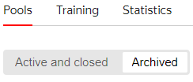

# Archiving a pool

A [pool](../../glossary.md#pool) with the “Archived” status can't be started or edited and isn't available for the [task review](accept.md).

By default, archived pools are not visible in the list of [project](../../glossary.md#project) pools. To view them:

1. Open the project page.

1. In the **Pools** tab, select **Archived**.

The pool is automatically archived if none of the following actions is performed in the pool for a month:

- Editing.
- Uploading tasks.
- Changing status.
- Completing a task.
- Cloning via the Toloka API.

To archive a pool, click ** → Archive** at the top of the pool page, or  in the list of pools on the project page.



To [archive the training pool](train.md), first archive all the main pools to which it is linked.



## What's next {#what-next}

- [Add tasks to the pool](pool.md)
- Learn more about how to set up a pool:

    - [Setting up pricing](dynamic-pricing.md).
    - [Dynamic overlap](dynamic-overlap.md).
    - Selective [majority vote](selective-mvote.md) control.
    - [Filters](filters.md).
    - [Speed/quality balance](adjust.md).
    - [Reviewed assignments](offline-accept.md).

## Troubleshooting {#troubleshooting}



You can't completely delete a pool, but you can archive it. The system won't delete my pools automatically.





If there is no activity in the pool for a month, it is archived. You can't run such a pool, but you can clone it or download the labeled data from it.





Inactive pools are archived after one month. To see them, select **Archived** in the **Pools** tab.





To find out the archiving date, get a [list of operations](../../api/concepts/get-operations-list.md) with the `POOL.ARCHIVE` type. The response will contain the pool number and the archiving date. You can't get the method used to archive the pool via the API.

If less than a month passed between the activity in the pool and its archiving, you can assume that the pool was archived manually, and if it's been one month or more, then it was archived automatically.





Simply [give the Toloker a separate reward](bonus.md) without changing the task status. You can't change the task status in the pool in this case.



