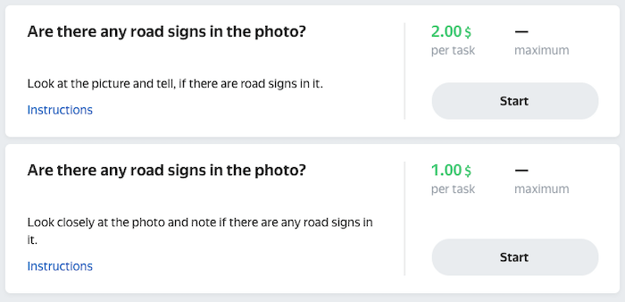

# Creating a pool

If you already have a [pool](../../glossary.md#pool) and you want to create an identical one, [clone](pool-main.md) the existing pool. If not, create a new pool.

## New pool {#new-pool}

A pool contains the settings of a set of task that are sent out for completion. [The task interface](../../glossary.md#task-interface) is described in the [project](project.md).



You can first test the pool settings in the [sandbox](sandbox.md) and then [move](sandbox.md#export) them to the Toloka production version along with the project.



To create a pool, follow the instructions:

1. Click **Add pool** on the project page.

1. Set the parameters and click **Save**.

Tasks in pools will automatically be available in the web version of Toloka and the mobile app. If you want to change the default settings and limit the visibility of the task for any of the versions, add the **Client** filter and select the desired value: **Toloka web version** or **Toloka for mobile**.

### Pool parameters {#pool-params}

#|
||**Parameter** | **Overview** | **Found in the block**||
||**Pool name** | The [pool](../../glossary.md#pool) name shown only to you (as a requester) on the [project](../../glossary.md#project) page. | **General information**||
||**Public description** | Will be displayed instead of the project description in the task list for Tolokers and [linked training](train.md). | **General information**||
||**Private comment** | If necessary, you can add a private project description that will only be available to you. | **General information**||
||**Price per task suite, $** | Payment per [task suite](../../glossary.md#task-suite) in US dollars. For cents, use the dot (".") as a separator. If the **Pool type** is **General tasks**, the minimum price per task suite is $0.005. For other pool types, you can set the price to zero. To learn more about price management, go to [Setting up pricing](dynamic-pricing.md). | **Price**||
||**Overlap** | The number of Tolokers who should complete each task in the pool.

Configure this parameter if you need several people to complete your task. Overlap is necessary in tasks for collecting photo datasets, recording audio, or conducting surveys. In other types of tasks, it can improve the quality of results.

To save money, you can set up [dynamic overlap](../../glossary.md#dynamic-overlap) (also known as incremental relabeling or IRL).

Dynamic overlap will help you save money. [Learn more](dynamic-overlap.md). | **Price**||
||**My tasks may contain shocking or pornographic content** | Whether the tasks have shocking or pornographic content. Tasks with such content are only given to Tolokers who agree to complete these types of tasks.

If you aren't sure whether the tasks have shocking and pornographic content, enable this option.

Payment per [task suite](../../glossary.md#task-suite) in US dollars. For cents, use the dot (".") as a separator. If the **Pool type** is **General tasks**, the minimum price per task suite is $0.005. For other pool types, you can set the price to zero. To learn more about price management, go to [Setting up pricing](dynamic-pricing.md). | **Audience**||
||**Filters** | By setting the filters, you choose Tolokers that meet your requirements to complete your task. There are filter sets, filters by various criteria, and filters by skills that you can create yourself.

If you are working with Russian-language texts in the task, you don't need to display the project for non-Russian speakers. You can set a filter for the Russian language. Similarly, you can filter Tolokers by place of residence in a particular country or city, and so on. [Learn more](filters.md)

If you give [training tasks](../../glossary.md#training-task) to Tolokers, you can add a skill to the pool to choose Tolokers who already completed training. [Learn more about skills](nav.md) | **Audience**||
||**Speed/quality balance** | A [setting](adjust.md) for choosing Tolokers for your tasks. If you want to get responses very quickly, the quality may be doubtful. If you want very high quality, be prepared to wait longer. Find a balance that meets your needs. [Learn more](adjust.md). | **Audience**||
||**Non-automatic acceptance** | Turn on this option to [review](accept.md) the [completed tasks](../../glossary.md#completed-tasks) manually.

Set the time period when you can check the tasks and reject them if the results are poor.

To learn more about non-automatic acceptance, go to [Reviewing assignments](offline-accept.md). | **Quality control**||
||**Training** | This field is only available if you have training pools in the project.

[Training pool](../../glossary.md#training-pool) that will be linked to the main one. | **Quality control**||
||**Level required, %** | This field is only available if you have filled in the **Training** field.

Percentage of correct responses in training tasks (from 0 to 100) required to be admitted to the pool tasks. The calculation is based on the first response the Toloker gave in each task.

The minimum required level that you can set is 5. Tolokers who complete training with apercentage below this level won't have access to tasks. | **Quality control**||
||**Review period in days** | The number of days for reviewing and accepting tasks (max: 21). The Toloker will see the deadline for checking the tasks:

- In the task information on the Toloka main page.
- In the history of completed tasks. | **Quality control**||
||**Dynamic pricing** | This parameter allows you to vary the task price depending on the Toloker's [skill](../../glossary.md#skill) level. [Learn more](dynamic-pricing.md) | **Dynamic pricing and overlap**||
||**Dynamic overlap** | You can use this parameter if you specify fixed values for the [input data](../../glossary.md#input-output-data) fields. It lets you save your budget and avoid setting fixed [overlap](../../glossary.md#overlap) for all pool tasks.

You set the range, the service analyzes the responses, their consistency, the level of Tolokers' skills and, if necessary, increases the overlap within the range you specified. | **Dynamic pricing and overlap**||
||**Priority** | Number from 0 to 100. Allows you to rank a pool within a project. First, a Toloker is assigned tasks from a pool with higher priority. | **Additional settings**||
||**Time per task suite, sec** | The time allowed for completing a task suite, in seconds. Uncompleted tasks are redistributed to other Tolokers.

We recommend spending no more than 60 seconds per task (including the time for page loading and sending responses).

If you set the interval too long, the tasks will stay open for a long time. If it is too short, the tasks won't be completed and paid for. | **Additional settings**||
||**Keep pool open after completion, sec** | The interval during which the pool will remain open from the moment all tasks are completed. Minimum — 0, maximum — 259200 seconds (three days).

For example, you can use this parameter if you need an open pool where you regularly upload new tasks. | **Additional settings**||
||**Pool closing date** | The date the pool closes. The pool closes automatically on this date, even if the tasks aren't marked up. | **Additional settings**||
||**Pool type** | Specify the pool type:

- **General tasks**: The main pool that contains your regular tasks.

- **Exam**: A pool that contains only [control tasks](../../glossary.md#control-task).

- **Training**: A main pool that consists only of [training tasks](../../glossary.md#training-task) and can have zero cost. Use it to train Tolokers before performing real tasks if the [training pool](train.md) doesn't work well for your project.

- **Retry**: A pool that helps Tolokers who make mistakes improve their skills and get a second chance to complete tasks.

- **Other**: If none of the previous options fit.



If the price per task suite is zero, you must select the pool type.


| **Additional settings**||
||**Keep task order** | **Option disabled (default value)**

The uploaded tasks are grouped in pages and given to Tolokers in random order. Within the page, the task order is always random.



If you specified 2 tasks per page when uploading the [TSV file](../../glossary.md#tsv) with image links to the pool, the system can generate them as follows:

#|
||**Tasks in the file** | **Page 1** | **Page 2** | **Page 3**||
||Image 1 | Image 2 | Image 6 | Image 4||
||Image 2 | Image 5 | Image 1 | Image 3||
||Image 3 |  |  | ||
||Image 4 |  |  | ||
||Image 5 |  |  | ||
||Image 6 |  |  | ||
|#



**Option enabled**

Tasks will be grouped on pages in the order they are listed in the task file.



If you specified 2 tasks per page when uploading the file with image links to the pool, you're equally likely to get pages where the first link goes first and the second goes second, and the other way around:

#|
||**Tasks in the file** | **Page 1** | **Page 2** | **Page 3**||
||Image 1 | Image 1 | Image 3 | Image 5||
||Image 2 | Image 2 | Image 4 | Image 6||
||Image 3 | _or_ | _or_ | _or_||
||Image 4 | Image 2 | Image 4 | Image 6||
||Image 5 | Image 1 | Image 3 | Image 5||
||Image 6 |  |  | ||
|#



If the pool has an overlap, the next task is distributed only when the previous task is completed by the necessary number of Tolokers.

Use this parameter to:

- Speed up collection of responses for [majority vote](mvote.md) check.

- Issue tasks by priority.

    Put important tasks in the beginning of the file. They will be completed faster and with the necessary overlap.
|**Additional settings**||
|#

## How Tolokers see pools {#pool-appear}

Tolokers can't see pools inside the project and select specific tasks (except for field tasks, where they can select points on the map). They also can't see pool settings, the number of tasks, or completion progress.

If at least one pool from the project is available to the Toloker, then this project is displayed on the main page as a card with the name, description, and price for the task. After selecting a project, the Toloker is issued a task from the pool. When they complete it, another one is issued, and so on.

A single project card is displayed if the pools in it differ only by name, quality control, or [filters](../../glossary.md#filters). In the latter case, the project card only includes tasks from the pools that the Toloker has access to.



For example, you create "Pool 1" and "Pool 2" with the same settings in the "Are there traffic signs in the photo?" project. If the Toloker has access to both pools, they are displayed as a single card on the main page. 



Several cards are displayed if the pools differ in these settings:

- Acceptance type
- Public description
- Task price

This is useful if you want to combine tasks in pools by subject, duration of audio recordings, or difficulty of evaluation.



In this example, the Toloker has access to two pools with different prices and descriptions, so there are two project cards on the main page. The Toloker can choose any of them — for example, the one with the higher price. 



## Cloning a pool {#clone}

To clone a pool, click ** → Clone** at the top of the pool page or  in the list of pools on the project page.

If you need to change the pool settings, [open edit mode](pool-edit.md).

## What's next {#what_next}

- [Add tasks to the pool](pool.md)
- Learn more about how to set up a pool:

    - [Setting up pricing](dynamic-pricing.md).
    - [Dynamic overlap](dynamic-overlap.md).
    - Selective [majority vote](selective-mvote.md) control.
    - [Filters](filters.md).
    - [Speed/quality balance](adjust.md).
    - [Setting up quality control](qa-pool-settings.md).
    - [Reviewed assignments](offline-accept.md).

## Troubleshooting {#troubleshooting}



Overlap defines how many Tolokers complete the same pool task.

The best overlap is an overlap that provides satisfying quality of results. For most tasks that are not [reviewed](../../glossary.md#assignment-review), overlap from “3” to “5” is enough. If the tasks are simple, overlap of “3” is likely to be enough. For tasks that are reviewed, set overlap to “1”.





Yes. [Open edit mode for the pool](pool-edit.md) and set a new overlap value. You don't need to restart the pool. Updating the settings is usually fast, but if there are many tasks, it may take several minutes.





Try completing the tasks yourself. Ask your colleagues and friends to complete them. Find out average completion time and add 50% to it.





The number of tasks depends on how difficult and time-consuming the tasks are. Keep the size reasonably small. Large task suites are unpopular, partly because they are inconvenient for Tolokers (for example, if the internet connection is unstable).





It is better to use one [skill](../../glossary.md#skill) in a project. You can choose the way to calculate the skill:

- Calculate the skill for each pool separately. The current skill value is the value of the skill in the pool the Toloker completed last. This option is convenient if:

    - The pools are intended for different groups of Tolokers (for example, there are filters by city or country).

    - Pools are started one by one and you don't want to take into account the responses in the previous pools to calculate the skill in the current pool.

    This calculation method is used by default when adding a quality control rule to a pool. For the control tasks block, leave the **Recent control task responses to use** field empty.

- Calculate skill based on all tasks in a project This option is good if the pools are small and you don't need to have skill calculated for each pool.

    This option is available only for skills on control tasks. To use it, fill in the **Recent control task responses to use** field in pool quality control rules.



