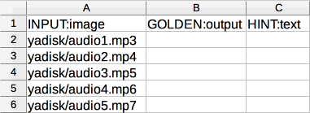
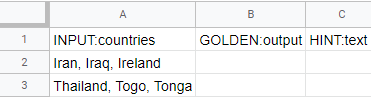
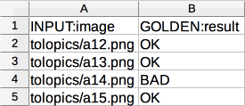
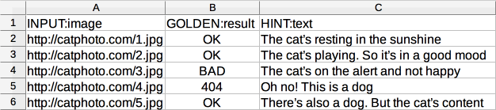
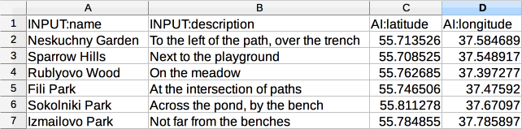
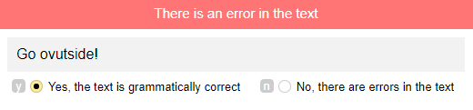

# Creating a file with tasks

Tasks are uploaded to the [pool](pool-main.md) in [the tasks file](../../glossary.md#tsv).

Download the file template for your [project](../../glossary.md#project) on the [pool](../../glossary.md#pool) page. Use the template to create your own task file and upload it to the pool.



If you want to see what your project will look like after the launch, but you don't have any labeling tasks yet, you can upload ready-made sample data to the pool. Sample data is available for templates:

- **Image classification**
- **Product search relevance**
- **Object recognition & detection**
- **Clickbait or not?**

Click **Use sample data** next to **Attach the prepared file with data**. This lets you avoid any additional actions with files.

Once you've finished working with the sample data and everything looks good, prepare your data and upload it to the pool.



If you need to add different task types to the pool, upload multiple files, one for each task type.

## Tasks file structure {#structure}



- TSV/XLSX

  The first line of the file contains the column headers:

  - `INPUT:<name of the input data field>` — input data for tasks.

  - `GOLDEN:<name of the output data field>` — responses for [control tasks](../../glossary.md#control-task).

  - `HINT:text` — hints for [training tasks](../../glossary.md#training-task). The Toloker will see the hint text at the top of the task (on a red background) if their response to the control task is different from the correct one.

  - Point coordinates for [field tasks](../tutorials/walk.md):

      - `Al:latitude` — latitude.

      - `Al:longitude` — longitude.

  ### Escaping in TSV/XLSX {#string}

  Escaping is the replacement of control characters in the text that are used for labeling with the corresponding text substitutions. It is used when you need to display a control character as a regular one.

  The type of input data determines how control characters are escaped. Determine the type of data and study the corresponding paragraph. Possible options:

  

  To display quotation marks `"` in the string type field:

  - The quotation marks of this type come in pairs. Don't escape other types of quotation marks (`« »` and `“ ”`).

  - Enclose the field in quotation marks `" "`.

  Unescaped quotation marks are removed when processing the file.

  Data | Example of transferring data to a file | Status | What the Toloker will see
  ----- | ----- | ----- | -----
  `monitor 24" buy` | `"monitor 24"" buy"` | `correct` | `monitor 24" buy`
  `book "All about dogs"` | `book "All about dogs"` | `correct, but the quotes won't be displayed` | `book All about dogs`
  `book “All about dogs”` | `"book “All about dogs”"` | `correct` | `book “All about dogs”`
  `monitor 24" buy` | `monitor 24" buy` | `loading error` |

  

  

  

  - Add another quotation mark to each `"` type of quotation mark. Don't escape other types of quotation marks (`« »` and `“ ”`).

  - Enclose the field in quotation marks `" "`.

  | Data | Example of transferring data to a file | Status | What the Toloker will see
  |----- | ----- | ----- | -----
  |`{"query": "monitor 24 inch buy"}` | `"{""query"": ""monitor 24 inch buy""}"` | `correct` | `monitor 24 inch buy`
  |`{"query": "monitor 24 inch buy"}` | `"{"query": "monitor 24 inch buy"}"` | `loading error` |

  

  

  - Add another quotation mark `"` or a backslash and a quotation mark `\"` if there is no backslash before the quotation mark.

  - Enclose the field in quotation marks `" "`.

  |Data | Example of transferring data to a file | Status | What the Toloker will see
  |----- | ----- | ----- | -----
  |`{"query": "monitor 24\" buy"}` | `"{""query"": ""monitor 24\"" buy""}"` | `correct` | `monitor 24" buy`
  |`{"query": "monitor 24" buy"}` | `"{""query"": ""monitor 24\"" buy""}"` | `correct` | `monitor 24" buy`
  |`{"query": "book \"All about dogs\""}` | `"{""query"": ""book \""All about dogs\""""}"` | `correct` | `book "All about dogs"`
  |`{"query": "monitor 24\" buy"}` | `"{""query"": ""monitor 24\"\" buy""}"` | `loading error` |
  |`{"query": "book \"All about dogs\""}` | `"{"query": "book \"All about dogs\""}"` | `loading error` |

  

  

  - Escape it with an additional slash `\`.

  - Enclose the field in quotation marks `" "`.

  | Data | Example of transferring data to a file | Status | What the Toloker will see
  |----- | ----- | ----- | -----
  |`{"query": "array A\B"}` |`"{""query"": ""array A\\B""}"` |`correct` |`array A\B`
  |`{"query": "array A\B"}` | `"{""query"": ""array A\B""}"` | `loading error` |

  

  

  

  

  - Add another quotation mark to each `"` quotation mark. Don't escape other types of quotation marks (`« »` and `“ ”`).

  - Add a backslash `\` before each comma inside the object if it isn't there already. Don't escape commas that separate objects inside the array.

  - Enclose the field in quotation marks `" "`.

  |Data | Example of transferring data to a file | Status | What the Toloker will see
  |----- | ----- | ----- | -----
  |`[{"query": "monitor 24 inch buy"},{"query": "monitor 19 inch buy"}]` | `"{""query"": ""monitor 24 inch buy""},{""query"": ""monitor 19 inch buy""}"` | `correct` | `monitor 24 inch buy monitor 19 inch buy`
  |`[{"query": "monitor 24 inch\, system unit buy"},{"query": "monitor 17 inch\, system unit buy"}]` | `"{""query"": ""monitor 24 inch\, system unit buy""},""query"": ""monitor 19 inch\, system unit buy""}"` | `correct` | `monitor 24 inch, system unit buy monitor 19 inch, system unit buy`
  |`[{"query": "monitor 24 inch buy"},{"query": "monitor 19 inch buy"}]` | `"{"query": "monitor 24 inch buy"},{"query": "monitor 19 inch buy"}"` | `loading error` |
  |`[{"query": "monitor 24 inch, system unit buy"},"query": "monitor 17 inch, system unit buy"}]` | `"{""query"": ""monitor 24 inch, system unit buy""},""query"": ""monitor 19 inch, system unit buy""}"` | `loading error` |

  

  

  - Add another quotation mark `"` or a backslash and a quotation mark `\"` if there is no backslash before the quotation mark. Don't escape other types of quotation marks (`« »` and `“ ”`).

  - Enclose the field in quotation marks `" "`.

  |Data | Example of transferring data to a file | Status | What the Toloker will see
  |----- | ----- | ----- | -----
  |`[{"query": "monitor 24\" buy"},{"query": "monitor 19\" buy"}]` | `"{""query"": ""monitor 24\"" inch buy""},{""query"": ""monitor 19\"" buy""}"` | `correct` | `monitor 24" buy monitor 19" buy`
  |`[{"query": "monitor 24\" buy"},{"query": "monitor 19\" buy"}]` | `"{""query"": ""monitor 24\"" inch buy""},{""query"": ""monitor 19\" buy""}"` | `loading error` |

  

  

  - Escape it with two backslashes `\\`.

  - Enclose the field in quotation marks `" "`.

  |Data | Example of transferring data to a file | Status | What the Toloker will see
  |----- | ----- | ----- | -----
  |`[{"query": "array A\B"},{"query": "array C\B"}]` | `"{""query"": ""array A\\\B""},{""query"": ""array C\D""}"` | `correct` | `array A\B array C\D`
  |`[{"query": "array A\B"},{"query": "array C\B"}]` | `"{""query"": ""array A\\B""},{""query"": ""array C\\D"}"` | `loading error` |

  

  

  ### Examples

  See examples for the different tasks types and different [data types](incoming.md#data-types).

  

  Task type depends on which fields are filled in.

  

    To create a [general task](../../glossary.md#general-task), fill in the columns with the `INPUT` header.

    

    

    

    

    

    

  

  

    To create a control task, add:

    - The task input data in the columns with the `INPUT` header.

    - Correct responses in the columns with the `GOLDEN` header.

    

    You can also add responses when creating a pool in [task markup mode](task_markup.md) (you need to use [“smart mixing”](distribute-tasks-by-pages.md#smart-mixing) when uploading tasks).

    

    

    

    

  

  

    To create a training task, add:

    - The task input data in the columns with the `INPUT` header.

    - Correct responses in the columns with the `GOLDEN` header.

    - A hint in the `HINT:text` column.

    For training tasks, it is convenient to create a [separate pool](train.md).

    

    You can also add responses and hints when creating a pool in [task markup mode](task_markup.md) (you need to use ["smart mixing"](distribute-tasks-by-pages.md#smart-mixing) when uploading tasks).

    

    

    

    

  

  

    The task that the Toloker chooses on the map in the Toloka mobile app.

    To create a field task, add:

    - The task input data in the columns with the `INPUT` header.

    - Coordinates in the `Al:latitude` and `Al:longitude` columns.

    

    

    

    

  

  

  

  

  

  ```
  INPUT:height
  1
  2.3
  ```

  

  

  

  ```
  INPUT:comment
  Hi
  Very nice
  This, but
  "Text with ""qoutes""."
  "Text with \n or \t"
  "Text with ""quotes"" and ,"
  ```

  

  

  ```
  INPUT:link
  https://www.example.com
  https://site.com
  ```

  

  

  ```
  INPUT:answer
  true
  false
  ```

  

  

  You can use [coordinates](*type-coordinates) to specify a location on the map.

  ```
  INPUT:location
  22.3341,32.32
  ```

  

  

  

  

  ```
  INPUT:banner
  "{""title"":""banner"",""links"":[""https://www.example.com"",""https://site.com""],""priority"":true,""flags"":[{""type"":""horizontal""},{""type"":""wide""}]}"

  ```

  

  

  

  

  

  ```
  INPUT:banner
  "{""title"":""banner""\,""links"":[""https://www.example.com""\,""https://site.com""]\,""priority"":true\,""flags"":[{""type"":""horizontal""}\,{""type"":""wide""}]}"

  ```

  

  

  [Array](*type-array) elements are separated by commas.

  

  

  ```
  INPUT:heights
  1,2.3
  ```

  

  

  

  ```
  INPUT:comments
  "Hi,Very nice,""This, but"",Text with ""quotes"".,Text with \n or \t,""Text with """"quotes"""" and ,"""
  ```

  

  

  ```
  INPUT:links
  "https://www.example.com,https://site.com"
  ```

  

  

  ```
  INPUT:answers
  true,false,true
  ```

  

  

  Each pair of [coordinates](*type-coordinates) must be enclosed in `""`.

  ```
  INPUT:locations
  """22.3341,32.32"",""22.3341,32.32"",""22.3341,32.32"""
  ```

  

  

  The [array](*type-array) of the [JSON](../../glossary.md#json-format) objects is similar to the [string](*type-string).

  

  ```
  INPUT:banners
  "{""title"":""banner1"",""links"":[""https://www.example.com"",""https://site.com""],""priority"":true,""flags"":[{""type"":""horizontal""},{""type"":""wide""}]},{""title"":""banner2"",""links"":[""https://www.example.com"",""https://site.com""],""priority"":false,""flags"":[{""type"":""vertical""},{""type"":""narrow""}]}"
  ```

  

  

  The [array](*type-array) of the [JSON](../../glossary.md#json-format) objects is similar to the string.

  

  

  ```
  INPUT:banners
  "{""title"":""banner1""\,""links"":[""https://www.example.com""\,""https://site.com""]\,""priority"":true\,""flags"":[{""type"":""horizontal""}\,{""type"":""wide""}]},{""title"":""banner2""\,""links"":[""https://www.example.com""\,""https://site.com""]\,""priority"":false\,""flags"":[{""type"":""vertical""}\,{""type"":""narrow""}]}"
  ```

  

  

  

  The columns with [required input data fields](incoming.md) must be filled. The other columns can be deleted if they are empty.

- JSON

  

  Check the format of the file with tasks. If the format of your file is old, download the template on the pool page and replace the sample data in it with your own data.

  

  The file is a JSON object which contains:

  - `input_values` — input data for tasks.

  - `known_solutions` — responses for control tasks.

  - `message_on_unknown_solution` — hints for training tasks. The Toloker will see the hint text at the top of the task (on a red background) if their response to the control task is different from the correct one.

  - Point coordinates for field tasks:

      - `latitude` — latitude.

      - `longitude` — longitude.

  ### Examples

  See examples for the different tasks types and different [data types](incoming.md#data-types).

  

  

  To create a [general task](../../glossary.md#general-task), specify the names and the values of the input fields in the `input_values` object.

  

  ```json
  [
    {
      "input_values": {
       "image_url": "https://www.example.com/image1.png"
      }
    },
    {
      "input_values": {
       "image_url": "https://www.example.com/image2.png"
      }
    },
    {
      "input_values": {
       "image_url": "https://www.example.com/image3.png"
      }
    }
  ]
  ```

  #|
  || Key | Description ||
  || **input_values** | **object**

  Input data for a task. List of pairs:

  ```json
    "<ID of field 1>": "<value of field 1>",
    "<ID of field 2>": "<value of field 2>",
    ...
    "<ID of field N>": "<value of field N>"
  ```
  ||
  |#

  

  

  

  To create a control task, specify:

  - The names and the values of the input fields in the `input_values` object.

  - Correct responses in the `known_solutions` object.

  

  ```json
  {
    "input_values": {
      "image_url": "https://www.example.com/image1.png"
    },
    "known_solutions": [
      {
        "output_values": {
          "result": "OK",
          "like": false
        }
      }
    ]
  }
  ```

  #|
  || Key | Description ||
  || **input_values** | **object**

  Input data for a task. List of pairs:

  ```json
    "<ID of field 1>": "<value of field 1>",
    "<ID of field 2>": "<value of field 2>",
    ...
    "<ID of field N>": "<value of field N>"
  ```
  ||
  || **known_solutions[].output_values** | **object**

  Output data values to check. You should specify values for all required output data fields.

  ```json
    "<ID of field 1>": "<correct response>",
    "<ID of field 2>": "<correct response>",
    ...
    "<ID of field N>": "<correct response>"
  ```
  ||
  |#

  

  

  

  To create a training task, specify:

  - The names and the values of the input fields in the `input_values` object.

  - Correct responses in the `known_solutions` object.

  - A hint in the `message_on_unknown_solution` property.

  For training tasks, it is convenient to create a [separate pool](train.md).

  

  You can also add responses and hints when creating a pool in [task markup mode](task_markup.md) (you need to use ["smart mixing"](distribute-tasks-by-pages.md#smart-mixing) when uploading tasks).

  

  

  ```json
  {
    "input_values": {
      "image_url": "https://www.example.com/image1.png"
    },
    "known_solutions": [
      {
        "output_values": {
          "result": "OK",
          "like": false
        }
      }
    ],
    "message_on_unknown_solution": "The cat is in a good mood."
  }
  ```

  #|
  || Key | Description ||
  || **input_values** | **object**

  Input data for a task. List of pairs:

  ```json
    "<ID of field 1>": "<value of field 1>",
    "<ID of field 2>": "<value of field 2>",
    ...
    "<ID of field N>": "<value of field N>"
  ```
  ||
  || **known_solutions[].output_values** | **object**

  Output data values to check. You should specify values for all required output data fields.

  ```json
    "<ID of field 1>": "<correct response>",
    "<ID of field 2>": "<correct response>",
    ...
    "<ID of field N>": "<correct response>"
  ```
  ||
  || **message_on_unknown_solution** | **string**

  Hint for the task.

  ||
  |#

  

  

  

  To create a field task, specify:

  - The names and the values of the input fields in the `input_values` object.

  - Point coordinates in the `latitude` and `longitude` properties.

  

  ```json
  {
    "input_values": {
      "image_url": "https://www.example.com/image1.png"
    },
    "latitude": "12.21",
    "longitude": "24.32"
  }
  ```

  #|
  || Key | Description ||
  || **input_values** | **object**

  Input data for a task. List of pairs:

  ```json
    "<ID of field 1>": "<value of field 1>",
    "<ID of field 2>": "<value of field 2>",
    ...
    "<ID of field N>": "<value of field N>"
  ```
  ||
  || **latitude** | **string**

  Latitude of a point on the map.

  ||
  || **longitude** | **string**

  Longitude of a point on the map.

  ||
  |#

  

  

  

  

  ```json
  [
    {
      "INPUT:image_url": "https://www.example.com/image1.png"
    },
    {
      "INPUT:image_url": "https://www.example.com/image2.png"
    },
    {
      "INPUT:image_url": "https://www.example.com/image3.png"
    }
  ]
  ```

  

  

  

  

  

  ```json
  [
    {
      "input_values": {
        "height": 1
      }
    },
    {
      "input_values": {
        "height": 2.3
      }
    }
  ]
  ```

  

  

  According to the JSON standard, double quotes `"` inside the string should be escaped with `\"`.

  ```json
  [
    {
      "input_values": {
        "comment": "Hi"
      }
    },
    {
      "input_values": {
        "comment": "This, but"
      }
    },
    {
      "input_values": {
        "comment": "Very nice"
      }
    },
    {
      "input_values": {
        "comment": "Text with \"qoutes\"."
      }
    },
    {
      "input_values": {
        "comment": "Text with \n or \t"
      }
    },
    {
      "input_values": {
        "comment": "Text with \"qoutes\". and ,"
      }
    }
  ]
  ```

  

  

  ```json
  [
    {
      "input_values": {
        "link": "https://www.example.com"
      }
    },
    {
      "input_values": {
        "link": "https://site.com"
      }
    }
  ]
  ```

  

  

  ```json
  [
    {
      "input_values": {
        "answer": true
      }
    },
    {
      "input_values": {
        "answer": false
      }
    }
  ]
  ```

  

  

  You can use [coordinates](*type-coordinates) to specify a location on the map.

  ```json
  [
    {
      "input_values": {
        "location": "22.3341,32.32"
      }
    }
  ]
  ```

  

  

  ```json
  [
    {
      "input_values": {
        "banner": {
          "title": "banner",
          "links": ["https://www.example.com", "https://site.com"],
          "priority": true,
          "flags": [{ "type": "horizontal" }, { "type": "wide" }]
        }
      }
    }
  ]
  ```

  

  

  [Array](*type-array) elements are separated by commas.

  

  ```json
  [
    {
      "input_values": {
        "heights": [1, 2.3]
      }
    }
  ]
  ```

  

  

  ```json
  [
    {
      "input_values": {
        "comments": [
          "Hi",
          "This, but",
          "Very nice",
          "Text with \"qoutes\".",
          "Text with \n or \t"
          "Text with \"qoutes\". and ,"
        ]
      }
    }
  ]
  ```

  

  

  ```json
  [
    {
      "input_values": {
        "links": [
          "https://www.example.com",
          "https://site.com"
        ]
      }
    }
  ]
  ```

  

  

  ```json
  [
    {
      "input_values": {
        "answers": [true,false,true]
      }
    }
  ]
  ```

  

  

  ```json
  [
    {
      "input_values": {
        "locations": ["22.3341,32.32", "22.3341,32.32", "22.3341,32.32"]
      }
    }
  ]
  ```

  

  

  ```json
  [
    {
      "input_values": {
        "banners": [
          {
            "title": "banner1",
            "links": ["https://www.example.com", "https://site.com"],
            "priority": true,
            "flags": [{ "type": "horizontal" }, { "type": "wide" }]
          },
          {
            "title": "banner2",
            "links": ["example.com", "site.com"],
            "priority": false,
            "flags": [{ "type": "vertical" }, { "type": "narrow" }]
          }
        ]
      }
    }
  ]
  ```

  

  

  



## Working with the file {#applications}

In popular spreadsheet editors, you can import and export data in TSV or XLSX:

- [MS Excel]({{ ms-excel }})
- [LibreOffice]({{ libre-office }})
- [Google Documents]({{ google-docs }}).

A text editor is good for JSON files (for example, Notepad on Windows or TextEdit on Mac OS).

You can work with data in an editor and then save it in the desired format.



- TSV

  1. Create a spreadsheet with [appropriate headings](#structure) or copy them from the template.

  1. Add data for tasks.

  1. Copy the entire spreadsheet. Paste it into a simple text editor (such as Notepad in Windows or TextEdit in Mac).

  1. Save the file in UTF-8 encoding with the `tsv` extension.

- XLSX

  1. Create a spreadsheet with [appropriate headings](#structure) or copy them from the template.

  1. Add data for tasks.

  1. Save the file in `XLSX`.

- JSON

  1. Download the file template in `JSON`.

  1. Open the template in a text editor and add your data.

  1. Save the file.



The maximum file size is 100 MB.

## What's next {#what_next}

- [Upload tasks to the pool](task_upload.md).

## Troubleshooting {#troubleshooting}





The number of tasks depends on how difficult and time-consuming the tasks are. Keep the size reasonably small. Large task suites are unpopular, partly because they are inconvenient for Tolokers (for example, if the internet connection is unstable).







To view the processing log, click **More on uploading errors**. The processing log is written in JSON format. Objects inside `result` match the line number of the uploaded file. Lines that were processed with an error have the status `"success": false`.



To work with a large log conveniently, copy it to the text editor.





#### Errors in column headers

If the [column headings](pool_csv.md) are incorrect, the whole file is rejected. Otherwise, Toloka specifies the number of tasks with processing errors.

#### Processing errors tables

```json
"parsing_error_of": "https://tlk.s3.yandex.net/wsdm2020/photos/2d5f63a3184919ce7e3e7068cf93da4b.jpg\t\t",
"exception_msg": "the nameMapping array and the sourceList should be the same size (nameMapping length = 1, sourceList size = 3)"
```

#|
||**Overview**|**How to fix**||
||**Extra tabs.**

If the uploaded file contains more `\t` column separators after the data or the link than the number of columns set in the [input data](../../glossary.md#input-output-data), you get an error message.

For example, if 1 column is set in the input data, and two more `\t\t` tabs are added in the file after the link, you get 3 columns, 2 of which are excessive. | Remove extra column separators in the above example — both `\t\t` characters.||
|#

```json
"exception_msg": "the nameMapping array and the sourceList should be the same size (nameMapping length = 4, sourceList size = 6)"
```

#|
||**Overview**|**How to fix**||
||**The number of fields in the header and in the row doesn't match.** | Make sure that:

- The number of tabs in the file structure is correct.
- String values with tab characters are enclosed in [quotation marks](pool_csv.md#string)`" "`.
|#

```json
"code": "VALUE_REQUIRED", "message": "Value must be present and not equal to null"
```

#|
||**Overview**|**How to fix**||
||**The value is missing for a required input field.** | Make sure that columns with required input data fields are filled.||
|#

```json
"code": "INVALID_URL_SYNTAX", "message": "Value must be in valid url format"
```

#|
||**Overview**|**How to fix**||
||**Invalid data in a “link” (“url”) field.** | Make sure that:

- Links start with the `http://`, `https://` or `www` prefix.||
|#

```json
"exception_msg": "unexpected end of file while reading quoted column beginning on line 2 and ending on line 4"
```

#|
||**Overview**|**How to fix**||
||**Unpaired quotation mark in a string.** | Check that all quotation marks are [escaped](pool_csv.md#string).||
|#





You can specify the number of tasks on the page when you upload your tasks to the pool. For more information about distributing tasks across pages, see [this article](distribute-tasks-by-pages.md).





Use the button **Upload review results** to upload your file. You can see the format [here](accept.md).

Assignments are reviewed in the tasks file.





Check the `hint` field. For the general tasks, this field must be empty.





In the file with the general tasks, the columns with the `INPUT` headers must be filled out. You can see those headers if you download a sample file from the pool.

If you are creating control tasks, fill out the `GOLDEN` columns with the correct responses.

If you are creating a training task, you also need to fill in the `HINT:text` column. For the general tasks you don't need any columns other than `INPUT`, so feel free to delete them.

You have to use the TSV, XLSX or JSON file format and UTF-8 encoding.

For more information about creating the file, see the [Guide](pool_csv.md). If there are errors during the upload, look up the error description on this [page](task_upload.md).





The error might occur if the expected input type is URL, but a string is received.

There may be two reasons:

- The input field has the "link" type.

- The pool was created for an outdated project version. It means that the pool was created before you changed the input field type.





It depends on the task. Technically, you can use as many tasks you want.

But Tolokers don't like to take lengthy tasks. They'd rather do 10 tasks that take one minute each than one task that takes 10 minutes.

In addition, if you use a large number of tasks on the page, there might be issues with uploading the files to be labeled. This problem might occur with images.

The third thing to consider is quality control and manual review. If you allow recompletion of assignments by banned Tolokers, you should split the task into smaller parts so that fewer assignments are recompleted. You are more likely to meet your budget this way.





Smart mixing settings are specified for the file rather than for the pool.

The settings specified during the first file upload are applied to all the files that are uploaded to this pool later on.





Try completing the tasks yourself. Ask your colleagues and friends to complete them. Find out average completion time and add 50% to it.





A task means a separate task. A task suite means a page with tasks. The Toloker gets paid for a task suite.





The same task may appear on different pages if:

- Dynamic overlap is used (incremental relabeling, IRL). As an example, let's say there were 5 tasks on a page. For 4 of them, responses coincided and the common response was counted as correct. The fifth task was mixed into another set because it didn't get into the final response and it needs to be “reassessed”.

- Different tasks have different overlap. Tasks with higher overlap will be additionally shown in sets with the other remaining tasks in the pool.

- If a [quality control rule](../../glossary.md#quality-control-rule) changes a task's overlap, it will appear in a different set.









You must use a separate row for each task in your tasks file. For more information, see [here](pool_csv.md).

When you create a pool, the pool will have settings for the number of tasks per suite.





You can't use the interface to upload the tasks with multiple correct responses to the pool. You can only use the [API](../../api/concepts/tasks.md) for that.





If you have the **Keep task order** option enabled in the pool settings, labeling will start after the tasks you uploaded previously are taken by Tolokers. If this option is disabled, we can't guarantee that the tasks will be assigned in that order.





All the values are written to the same column. Make sure to escape quotes. For more information about escaping quotes in JSON format, see the [Guide](pool_csv.md#json).





The array of strings in the input data must be comma-separated. For example: `INPUT:typestext1, text2, text3, text4`





The order of the fields in the file does not matter. Use your preferred order of fields.





No. If you try to upload a file with missing headers to the pool, the system issues an upload error. All the INPUT fields required in the specification must be present in the tasks file. There must be no extra fields or columns.

If you don't want to show some data to Tolokers, but you still need this data in the file, create the optional hidden input fields for such data in the project.









Escape commas with a backslash (`\`).





The text from the `hint`field will be shown to the Toloker in a red box at the top of the page if they give a response to the control task that differs from the correct one.

#### Example



If you need to display the text from the `hint` field in several lines, add hyphens to the file and enclose the text in quotation marks.





"Add your text here" is a hint for you. It means that you can replace the text in the field with your task data. The file structure and how to fill it out is described [here](pool_csv.md).





If you have one word enclosed in quotes, format the uploaded assignment like this: `"How many letters are there in the word ""Liechtenstein"""`. If you are escaping quotes inside your text, then the entire text must be enclosed in quotes. For more information, see the [Guide](pool_csv.md#string).





Text in the GOLDEN field must match the control text exactly.

Usually, if you copy site links from the browser, the copied links have the same format. But this is not the case when the link is trimmed or typed manually.

Check the links that you use. There are several ways to unify links:

- Add requirements for the link format in your instructions and hints in your training pool.

- Use RegExp in your JS to trim the received links and write the result to the new output field, and then match the received value against the control value.







[*type-array]: 
[*type-string]: 
[*type-coordinates]: 
[*type-integer]: 
[*type-float]: 