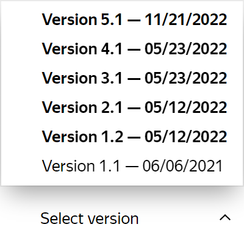

# Returning to a previous version of a project

All changes made to the [project](../../glossary.md#project) are saved in the version history. You can view previous versions or return to any of them.

The version number (for example, `1.2`) consists of two numbers:

1. The first number is the major version. It appears when you change a required field in the [input or output data](incoming.md):

    - Add, remove or rename a required field.
    - Change the field from optional to required.
    - Change the field parameters that aren't compatible with the current specification:

        - Reduce the maximum or increase the minimum number of items in the array.
        - Change allowed string values.
        - Reduce the maximum or increase the minimum length of a string.
        - Reduce the maximum or increase the minimum value for a number.

1. The second number is the minor version. It appears when you make any other changes to the project.

## How to select the project version



Changes to the major version of the project don't affect existing [pools](../../glossary.md#pool).



1. Go to the [project editing](edit-project.md).

1. Click **Select version** at the bottom of the page.

   

   

   

1. Choose a version. The project parameters return to the chosen version.

1. Save the project to use the chosen project version as current.

## What's next {#what_next}

- [Create a task pool in the project](pool-main.md).



