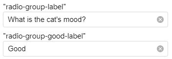
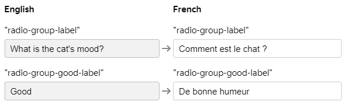

# Translations

If your tasks are intended for Tolokers from different countries, you can translate your project into their languages.

Advantages of a multi-language project:

- Tolokers are more likely to take tasks if the description and instructions are in their own language.
- Tolokers will better understand how to do the task.

If your project will be translated into multiple languages, we recommend creating the project in English and selecting it as the source language.



You can only add translations in the new interface for creating projects.




## Adding a translation {#project-lang}

Read the instructions.

1. When creating or editing your project, open the **Translations** page.

1. Select the **Source language** and add the target language.

1. Add translations and save the page.


## How does it work? {#how-it-works}

Toloka automatically selects the language based on the Toloker's language settings in the interface and profile.

## Deleting and editing {#delete-edit}

To delete or edit your translation, open the **Translations** page and click  to delete or  to edit.

## Translation parameters {#param}


Parameter
 | Overview
----- | -----
**Source language** | The main language used in the project settings.
**Translations** | The languages you selected and their translation status.
**Language** | All languages you selected and their current status.<br/><br/>-  — the language is active and will be displayed to users.<br/>    <br/>-  — the language is inactive. If you added a language but didn't fill in the fields, it is inactive and users don't see it.
**Name and description** | The current translation status of the project name and description.
**Instructions** | The current translation status of the project instructions.
**Task interface** | The current translation status of the task interface.


## Translating the task interface {#interface-translate}



Interface elements can only be translated in the Template Builder editor.




1. When creating or editing a project, add the following components to the text property configuration at the **Task interface** step:
    - `helper.translate` — the translation component.
    - `key` — the value where the translation will be stored.
    For example, here is how the `label` property looks before:
    ```json
    {  "type": "field.radio-group",  "label": "What is the cat's mood?"
    }
    ```
    
    Now, this is how the `label` property looks after adding the translation component and `radio-group-label` key:

    ```json
    {
    "type": "field.radio-group",
    "label": {
    "type": "helper.translate",
    "key": "radio-group-label"
    }
    }
    ```
    You create the keys yourself, so give them names that indicate:
    - The component that it belongs to.
    - The value that it belongs to within the component.
    For example, the key name `radio-group-good-label` indicates that it belongs to:
    - The `field.radio-group` component.
    - The `good` value.
    - The `label` property.

1. Add text to the keys in the source language.

    In this example, two keys were added: `radio-group-label` and `radio-group-good-label`. All we have left to do is add the text to be translated into other languages.

    

    Save the changes to the interface.

1. At the **Translations** step, select the desired languages and add the translations of the task interface keys.

    



