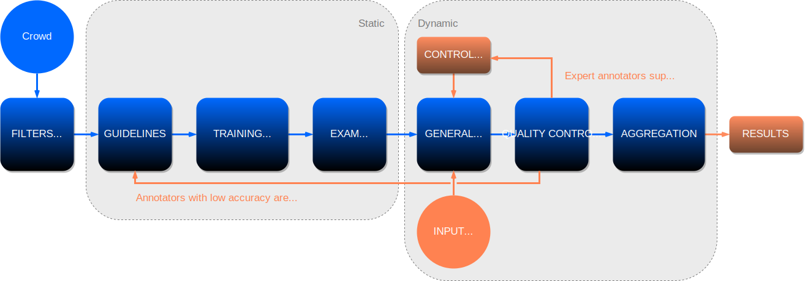
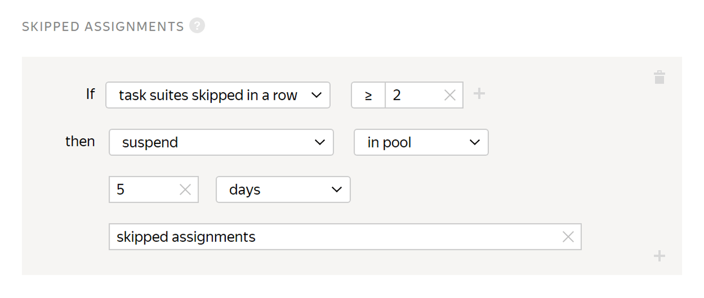

# Overview

To improve quality of answers, you must [select the audience](filters.md) you need and [train](train.md) it.

## Selecting the audience {#audience-select}

### Filters {#audience-filters}

- [Demographics](filters.md#filter-user-profile) (age, gender, education, languages, region, citizenship).

- [Device specs](filters.md#filter-calc-data) (device type, OS and browser version).

- [Skills](filters.md#filter-skill) (quality on specific [tasks](../../glossary.md#task)).

- Top \% of the best on the platform.





### Training and onboarding {#audience-training}

- Correct answers + hints.

- High scores continue on to the [exam](../../glossary.md#exam).

### Exam {#audience-exam}

- Scored by \% correct answers.

- Best scores grant access to paid tasks.

## Multi-level quality checks {#quality-checks}

### Quality control {#quality-control}

- [Overlap](overlap-faq.md) (including dynamic overlap).

- [Control tasks](goldenset.md).

- [Majority vote](mvote.md).

- Validation by other annotators.

### [Anti-fraud system](https://toloka.ai/anti-fraud/) {#anti-fraud}

- Platform-wide ban for fraudulent Tolokers.

- Behavior analysis system.

- Multilayer technologies to detect and prevent all types of fraud.

### Protect your project {#protection-from-cheaters}



To protect your project from cheaters, you can use the quality control rules:

- [Ban](ban.md) for [fast responses](quick-answers.md).

- [Captcha](captcha.md).

- Limit [skipped assignments](skipped-assignments.md).

- Limit number of tasks per person.





A Toloker who completes a [task suite](../../glossary.md#task-suite) in less than 10 seconds will be banned and won't be able to access your tasks.





A Toloker who skips 2 task suites in a row is restricted from accessing the pool and can't complete your tasks for 5 days.





## Obtaining quality results after data labeling {#obtaining-results}

### Aggregating results {#aggregating-results}

- Using [majority vote](mvote.md).

- Using the [Dawid-Skene method](result-aggregation.md#dawid-skene).

- [By skill level](result-aggregation.md#aggr-by-skill).

### Evaluating metrics {#evaluating-metrics}

- Accuracy\/completeness/F1/MCC, etc.

- Consistency.

- Confidence.

### Reassigning tasks {#reassigning-tasks}

- If the submitted task is rejected.

- If consistency is low.

- If answers from banned Tolokers are thrown out.

## Main project scenarios {#main-project-scenarios}

### Validate results {#validate-results}

- [Control tasks](goldenset.md) — set the Toloker’s skill level based on answers in control tasks and exclude Tolokers who give the wrong answers.

- [Majority vote](mvote.md) — have multiple Tolokers do the same task and look for consistency in answers.

- Manually check results — evaluate Tolokers by the number of accepted and rejected tasks.

### Diversify the audience {#diversify-audience}

- [Earnings](income.md) — limit the earnings per person in your [pool](../../glossary.md#pool) in 24 hours.

- Completed tasks — limit the number of tasks per person in your pool in 24 hours.

### Prevent random clicking and bots {#random-clicking}

- [Fast responses](quick-answers.md) — monitor the minimum time to complete a [task suite](../../glossary.md#task-suite).

- [Captcha](captcha.md) — periodically display a [captcha](../../glossary.md#captcha) to catch automated scripts and bots.

- [Skipped assignments](skipped-assignments.md) — exclude Tolokers who skip too many tasks in a row.

### Redo certain tasks {#redo-tasks}

- [Re-assign tasks](restore-task-overlap.md) completed by someone who was banned — if a Toloker gets banned, all their completed tasks can be automatically assigned to other people.

- [Rejected and accepted task processing](reassessment-after-accepting.md) — set the rules for assigning rejected tasks to other people.

## Technologies for quality management {#quality-management-tech}

Transform the crowd into computing power with advanced technologies for quality management.

### Multiple quality control methods {#multiple-quality}

Toloka offers different approaches to achieve the best quality for each [project](../../glossary.md#project).

- Post-verification.

- Task-based crowd training and testing.

- Golden sets (honeypots) to monitor quality.

- Advanced [aggregation](result-aggregation.md) tools.

- Platform-wide anti-fraud system.

### Adaptive selection of Tolokers {#adaptive-selection}

Multi-stage selection of a distributed crowd.

- Audience [filters](filters.md) by language, age, gender, interests, location, real-time ranking, and more.

- [Training](train.md), [exams](how-to-use-exams.md), and retraining to find Tolokers for your exact task.

### Smart matching mechanisms {#smart-matching}

Patent-pending matching system that honors the preferences of requesters and Tolokers for mutual benefit.

- Invite Tolokers to a project who are most qualified to handle it.

- Offer Tolokers personalized recommendations of interesting projects they will enjoy.

### Autolabeling \& verification (on demand) {#autolabeling-verification}

Autolabeling and pretrained models with quality control built in.

- Automated prelabeling. Results are verified by human Tolokers for high accuracy.

- Human in the loop workflows.

## What's next {#what_next}

- [Set up quality control](qa-pool-settings.md).
- [Add tasks](pool.md) to the pool.
- [Start the pool](pool-run-and-stop.md).

## See also {#see-also}

- [Crowdsourcing concepts: Quality control](https://toloka.ai/knowledgebase/quality-control/)

## Troubleshooting {#troubleshooting}























































































