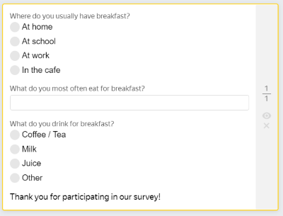
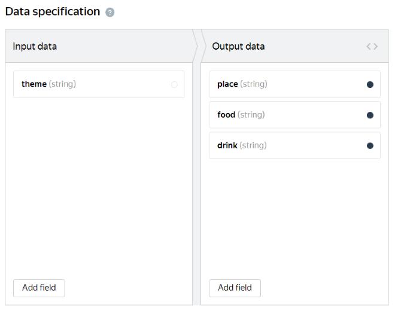
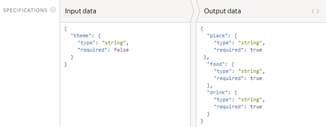

# Survey



Run the project in the [Sandbox]({{ sandbox }}) first. This helps you avoid making mistakes and spending money on a task that isn't working right.




Surveys are designed to collect information for research purposes. The number of respondents is set in [overlap](pool_poolparams.md#ovlp), and the requirements for them are set with [filters](filters.md).

You may need additional projects for your task, such as dataset pre-check or checking Tolokers' responses. Learn more about this in [Decomposition of the task](solution-architecture.md).

Suppose you want to know where Russian-speaking respondents have breakfast and what they prefer. To do this, create a single task on a page and in the [pool](../../glossary.md#pool-ru), so the Toloker sees several questions with response options.

#### Example of a prepared task


To run tasks and get responses:

1. [Create a project](#project)
1. [Add a task pool](#pool)
1. [Upload tasks](#tasks_upload)
1. [Set up quality control](#quality_control)
1. [Start the pool and get the results](#launch)

## Create a project {#project}

The project defines what the task will look like for a Toloker.

#### In the interface:

1. Choose a template:

    1. Click **Create project**.

    1. Select the **Customer survey** template.

1. Provide general information:

    1. Enter a clear name and a short description for the project. Tolokers will see this in the task list.

    1. Optionally add a **Private comment**.

    1. Click **Save**.

1. Edit the task interface in the editor you selected:

    #### Template Builder

    1. The task interface describes how the elements should be arranged in the task.

    Use the [ready-made code](https://clck.ru/VC4xu) for this project with pre-configured validation and task layout. The Toloker won't be able to submit the response until they answer all the questions.

    [Learn more about setting up conditions]({{ tb-conditions }}) in Template Builder.

    1. Click **Show specifications** to see the input and output data fields.

    Input data fields are created from the code on the **Example of input data** tab.

    The output data fields depend on the components that use `data.output` and values supported by it.

    Learn more about [input and output data fields]({{ tb-create-specs }}) in the Template Builder Help.

    - Input data field — The `theme` string to upload a survey. It is not used in the interface and can contain any text.
    - Output data fields:
    - The required `place` string to record the Toloker's response to the question <q>Where do you usually have breakfast?</q>.;
    - The required string `food` to record the Toloker's response to the question <q>What do you eat for breakfast most often?</q>.;
    - The required string `drink` to record the Toloker's response to the question <q>What do you drink for breakfast (besides water)?</q>.

    1. Save the changes.

    #### HTML/CSS/JS editor

    1. Define which objects you are going to pass to the Tolokers and receive from them in response. To do this, add input and output fields in the **Data specification** section.

    #### What are input and output data?

    **Input data** is types of objects that are passed to the Toloker for completing the task. For example, this could be a text, an image, or geographic coordinates.

    **Output data** is types of objects that you receive after the task is completed. For example, this could be one of several response options, typed text, or an uploaded file.

    Learn more about [input and output data fields](incoming.md).

    Delete all the output data fields and add the fields you need:

    - Input data field — The `theme` string to upload a survey. It is not used in the interface and can contain any text.
    - Output data fields:
    - The required `place` string to record the Toloker's response to the question <q>Where do you usually have breakfast?</q>.;
    - The required string `food` to record the Toloker's response to the question <q>What do you eat for breakfast most often?</q>.;
    - The required string `drink` to record the Toloker's response to the question <q>What do you drink for breakfast (besides water)?</q>.

    #### Graphic mode
    
    #### JSON
    

    1. Create the task interface in the **HTML** block. It describes how the task elements should be arranged in the task.

    You can use standard HTML tags and [special expressions](spec.md) in double curly brackets for input and output data fields.
    
    ```html
    <div>
    <div>Where do you usually have breakfast?</div>
    {{field type="radio"name="place"value="home" label="At home"}}
    {{field type="radio" name="place" value="university" label="At school or university"}}
    {{field type="radio" name="place" value="work" label="At work"}}
    {{field type="radio" name="place" value="cafe" label="In a cafe"}}<br/><br/><br/>
    </div>
    <div>
    <div>What do you usually eat for breakfast?</div>
    {{#field type="select"name="food" placeholder="" width="300px"}}
    {{select_item value="kasha" text="Porridge/Muesli/Cold cereal"}}
    {{select_item value="egg" text="Eggs (fried/boiled/omelet)"}}
    {{select_item value="sandwich" text="Sandwich/Pastry/Crepes/Pancakes"}}
    {{select_item value="curd" text="Cottage cheese/Yogurt/Other dairy"}}
    {{select_item value="other" text="Other"}}
    {{/field}}<br/><br/><br/>
    </div>
    <div>
    <div>What do you usually drink at breakfast?</div>
    {{field class="option" type="radio"name="drink" value="coffee" label="Coffee/Tea"}}
    {{field class="option" type="radio" name="drink" value="milk" label="Milk"}}
    {{field class="option" type="radio" name="drink" value="juice" label="Juice"}}
    {{field class="option" type="radio" name="drink" value="other" label="Other"}}<br/><br/><br/>
    </div>
    <div>
    Thank you for completing our survey!
    </div>
    ```
    
    This means that the Toloker will see three questions with response options.

    Clear the JavaScript and CSS blocks.

    1. Click  to see the Toloker's view of the task.

    

    The project preview shows one task with standard data. You can define the number of tasks to show on the page later.

    

    1. Save the changes.

1. For a survey, [instructions](../../glossary.md#task-instruction-ru) aren't required. Place the recommendations for filling out the survey in the [task interface](../../glossary.md#task-interface-ru).
    

    Don't leave your contact information. This contradicts the [Requester Agreement]({{ customeragreement }}).

    

1. To go back to the **Projects**page, click **Finish**.

Learn more about working with the project in the [Project](project.md) section.

## Add a task pool {#pool}

A pool is a set of paid tasks sent out for completion at the same time.

1. Open the project and click **Add pool**.
1. Give the pool any convenient name. It is available only to you — the Toloker will only see the name of the project.
1. In the **Audience** block, add **Filters** to select Tolokers.
    Tasks in pools will be automatically available in the web version of Toloka and the mobile app. If you want to change the default settings and limit the visibility of the task for any of the versions, add the **Client** filter and select the desired value: **Toloka web version** or **Toloka for mobile**.

1. In the **Price** block, set the price per [task suite](../../glossary.md#task-page-ru) in US dollars (for instance, `0.01`). In a survey, a task suite must contain one task. If you need help rating tasks, read about [setting up pricing](dynamic-pricing.md#section_wb1_lhl_vlb).
1. In the **Quality control** block, set the **Task overlap**, which is the number of Tolokers to complete the same task. At first, set a small number like 100. If you see that this is not enough for sampling, increase the overlap.
1. In the **Additional settings** block, specify the **Time** for task completion (for instance, 600 seconds).
1. Click **Create a pool**.

## Upload tasks {#tasks_upload}
 
Download the sample upload file. You can find it on the pool page. There are links to **files** with regular, control, and training tasks. Use it to prepare your own [file](../../glossary.md#tsv-file-definition-ru) with tasks.

1. Click **Upload**. In the window that opens, you can also download a sample file.
1. Add input data in it. The header of the input data column contains the word `INPUT`. To upload a task, add any text to the `INPUT` column. The string from the input data field isn't used in the interface. Leave the other columns empty.
1. Load tasks by choosing **Set manually** and setting 1 task per suite.

## Set up quality control {#quality_control}

[Quality control rules](control.md) allow you to filter out inattentive Tolokers. You can configure quality control both in the project and in the pool.

1. #### Pool

    Go to pool editing (the **Edit** button in the upper-right corner of the page) and click **Add Quality Control Rule**.

    You can copy quality control settings from another pool. To do this, click **Copy settings from** in the **Tolokers filter** section.

    #### Project

    Open the project page, open the **Quality control** tab and click **Set quality control**. Then click **+ Add Quality Control Rule**.

    The rules are applied to all project pools, so you can't change settings in just one of the pools.

    

    When you [clone a project](project.md), its quality control settings aren't transferred.

    

1. Add the **Fast responses** rule and enter the following values:
1. Add the **Banned users' reassessment** block.
    For surveys, always add both rules, since they're only effective when paired up for such tasks. Surveys usually only have one task suite. This rule complements fast responses so that you get the necessary number of responses, and not just ban those who respond too quickly.

    

    **Recompletion of assignments from banned users** increases the overlap, hence the budget, too.

    

    Reject assignments according to the conditions described in the instructions. To maintain the reputation of a good requester, don't automatically reject fast responses like that. It's easy to fill out a simple surveys in less than 20 seconds.


## Start the pool and get the results {#launch}

1. Start the pool by clicking .
1. Track the completion of tasks in the **Pool statistics** section.
1. When the pool is completed, launch aggregation of results. To do this, find the **Download results** button and click  next to it.
    Aggregation of responses is necessary to get a complete picture of all results. Learn more [about aggregation](result-aggregation.md).

1. Track the aggregation progress on the **Operations** page. When the process is completed, click **Download**.
1. If the Tolokers' responses aren't enough for analysis, increase the **Overlap** to receive more responses.
    #### How do I increase overlap?

    1. Stop the pool by clicking .
    1. In the upper-right corner, click **Edit**.
    1. Change the value in the **Overlap** block.
    1. Click the **Save** button and start the pool.


## Troubleshooting {#troubleshooting}

#### How do I create a simple survey with no options, where the Toloker writes an arbitrary response?

1. Create a project from an empty template.
1. Write your question in the HTML block.
1. If you need an [extensive](t-components/text.md) response, add the required number of text entry components.
1. If you need a [short](t-components/string.md) response, add the required number of string entry components.
1. Come up with a name for each of the components and create a matching number of string-type output fields with the same names. They will be used to save responses.
1. Make all the output fields mandatory.
1. Make the input field auxiliary. It will only be used to create a file with tasks.
1. Come up with a name for the input field and set the string type for it (see the step-by-step [guide on creating a survey](questionnaire.md)).

#### How do I create a survey with a single question based on the preset survey template?

The survey includes an auxiliary input field. You can use it to pass any information, and it won't be visible to Tolokers.

Upload one task and use the overlap parameter to enter the number of people you want to survey.



