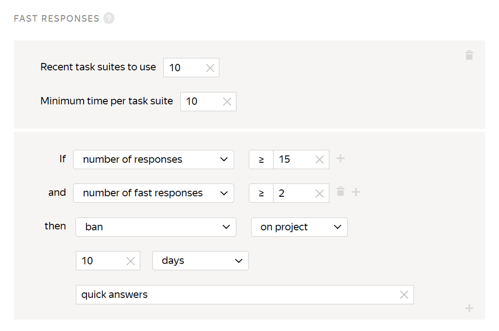
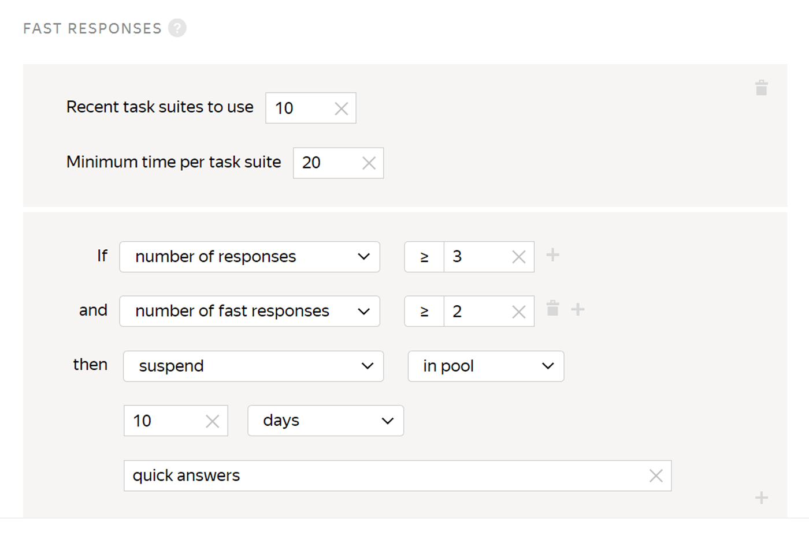

# Fast responses

This rule is necessary to filter out cheating Tolokers who complete tasks too quickly and carelessly. You can also use it to provide protection against robots that can distort the final results in the pool.

## When to use {#when-use}

Restrict the pool access for Tolokers who respond too quickly to:

- Restrict access for Tolokers who cheat in their responses. In this case, set the time required to complete a [task suite](../../glossary.md#task-suite) when giving random responses.

- Provide anti-robot protection. In this case, set twice as little time for task suite completion.

To estimate the time required to complete a task suite:

- [Complete a task in the sandbox](sandbox.md#self), if you didn't start the tasks yet.

- Look up the **Average assignment completion time** in [pool statistics](pool_statistic-pool.md#avgtime) if the tasks are already running.

## How do I set it up? {#rule}

#|
|| **Field** | **Overview**||
||**Recent task suites to use** | The number of recent assignments submitted by the Toloker.

If this field is not filled in, the calculation includes only recent task suites from the pool to which the rule applies.

If the field is filled in, the corresponding number of task suites is used. The rule takes into account the task suites from both this pool and other pools where this field is filled in.

To learn more about how this field works, go to [Parameter "Remember values"](remember-values.md).||
||**Minimum time per task suite** | The task suite completion time (in seconds). Everything that is completed faster is considered a fast response.||
||**If** | A condition for performing the action in the **then** field:

- **number of responses** — The number of the Toloker's recent responses (less than or equal to the number in the **Recent task suites to use** field).

- **number of fast responses** — Allowed number of fast responses (out of the recent ones).

To add multiple conditions, click .||
||**then** | Action to perform for the condition:

- **assign skill value** — Assign a fixed value to the Toloker's [skill](nav.md).

- **accept all assignments from this Toloker in the pool** — Requires the [non-automatic acceptance](offline-accept.md) option to be set.

    Useful if the Toloker completes most tasks well. Example: The Toloker completed more than 80% of the tasks correctly and you're satisfied with this result. The rule will work automatically and accept all responses in the pool.

- **suspend** — Suspend the Toloker's access to the pool for the specified number of days. Only the requester can view the reason.

- **ban** — Block access to the project or all of the requester's projects for the specified number of days. Only the requester can view the reason.

    If access to tasks is blocked temporarily (for example, for 7 days), the history of the Toloker's responses is not saved after the ban is lifted. The skill level is calculated based on the new responses.||
|#

## Examples of rules {#examples}

**Task**: you noticed that the pool closed too quickly and the final result was unsatisfactory. To prevent this from happening again, you decided to filter out Tolokers who complete tasks too quickly.

Examples are provided for simple [classification](../tutorials/image-classification.md). There are 10 tasks per suite.



The assignments submitted by banned Tolokers will be taken into account if you don't reject them manually using assignment review They can be reassigned by setting up the [Recompletion of assignments from banned users](restore-task-overlap.md) rule.



#### Blocking for fast responses



- Correct settings

  

  A Toloker who completes a task suite in less than 10 seconds will be banned and won't be able to access your tasks.

- Incorrect settings

  

  This rule will never take effect because the number of responses counted (**Recent task suites to use**) is less than the number of recent responses in the rule (**number of responses**).



#### Suspension in the pool for fast responses

A Toloker who completes two task suites in less than 20 seconds is suspended from accessing the pool and can't complete your tasks for 10 days.

## For developers {#for-developers}

- [Toloka API: Fast responses](../../api/concepts/fast.md)
- [Toloka-Kit: AssignmentSubmitTime collector class](../../toloka-kit/reference/toloka.client.collectors.AssignmentSubmitTime.md)

## Troubleshooting {#troubleshooting}











