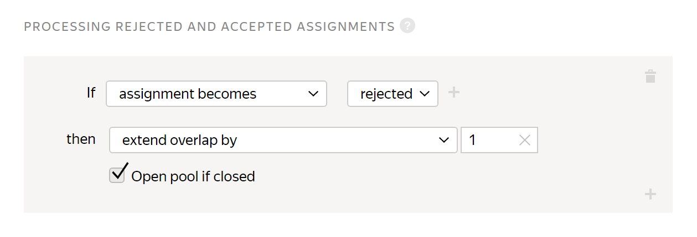
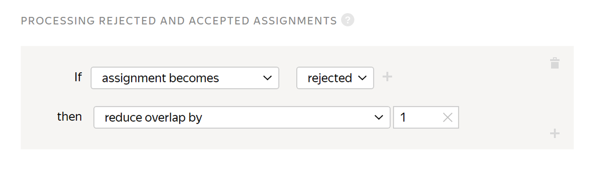

# Processing rejected and accepted assignments

You can enable the [Non-automatic acceptance](offline-accept.md) option to [reject or accept](accept.md) assignments that Tolokers completed. Assignments are rejected and accepted on a page-by-page basis.



After the end of the review period specified in the **Non-automatic acceptance** option, assignments are accepted automatically.



## When to use {#when-use}

This rule is helpful when you need to:
- Resend rejected assignments for re-completion to other Tolokers.

    If you rejected an assignment, you may want it to be completed by another Toloker instead of the one whose response you rejected. To do this, you can increase the [overlap](../../glossary.md#overlap-ru) for this assignment only. This is especially helpful if you have the overlap value set to 1.

- Save money on re-completing assignments that you have already accepted.

    If you reviewed and accepted an assignment, it may not make sense for other users to complete the same assignment. To avoid this, you can reduce the overlap for accepted assignments only.

## Rule settings {#rule}



All fields in this rule are required. If you don't fill in at least one of them, you won't be able to save the rule.



Field
 |
Overview

----- | -----
**If** | A condition for performing the action in the **then** field: - **submitted assignments** — The number of [task suites](../../glossary.md#task-page-ru) that are completed and awaiting review.      - **approved assignments** — The number of task suites accepted after the review.      - **rejected assignments** — The number of task suites rejected after the review.      - **assignment becomes approved** — The task suite was accepted after the review.      - **assignment becomes approved after rejection** — The task suite was first rejected, but then accepted after the review.                    Note that you can't change the task status if the task [pool](../../glossary.md#pool-ru) was [archived](pool-archive.md).                - **assignment becomes rejected** — The task suite was rejected after the review.  To add multiple conditions, click .
**then** | Action to perform for the condition:  - **extend overlap by** — Resend the [task suite](../../glossary.md#task-page-ru) for completion to other Tolokers.          If you want an assignment to be automatically reassigned even if your pool is already completed and closed, turn on the option **Open pool if closed**.      - **extend overlap by** — Decrease the number of times a task suite can be completed by Tolokers. For example, use this action to cancel the recompletion of accepted assignments.

## Rule example {#examples}

The task is to send rejected and recompleted assignments for review. Or assign them to new Tolokers after rejection.

#### Correct settings

A Toloker's assignments rejected after the review are sent to another Toloker for recompletion.

#### Incorrect settings

A Toloker's assignments rejected after the review are not sent to another Toloker for recompletion.

## Troubleshooting {#troubleshooting}

#### What overlap should I set?

Overlap defines how many Tolokers complete the same pool task.

The best overlap is an overlap that provides satisfying quality of results. For most tasks that are not [reviewed](../../glossary.md#left-off-acceptance-ru), overlap from <q>3</q> to <q>5</q> is enough. If the tasks are simple, overlap of <q>3</q> is likely to be enough. For tasks that are reviewed, set overlap to <q>1</q>.

#### Can I change overlap after the pool is started?

Yes. [Open edit mode for the pool](pool-edit.md) and set a new overlap value. You don't need to restart the pool. Updating the settings is usually fast, but if there are many tasks, it may take several minutes.


