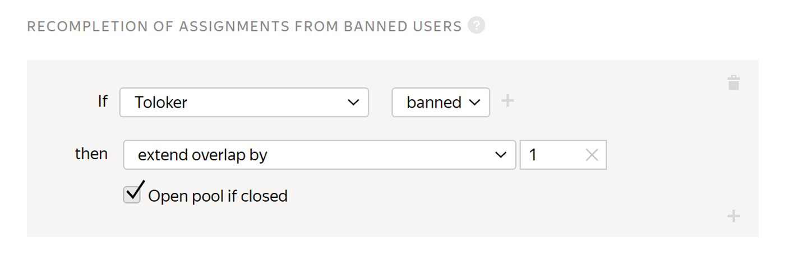
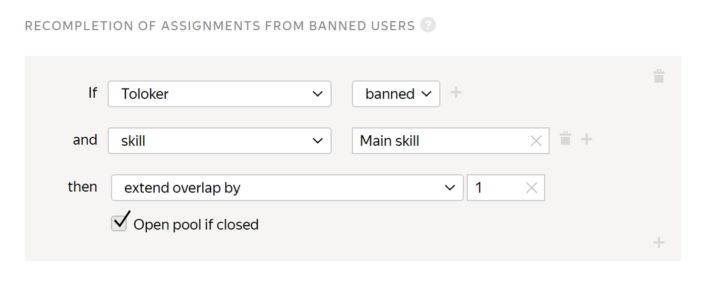
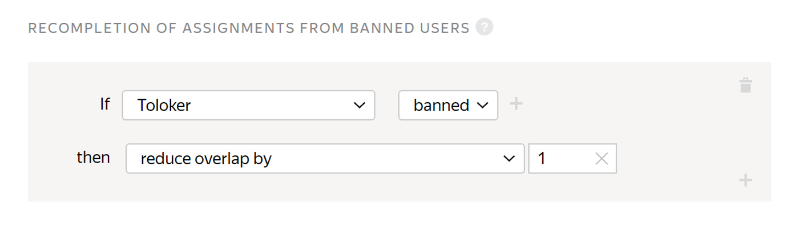

# Recompletion of assignments from banned users

Use this rule if the Toloker was banned and you want someone else to complete their tasks.



Don't use this rule in [pools](../../glossary.md#pool) with [dynamic overlap](dynamic-overlap.md). This increases the maximum [overlap](../../glossary.md#overlap) value.



## When to use {#when-use}



This rule can increase the cost of the pool.



Use the rule if you want to get responses only from honest Tolokers to each task in the given overlap.

The assignments submitted by banned Tolokers will be taken into account if they are not rejected manually using [manual review](../../glossary.md#assignment-review). They can be reassigned by setting up the corresponding rule.

To download the responses of users who are not blocked:

1. On the pool page, click **Download results** on the right.
1. Select **Exclude assignments by banned Tolokers**.
1. Click **Download results**.

#### Don't use it if:

- You don't want to increase the overlap for tasks.
- You don't want the final budget for pool labeling to exceed the initial budget.
- You set up [dynamic overlap](dynamic-overlap.md). This increases the maximum overlap value.

## How do I set up? {#rule}



All fields in this rule are required. If you don't fill in at least one of them, you won't be able to save the rule.



#|
|| **Field** | **Overview**||
||**If** | A condition for performing the action in the **then** field:

- **Toloker banned** — The Toloker's access to tasks is blocked by a [quality control rule](../../glossary.md#quality-control-rule) (such as [control tasks](../../glossary.md#control-task), [majority vote](../../glossary.md#majority-vote), [fast responses](../../glossary.md#fast-responses), or [skipping tasks](../../glossary.md#skipping-tasks)).

- **Toloker filtered out** — The Toloker no longer meets one or more [filters](filters.md).

- **skill** — The Toloker no longer meets the specific skill filter.

To add multiple conditions, click .||
||**then** | Action performed under the **If** condition:

- **extend overlap by** — Resend the [task suite](../../glossary.md#task-suite) for completion to other Tolokers.

- **reduce overlap by** — Ignore the Toloker's response.

    If you want an assignment to be automatically reassigned even if your pool is already completed and closed, turn on the option **Open pool if closed**.||
|#

## Examples {#examples}

**Task**: classify photos for a dataset across different categories. If a Toloker is banned by a quality control rule (for example, [fast resposes](quick-answers.md)) or no longer matches the skill, their responses aren't counted and their tasks are sent for re-completion to another Toloker.



- Correct settings

  #### Resending tasks from a banned Toloker

  

  If a Toloker is banned by a quality control rule, their tasks are sent for re-completion to another Toloker.

  #### Resending tasks if the Toloker doesn't meet the skill filter

  

  If the Toloker no longer meets the requirements of the skill filter and their responses aren't taken into account, their tasks are sent for re-completion to another Toloker.

- Incorrect settings

  #### Resending tasks from a banned Toloker

  

  If a Toloker is banned by a quality control rule, their tasks are not sent for re-completion to another Toloker.

  #### Resending tasks if the Toloker doesn't meet the skill filter

  

  If the Toloker no longer meets the requirements of the skill filter and their responses aren't taken into account, their tasks are not sent for re-completion to another Toloker.



## For developers {#for-developers}

- [Toloka API: Recompletion of assignments](../../api/concepts/restore-task-overlap.md)
- [Toloka-Kit: UsersAssessment collector class](../../toloka-kit/reference/toloka.client.collectors.UsersAssessment.md)

## Troubleshooting {#troubleshooting}



Overlap defines how many Tolokers complete the same pool task.

The best overlap is an overlap that provides satisfying quality of results. For most tasks that are not [reviewed](../../glossary.md#assignment-review), overlap from “3” to “5” is enough. If the tasks are simple, overlap of “3” is likely to be enough. For tasks that are reviewed, set overlap to “1”.





Yes. [Open edit mode for the pool](pool-edit.md) and set a new overlap value. You don't need to restart the pool. Updating the settings is usually fast, but if there are many tasks, it may take several minutes.





It is better to use one [skill](../../glossary.md#skill) in a project. You can choose the way to calculate the skill:

- Calculate the skill for each pool separately. The current skill value is the value of the skill in the pool the Toloker completed last. This option is convenient if:

    - The pools are intended for different groups of Tolokers (for example, there are filters by city or country).

    - Pools are started one by one and you don't want to take into account the responses in the previous pools to calculate the skill in the current pool.

    This calculation method is used by default when adding a quality control rule to a pool. For the control tasks block, leave the **Recent control task responses to use** field empty.

- Calculate skill based on all tasks in a project This option is good if the pools are small and you don't need to have skill calculated for each pool.

    This option is available only for skills on control tasks. To use it, fill in the **Recent control task responses to use** field in pool quality control rules.





Yes, of course — you can use the same skill for different projects. But most often, a skill is intended for a specific project. If the Toloker completes a certain task well, this doesn't mean that they will complete other ones successfully. Another disadvantage is that if you filter by skills that were set long ago, you will artificially limit the number of available Tolokers.





To perform actions with users (assign a skill or ban them) based on the majority vote, add a relevant [rule](mvote.md) to the pool.

Don't forget to enable **Keep task order** in the pool parameters. Majority vote is used in the projects with preset options (radio buttons or checkboxes). This rule won't apply to the text entry or file upload fields.





You can create a task pool for all your Tolokers and create Toloker skills in it. In this case, you can open your tasks only to the Tolokers with the necessary skills.



