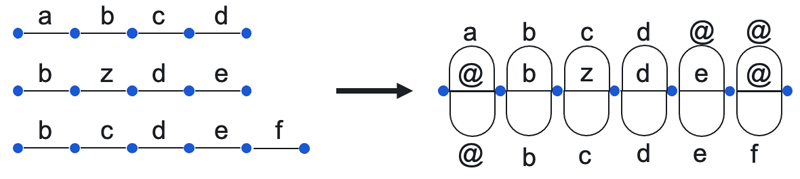

# Text aggregation

We recommend using aggregation for tasks with an [overlap](../glossary.md#overlap) of 2 or higher. Learn more about this process in [Aggregation of results](result-aggregation.md).

There are several methods of text field aggregation available.

## ROVER aggregation method {#rover}

This method aligns Tolokers' responses to improve the quality of aggregation.

Alignment is performed using the [ROVER](https://doi.org/10.1109/ASRU.1997.659110) method that forms a word transition graph. Each word of the aggregated text is selected [by majority vote](result-aggregation-mv.md). Therefore, the text obtained as a result of aggregation may differ from all of the Tolokers' responses.



Aggregation only includes accepted tasks.



## TextRASA and TextHRRASA aggregation methods {#textRASA}

The TextRASA aggregation method takes into account the reliability of Tolokers' responses. This method evaluates how well each Toloker copes with tasks and accounts for this information when determining the aggregation result.

The TextHRRASA method is derived from TextRASA. The TextHRRASA model uses an aggregation algorithm that takes into account the distance between Tolokers' responses.

## Aggregation with a language model {#textsum}

This method uses a pre-trained language model to aggregate responses. Each task's responses are combined into a string, which is passed to the model as input data. You can learn more about this method [here](https://datasets-benchmarks-proceedings.neurips.cc/paper/2021/hash/65ded5353c5ee48d0b7d48c591b8f430-Abstract-round1.html).

##Troubleshooting



The pool page contains the **List of Operations** button.





Yes. To set up notifications in your account, go to **Profile → Notifications → Pool or aggregation completed**. Learn more about [setting up notifications](../concepts/result-aggregation.md).



